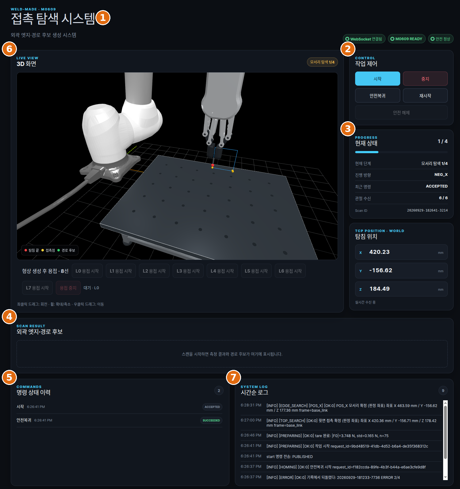
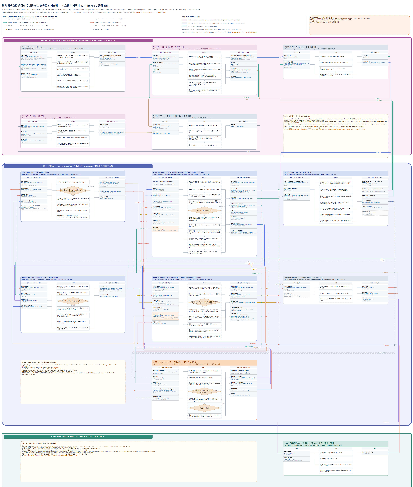
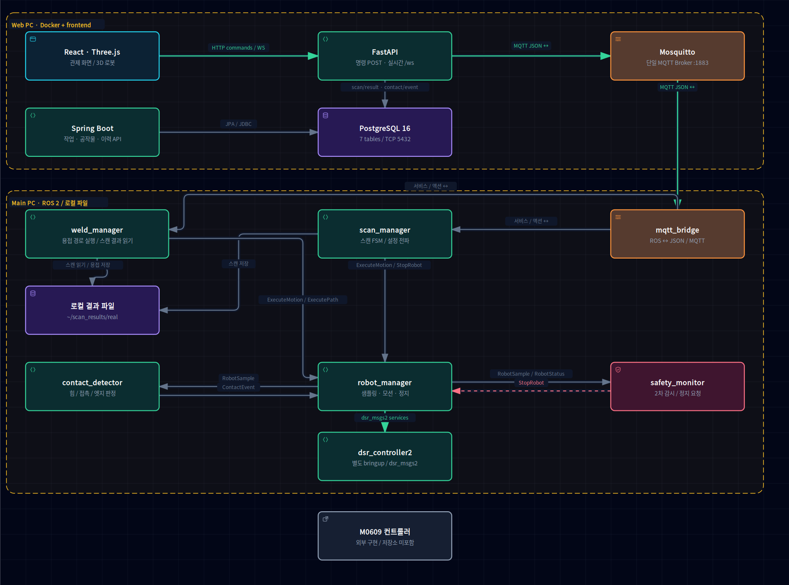
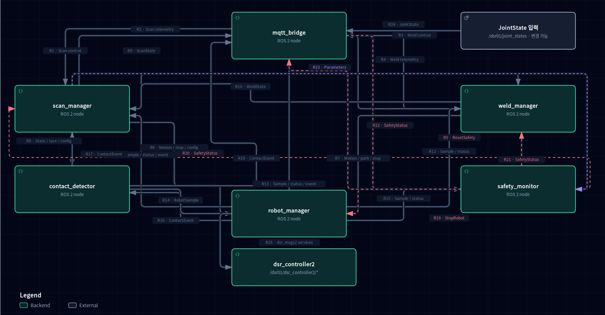
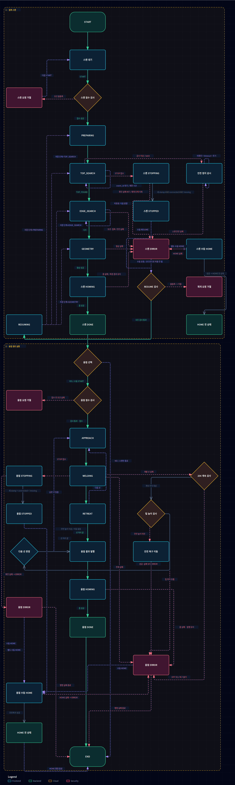
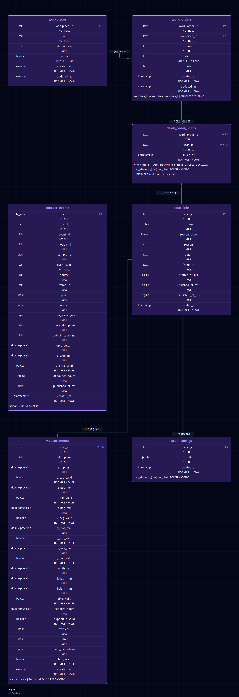
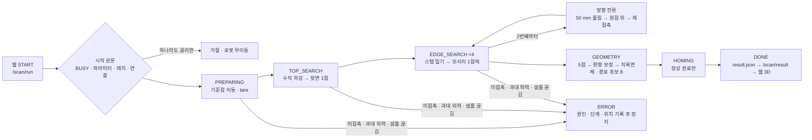
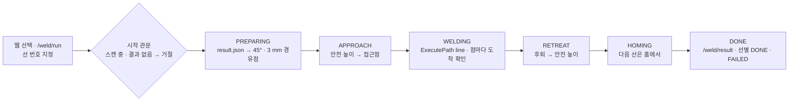

# weld-made — 협동로봇 추정 외력을 활용한 부재 형상 측정과 용접 경로 생성

카메라도 추가 센서도 없이, 로봇이 직육면체 부재를 직접 만져 윗면 1점 · 모서리 4점을 얻고, 외곽 엣지 · 경로 후보 8선을 계산해 웹 3D로 보여 준 뒤 그 선을 45° 자세로 따라간다.



> 두산로보틱스 지능형 로보틱스 엔지니어 · 협동-1 프로젝트 "ROS2를 활용한 로봇 자동화 공정 시스템 구현" · TEAM C-3조 **weld-made** (박병후 · 김학민 · 남현지 · 정의석, 멘토 이일주) · 2026-09-14 ~ 09-30

## 시연 영상

실제 M0609 동작과 웹 3D 관제 화면을 함께 확인할 수 있습니다. 아래 제목을 클릭하면 저장소의 원본 영상으로 이동합니다.

### 실물·웹 통합 시연

**[통합 시연 영상 보기](./docs/demonstration-video/통합.webm)** · 3분 39초  
실물 로봇과 웹 관제 화면을 나란히 배치해 접촉 탐색과 용접 경로 추종을 함께 보여줍니다.

<!-- GIF 교체 위치: 통합 시연. GIF를 추가할 때 이미지의 링크 대상은 위 원본 영상 경로를 유지합니다. -->

| 실제 로봇 공정 | 웹 3D 관제 |
|---|---|
| [실물 시연 영상 보기](./docs/demonstration-video/전체시연통합.webm) · 3분 18초 | [관제 시연 영상 보기](./docs/demonstration-video/관제통합.webm) · 3분 15초 |
| 로봇·시편·관제 모니터를 함께 촬영한 접촉 탐색과 경로 추종 과정입니다. | 탐색 진행 상태, 탐침 위치, 측정 결과와 선별 경로 실행 화면입니다. |

<!-- GIF 교체 위치: 위 표의 각 영상 링크 앞에 해당 원본 영상을 링크 대상으로 하는 GIF 미리보기를 넣습니다. -->

<details>
<summary><b>시스템 실행 준비 영상</b></summary>

**[실행 준비 영상 보기](./docs/demonstration-video/터미널x4.mp4)** · 28초 · 4배속  
빌드부터 Docker 서비스, 로봇 드라이버, ROS 2 노드와 프런트엔드 기동까지 보여줍니다.

<!-- GIF 교체 위치: 실행 준비. 원본이 이미 4배속이므로 추가 배속 없이 미리보기를 넣습니다. -->

</details>

## 주요 기능

- **티칭 없는 접촉 탐색**: 부재를 놓고 웹의 시작 버튼만 누른다. 수직 하강으로 윗면 높이 1점, 네 방향 스텝 밀기로 모서리 4점을 얻는다. 큐브 위치 · 크기를 입력하지 않는다.
- **센서 추가 없는 접촉 판정**: 힘 센서 대신 M0609가 관절 토크로 추정한 외력만 쓴다. 탐침은 빈 인공눈물 용기다. 움직이는 중의 추정값은 믿지 않고, 한 스텝 가고 멈춰서 읽는다.
- **형상 · 경로 후보 생성**: 5점을 팁 기하(반지름 2 mm · 내려앉은 깊이)만큼 되돌려 직육면체 꼭짓점 8 · 모서리 12를 만들고, 작업대에 닿은 아래 4개를 뺀 **경로 후보 8선**을 낸다. ROS 없는 순수 Python 모듈이다.
- **웹 3D 관제**: M0609 자세 · 탐침 궤적 · 접촉점 · 결과 상자를 한 장면에 그린다. 명령 5종(시작 · 중지 · 안전복귀 · 재시작 · 안전 해제)은 서로 독립이다. 측정 못 한 값은 0이 아니라 빈칸이다.
- **용접 경로 따라가기 (phase 2)**: 스캔 결과의 8선을 두 면 사이 45°, 이음선에서 3 mm 띄운 채 위빙(진폭 2 mm)으로 따라간다. 실제 아크는 없다. 웹에서 선을 골라 한 선씩 실행하고 선마다 홈을 거친다.
- **두 겹 안전 감시**: 과대 외력 30 N · 급강하 · 샘플 끊김 500 ms를 contact_detector(1차)와 safety_monitor(2차)가 따로 본다. 정지는 웹을 거치지 않고 메인 PC 안에서 끝나며, 래치는 사람이 `/safety/reset`으로만 푼다.
- **계약 우선**: 토픽 · 서비스 · 액션 · MQTT · 단위 · 좌표를 `docs/contracts/`에 먼저 동결했다. 인터페이스 패키지와 문서가 어긋나면 CI가 실패한다. 수치는 코드가 아니라 `real.yaml` · `sim.yaml`에 둔다.

## 시스템 구성

### 아키텍처



📐 **Editable source:** [Download 01-system-architecture.drawio](./docs/deliverables/01-system-architecture.drawio)

두 PC와 로봇. PC 사이는 MQTT(1883) 하나이고, 접촉 판정 · 2차 감시 · 정지는 메인 PC 안에서 끝난다.

| 위치 | 구성 | 역할 |
|---|---|---|
| 메인 PC (ROS 2 Jazzy) | `scan_manager` · `robot_manager` · `contact_detector` · `safety_monitor` · `mqtt_bridge` · `weld_manager` | 스캔 순서 · 모션 · 판정 · 감시 · 번역 · 용접 모션. 두산 드라이버를 부르는 노드는 `robot_manager` 하나 |
| 웹 PC (Docker) | Mosquitto · FastAPI · PostgreSQL · Spring Boot + React/Vite | 브로커 · REST/WebSocket 중계와 명령 발급 · 측정 저장 · 이력 조회 · 3D 관제 |
| 로봇 셀 | 두산 M0609 + OnRobot RG2 + 탐침, 컨트롤러 DRCF | 제공 드라이버(`dsr_controller2` · `onrobot_driver`)는 수정하지 않는다 |

노드별 연결은 [06 ROS2 노드 구조도](docs/deliverables/06-node-graph.md), 타입 전문은 [05 인터페이스 정의서](docs/deliverables/05-interfaces.md)와 [`docs/contracts/`](docs/contracts/)에 있다.

### 구현 아키텍처 · Archify

실행 코드와 DB 스키마를 기준으로 정리한 네 가지 도면입니다. **각 이미지를 클릭하면 해당 Archify 인터랙티브 뷰어가 열립니다.**

**[전체 아키텍처 사이트](https://rokey-cobot1-weld-made.netlify.app/)** · [시스템](#1-시스템-아키텍쳐) · [ROS 2 통신](#2-ros-2-통신-아키텍쳐) · [공정 흐름](#3-전체-공정-플로우차트) · [ERD](#4-erd)

분석 기준: 프로젝트 커밋 `8933b739ee43294605e57dca07625bad2f9e8ca4`. 확인되지 않은 외부 연결은 구현된 경로로 표시하지 않았습니다.

#### 1. 시스템 아키텍쳐

[](https://rokey-cobot1-weld-made.netlify.app/01_system.html)

Web PC·Main PC·외부 로봇 컨트롤러의 실행 영역과 구성 요소를 보여줍니다. MQTT와 ROS 2를 통한 제어·상태 전달 경로를 정리했습니다.

[인터랙티브 보기](https://rokey-cobot1-weld-made.netlify.app/01_system.html) · [원본 SVG](./docs/architecture/01_system.svg)

#### 2. ROS 2 통신 아키텍쳐

[](https://rokey-cobot1-weld-made.netlify.app/02_ros2.html)

노드 간 토픽·서비스·액션의 이름과 타입, 송수신 방향을 보여줍니다. 모션 실행·접촉 판정·안전 감시·MQTT 중계 관계를 확인할 수 있습니다.

[인터랙티브 보기](https://rokey-cobot1-weld-made.netlify.app/02_ros2.html) · [원본 SVG](./docs/architecture/02_ros2.svg)

#### 3. 전체 공정 플로우차트

[](https://rokey-cobot1-weld-made.netlify.app/04_flow.html)

접촉 스캔과 용접 경로 실행의 상태 전이를 보여줍니다. 요청 거절·실패·정지·재개·수동 HOME 분기를 포함하며, 실제 용접 전원 제어와는 구분합니다.

[인터랙티브 보기](https://rokey-cobot1-weld-made.netlify.app/04_flow.html) · [원본 SVG](./docs/architecture/04_flow.svg)

#### 4. ERD

[](https://rokey-cobot1-weld-made.netlify.app/03_erd.html)

실제 초기화 SQL의 7개 테이블·71개 컬럼과 관계를 보여줍니다. PK·FK·UNIQUE·NULL·기본값·ON DELETE 정책과 카디널리티를 표시했습니다.

[인터랙티브 보기](https://rokey-cobot1-weld-made.netlify.app/03_erd.html) · [원본 SVG](./docs/architecture/03_erd.svg)

### 동작 흐름

스캔(1차 MVP). 상태기계가 순서를 쥐고, 실패하면 그 자리에서 멈춘다. 자동 홈 복귀는 없다.



용접 모션(phase 2). 웹에서 고른 선을 한 선씩 실행하고, 선마다 홈을 거친다.



관제자 명령 4종(중지 · 안전복귀 · 재시작 · 안전 해제)은 서로를 부르지 않는다. 자세한 순서도는 [03 동작 순서도](docs/deliverables/03-flowchart.md), 예외 처리는 [08 예외 · 오류 리스트](docs/deliverables/08-exceptions.md).

## 개발 환경

| 항목 | 값 |
|---|---|
| 메인 PC | Ubuntu 24.04 LTS · ROS 2 Jazzy · Python 3.12 · `rmw_fastrtps_cpp` · `ROS_DOMAIN_ID=30` |
| 로봇 드라이버 | `doosan-robot2` · `onrobot_driver` (github.com/ahnisinc/cobot_rg2 `4d5657f`, 레포 밖 `ws_dsr`) · 두산 컨트롤러 DRCF `GF02120100` · DRFL `GL013303` |
| 시뮬레이션 | 두산 에뮬레이터 `doosanrobot/dsr_emulator:3.0.1` (Virtual) + 자체 가상 접촉 입력원 (`source:=sim`) |
| 웹 PC | Docker Compose — Mosquitto 2 · PostgreSQL 16 · FastAPI (Python) · Spring Boot (Java 21, Gradle) |
| 프론트 | React 19 · Three.js 0.186 · Vite |
| 언어 · 도구 | Python 3.12 (ROS 노드 · FastAPI), JavaScript (React), Java (Spring Boot), colcon · pytest · Docker |

세 단계로 검증한다: 로봇 없이 `sim` → 두산 에뮬레이터 Virtual → 실기. 입력원은 launch 인자 `source:=sim|robot_force` 하나로 바꾼다.

## 사용 장비

| 장비 | 모델명 · 사양 | 수량 | 용도 |
|---|---|---|---|
| 협동로봇 | 두산 M0609 (6축 · 가반 6 kg · 도달 900 mm · 반복정밀도 ±0.03 mm) | 1 | 접촉 탐색 · 용접 모션. 관절 토크 기반 외력 추정값을 접촉 판정에 쓴다 |
| 로봇 컨트롤러 | 두산 DRCF, 192.168.1.100:12345 (유선) | 1 | 드라이버 연결 |
| 그리퍼 | OnRobot RG2 | 1 | 탐침 고정 파지. 폭 변화는 판정에 쓰지 않는다 |
| 탐침 | 빈 인공눈물 용기, 팁 반지름 약 2 mm, 몸통 지름 13 mm | 1 | 접촉 탐침 · 용접 경로 추종 (토치 대용). 별도 센서 아님 |
| 탐침 홀더 | 3D 프린트, 닫힌 핑거 끝 → 팁 12 mm | 1 | RG2 핑거에 유격 없이 맞물림 |
| 부재 | 약 80 mm 투명 큐브 (9/23 스캔 결과 83.00 × 80.64 × 80.76 mm) | 1 | 스캔 · 용접 대상 |
| 작업대 | 대나무 판, 표면 z = Base 95.006 mm (실측), 코끼리테이프 위 본드 고정 | 1 | 부재 고정 |
| 메인 PC | Ubuntu 24.04 노트북, 로봇과 유선 | 1 | ROS 2 노드 |
| 웹 PC | Ubuntu 24.04, 메인 PC와 MQTT | 1 | 브로커 · 백엔드 · 관제 화면 (한 PC로 합쳐 실행할 수도 있다, 아래 Runbook) |

툴 등록값(TCP `[0, 0, 252.12]` mm · 무게 1.3 kg)과 좌표 기준(홈 · 작업대 원점 · 탐색 기준점)은 [04 하드웨어 구성](docs/deliverables/04-hardware.md)과 [`docs/contracts/units-frames.md`](docs/contracts/units-frames.md)에 있다. 배치 사진은 산출물 04에 둔다.

## 설치 및 실행

### 빠른 시작

```bash
# 1. 레포 (두산 · RG2 드라이버 ws_dsr 는 레포 밖: docs/env/setup-record-20260916.md)
git clone https://github.com/yujh5537/rokey_cobot1_Weld-Made.git
cd rokey_cobot1_Weld-Made

# 2. 메인 PC — ROS 2 빌드 (ws_dsr 를 먼저 source: alias sod)
python3 -m pip install -r ws_cobot1/requirements.txt
cd ws_cobot1 && colcon build --symlink-install && source install/setup.bash
colcon test && colcon test-result --verbose
python3 -m pytest src/scan_manager/test -q        # ROS 없이 도는 순수 계산 모듈

# 3. 웹 PC — 브로커 · 백엔드 · DB
docker compose -f docker/docker-compose.yml up -d --build
cd frontend && npm ci && npm run dev -- --host 0.0.0.0    # http://<웹 PC>:5173

# 4. 로봇 없이 (sim 입력원)
ros2 launch contact_scan_bringup bringup.launch.py source:=sim broker_host:=<웹 PC>

# 5. 실기 — 드라이버 → 툴 · TCP 등록 → 노드 (사람이 비상정지 곁에서 직접 실행)
sodreal                                                    # 두산 드라이버, mode:=real
python3 docs/env/apply_tool_tcp.py --tcp-x 0 --tcp-y 0     # 재기동마다 다시 등록 (빠지면 외력 12 N 치우침)
ros2 launch contact_scan_bringup bringup.launch.py source:=robot_force broker_host:=<웹 PC>
```

주요 의존성: 메인 PC `pytest` · `PyYAML` · `paho-mqtt<2` · `numpy` (`ws_cobot1/requirements.txt`), 웹 `fastapi` · `uvicorn` · `paho-mqtt` · `psycopg` (`backend/app/requirements.txt`), 프론트 `react` · `three` (`frontend/package.json`). ROS 2 패키지는 `rosdep install --from-paths ws_cobot1/src -y --ignore-src`.

실기 파라미터는 `ws_cobot1/src/contact_scan_bringup/config/real.yaml`이 기준이다. 시연 절차와 각 화면에서 할 말은 [시연 대본](docs/presentation/demo-script.md), 용접 실기 절차는 [`docs/runbooks/`](docs/runbooks/)에 있다.

### 전체 실행 절차 (Runbook)

아래는 실기 PC 한 대에서 드라이버 · ROS 노드 · 브로커 · 백엔드 · 프론트를 모두 띄우는 절차다(기존 README 전문).

<details>
<summary><b>Real M0609 + Web 3D 단일 PC 통합 실행 Runbook 펼치기</b></summary>

### Real M0609 + Web 3D 단일 Web PC 통합 실행 Runbook

기준 브랜치: `main`

목적: **Web PC 한 대에서 기존 Web PC 역할 + Main PC 역할을 모두 실행**한다.

즉 아래 기능을 모두 **현재 실기 PC 한 대**에서 실행한다.

```text
M0609 Real Driver
ROS 2 contact_scan 노드
mqtt_bridge
Mosquitto
FastAPI
Spring Boot
PostgreSQL
React + Three.js
```

---

#### 1. 실행 환경

```text
PC              = 현재 로그인한 실기 PC
Repo            = $HOME/rokey_cobot1_Weld-Made
Doosan ws_dsr   = $HOME/ws_cobot_pjt/ws_dsr

ROS_DOMAIN_ID   = 30
RMW             = rmw_fastrtps_cpp

MQTT Broker     = 127.0.0.1:1883
FastAPI         = 127.0.0.1:8000
Spring Boot     = 127.0.0.1:8080
Frontend        = 127.0.0.1:5173

M0609           = 192.168.1.100:12345
Driver mode     = real
ROS force source= robot_force
```

> **중요**
>
> - ROS와 Web이 같은 PC에서 실행되므로 `broker_host`는 **`127.0.0.1`**을 사용한다.
> - Virtual용 `ROS_DOMAIN_ID=166`, MQTT `1884`, API `8001`, Frontend `5174`를 사용하지 않는다.
> - 실기 파라미터는 `ws_cobot1/src/contact_scan_bringup/config/real.yaml` 기준이다.
> - Real Driver를 다시 실행했다면 START 전에 Tool/TCP를 다시 등록한다.
> - 물리 E-stop에 즉시 접근 가능한 상태에서만 실제 로봇을 움직인다.

---


### 2. 처음 Clone하는 사용자 — 경로 준비

이 문서는 사용자명이나 `/home/<사용자>/...` 같은 절대경로에 의존하지 않는다.

권장 방식은 **홈 디렉터리에서 그대로 clone**하는 것이다.

```bash
cd "$HOME"

git clone https://github.com/yujh5537/rokey_cobot1_Weld-Made.git

cd "$HOME/rokey_cobot1_Weld-Made"
git switch main
git pull --ff-only origin main
```

그러면 모든 사용자는 동일하게 아래 경로를 사용할 수 있다.

```text
Repo          = $HOME/rokey_cobot1_Weld-Made
ws_cobot1     = $HOME/rokey_cobot1_Weld-Made/ws_cobot1
docker        = $HOME/rokey_cobot1_Weld-Made/docker
frontend      = $HOME/rokey_cobot1_Weld-Made/frontend
```

Doosan `ws_dsr`는 이 Git 저장소에 포함되지 않는 외부 의존성이다.

이 Runbook은 기본적으로 다음 위치에 `ws_dsr`가 설치되어 있다고 가정한다.

```text
$HOME/ws_cobot_pjt/ws_dsr
```

설치 여부 확인:

```bash
test -f "$HOME/ws_cobot_pjt/ws_dsr/install/setup.bash" \
  && echo "OK: ws_dsr setup found" \
  || echo "ERROR: ws_dsr install/setup.bash 경로 확인 필요"
```

다른 위치에 `ws_dsr`를 설치한 사용자는 문서의:

```bash
source "$HOME/ws_cobot_pjt/ws_dsr/install/setup.bash"
```

부분만 자신의 실제 `ws_dsr/install/setup.bash` 경로로 바꾼다.

> `rokey_cobot1_Weld-Made` 자체는 `$HOME` 아래에 clone하는 것을 권장한다.  
> 다른 위치에 clone했다면 문서의 `$HOME/rokey_cobot1_Weld-Made`만 실제 clone 경로로 바꾸면 된다.

---

### 3. 전체 실행 순서

```text
T0 main 동기화 + Clean Build
→ T1 Docker 4개 서비스
→ T2 MQTT Monitor
→ T3 M0609 Real Driver
→ T4 DSR 확인 + Tool/TCP 재등록
→ T5 contact_scan bringup
→ T6 ROS / MQTT / 실기 파라미터 확인
→ T7 Frontend
→ WebSocket + M0609 관절 확인
→ START
```

---

### 4. T0 — main 동기화 + Clean Build

**터미널 T0**

#### T0-1 — 최신 main

> 처음 clone한 사용자는 위의 Clone 단계를 먼저 완료한다.

```bash
cd "$HOME/rokey_cobot1_Weld-Made"

git fetch origin
git switch main
git pull --ff-only origin main
```

#### T0-2 — ROS Clean Build

```bash
cd "$HOME/rokey_cobot1_Weld-Made/ws_cobot1"

rm -rf build install log

source /opt/ros/jazzy/setup.bash
source "$HOME/ws_cobot_pjt/ws_dsr/install/setup.bash"

export ROS_DOMAIN_ID=30
export RMW_IMPLEMENTATION=rmw_fastrtps_cpp

colcon build --symlink-install
source install/setup.bash
```

#### T0-3 — 실제 M0609 네트워크 확인

```bash
ping -c 3 192.168.1.100
```

정상 기준:

```text
192.168.1.100 응답 수신
```

응답이 없으면 Real Driver를 실행하지 않는다.

---

### 5. T1 — Docker 4개 서비스

**새 터미널 T1**

```bash
cd "$HOME/rokey_cobot1_Weld-Made/docker"

[ -f .env ] || cp .env.example .env

docker compose up -d --build
docker compose ps
```

정상 서비스:

```text
weld_made_mosquitto
weld_made_postgres
weld_made_fastapi
weld_made_spring
```

확인:

```bash
curl http://127.0.0.1:8000/health
curl http://127.0.0.1:8000/db/test
curl http://127.0.0.1:8080/actuator/health
nc -vz 127.0.0.1 1883
```

정상 기준:

```text
FastAPI  :8000 정상
Postgres 연결 정상
Spring   :8080 정상
MQTT     :1883 연결 성공
```

Docker는 background로 실행되므로 T1은 계속 점유되지 않는다.

---

### 6. T2 — MQTT Monitor

**새 터미널 T2. 계속 켜 둔다.**

```bash
mosquitto_sub -h 127.0.0.1 -p 1883 \
  -t 'conn/ros' \
  -t 'hb/ros' \
  -t 'robot/status' \
  -t 'robot/joints' \
  -t 'robot/gripper_joints' \
  -t 'robot/sample' \
  -t 'scan/state' \
  -t 'scan/result' \
  -t 'scan/log' \
  -t 'contact/event' \
  -t 'safety/status' \
  -t 'cmd/ack' \
  -t 'scan/command_result' \
  -v
```

T2는 종료할 때까지 그대로 둔다.

---

### 7. T3 — M0609 Real Driver

**새 터미널 T3. 계속 켜 둔다.**

실행 전:

```text
[ ] 물리 E-stop에 즉시 접근 가능
[ ] 작업영역에 사람 없음
[ ] 작업영역에 장애물 없음
[ ] RG2 탐침 장착 확인
[ ] 티치펜던트 상태 확인
[ ] 192.168.1.100 ping 성공
```

환경:

```bash
source /opt/ros/jazzy/setup.bash
source "$HOME/ws_cobot_pjt/ws_dsr/install/setup.bash"

export ROS_DOMAIN_ID=30
export RMW_IMPLEMENTATION=rmw_fastrtps_cpp
```

Real Driver 실행:

```bash
ros2 launch m0609_rg2_bringup bringup.launch.py \
  mode:=real \
  host:=192.168.1.100 \
  port:=12345 \
  model:=m0609
```

반드시 실기 설정:

```text
mode  = real
host  = 192.168.1.100
port  = 12345
model = m0609
```

T3는 계속 켜 둔다.

---

### 8. T4 — DSR 확인 + Tool/TCP 재등록

**새 터미널 T4**

환경:

```bash
source /opt/ros/jazzy/setup.bash
source "$HOME/ws_cobot_pjt/ws_dsr/install/setup.bash"

export ROS_DOMAIN_ID=30
export RMW_IMPLEMENTATION=rmw_fastrtps_cpp
```

실제 M0609 관절 수신 확인:

```bash
ros2 topic echo /dsr01/joint_states --once
```

관절값이 수신되면 Tool/TCP 등록:

```bash
cd "$HOME/rokey_cobot1_Weld-Made"

python3 docs/env/apply_tool_tcp.py
```

반드시 마지막 줄:

```text
OK: tool=rg2_probe, tcp=rg2_probe_tip [0.0, 0.0, 252.12]
```

`OK`가 아니면 다음 단계로 가지 않는다.

> T3 Real Driver를 재시작했다면 Tool/TCP도 다시 등록한다.

---

### 9. T5 — contact_scan bringup

**새 터미널 T5. 계속 켜 둔다.**

```bash
cd "$HOME/rokey_cobot1_Weld-Made/ws_cobot1"

source /opt/ros/jazzy/setup.bash
source "$HOME/ws_cobot_pjt/ws_dsr/install/setup.bash"
source install/setup.bash

export ROS_DOMAIN_ID=30
export RMW_IMPLEMENTATION=rmw_fastrtps_cpp
```

실행:

```bash
ros2 launch contact_scan_bringup bringup.launch.py \
  source:=robot_force \
  broker_host:=127.0.0.1
```

기동 대상:

```text
robot_manager
contact_detector
safety_monitor
scan_manager
mqtt_bridge
```

같은 PC이므로 MQTT 흐름:

```text
ROS 2
→ mqtt_bridge
→ 127.0.0.1:1883
→ Mosquitto
→ FastAPI
→ WebSocket
→ React
```

T5는 계속 켜 둔다.

---

### 10. T6 — START 전 ROS / MQTT 확인

**새 터미널 T6**

환경:

```bash
cd "$HOME/rokey_cobot1_Weld-Made/ws_cobot1"

source /opt/ros/jazzy/setup.bash
source "$HOME/ws_cobot_pjt/ws_dsr/install/setup.bash"
source install/setup.bash

export ROS_DOMAIN_ID=30
export RMW_IMPLEMENTATION=rmw_fastrtps_cpp
```

#### T6-1 — 자체 ROS 노드 확인

```bash
ros2 node list | grep -E 'robot_manager|contact_detector|safety_monitor|scan_manager|mqtt_bridge'
```

정상:

```text
/robot_manager
/contact_detector
/safety_monitor
/scan_manager
/mqtt_bridge
```

#### T6-2 — 실기 적용 파라미터 확인

```bash
ros2 param get /contact_detector tare_max_std_n
ros2 param get /robot_manager step_release_n
```

현재 `real.yaml` 기준 기대값:

```text
tare_max_std_n = 1.0
step_release_n = 2.5
```

#### T6-3 — 실제 로봇 상태 확인

```bash
ros2 topic echo /dsr01/joint_states --once
```

```bash
ros2 topic echo /robot/status --once
```

```bash
ros2 topic echo /robot/sample --once
```

```bash
ros2 topic echo /safety/status --once
```

```bash
ros2 topic echo /scan/state --once
```

START 전 핵심 기준:

```text
/dsr01/joint_states → 실제 J1~J6 수신
/robot/status       → connected: true
/robot/sample       → valid: true
/safety/status      → latched: false
/scan/state         → 정상 수신
```

---

### 11. T2 — MQTT 수신 확인

T5가 정상이라면 T2에 최소 아래가 들어와야 한다.

```text
conn/ros
hb/ros
robot/status
robot/joints
robot/gripper_joints
scan/state
safety/status
```

특히 웹 M0609 자세에 필요한 경로:

```text
/dsr01/joint_states
→ mqtt_bridge (20 Hz)
→ MQTT robot/joints
→ Mosquitto :1883
→ FastAPI
→ WebSocket
→ React
→ Three.js joint_1 ~ joint_6
```

관절만 별도로 확인하려면:

```bash
mosquitto_sub -h 127.0.0.1 -p 1883 \
  -t 'robot/joints' -C 1 -v
```

정상 예:

```text
robot/joints {"schema_version":"0.1", ... "names":["joint_1","joint_2","joint_3","joint_4","joint_5","joint_6"], ...}
```

---

### 12. T7 — Frontend 5173

**T6와 MQTT 확인까지 끝난 후 새 터미널 T7에서 실행한다.**

```bash
cd "$HOME/rokey_cobot1_Weld-Made/frontend"

npm ci
```

실기 좌표 적용:

```bash
VITE_BASE_TO_FIXTURE_MM=420.255,-156.675,95.006 \
VITE_TABLE_ORIGIN_MM=420.255,-156.675,95.006 \
npm run dev -- --host 0.0.0.0
```

같은 PC 브라우저:

```text
http://127.0.0.1:5173
```

다른 PC에서 이 실기 PC의 웹에 접속할 경우 먼저 실기 PC의 LAN IPv4를 확인한다.

```bash
hostname -I
```

출력된 주소 중 **같은 LAN에서 접근 가능한 IPv4**를 사용한다.

```text
http://<WEB_PC_IP>:5173
```

예를 들어 LAN IP가 `192.168.0.50`이면:

```text
http://192.168.0.50:5173
```

웹에서 확인:

```text
[ ] WebSocket 연결
[ ] 실제 M0609 J1~J6 자세 갱신
[ ] RG2 표시
[ ] TCP 위치 / 궤적
[ ] scan.state 표시
```

실기 좌표:

```text
VITE_BASE_TO_FIXTURE_MM = 420.255,-156.675,95.006
VITE_TABLE_ORIGIN_MM    = 420.255,-156.675,95.006
```

---

### 13. START 전 최종 체크

```text
[ ] T1 Docker 4개 서비스 정상
[ ] T2 MQTT Monitor 실행 중

[ ] T3 M0609 Real Driver 실행 중
[ ] mode:=real
[ ] host:=192.168.1.100
[ ] /dsr01/joint_states 실제 관절 수신

[ ] T4 Tool/TCP 마지막 줄 OK
[ ] tool = rg2_probe
[ ] tcp = rg2_probe_tip [0.0, 0.0, 252.12]

[ ] T5 ROS 노드 5개 실행 중
[ ] source:=robot_force
[ ] broker_host:=127.0.0.1

[ ] tare_max_std_n = 1.0
[ ] step_release_n = 2.5

[ ] /robot/status connected: true
[ ] /robot/sample valid: true
[ ] /safety/status latched: false

[ ] MQTT conn/ros 수신
[ ] MQTT hb/ros 수신
[ ] MQTT robot/status 수신
[ ] MQTT robot/joints 수신
[ ] MQTT scan/state 수신
[ ] MQTT safety/status 수신

[ ] 브라우저 WebSocket 연결 정상
[ ] 웹 M0609 J1~J6가 실제 로봇과 같이 움직임

[ ] 물리 E-stop 접근 가능
[ ] 작업영역 사람 없음
[ ] 작업영역 장애물 없음
```

전부 확인한 뒤 브라우저에서 **START**를 누른다.

---

### 14. 실제 실행 데이터 흐름

명령:

```text
React :5173
→ FastAPI :8000
→ MQTT :1883
→ mqtt_bridge
→ scan_manager
→ robot_manager
→ M0609 Real Driver
→ 실제 M0609
```

상태:

```text
실제 M0609
→ /dsr01/joint_states
→ mqtt_bridge
→ robot/joints
→ Mosquitto
→ FastAPI
→ WebSocket
→ React / Three.js
```

스캔 실행:

```text
START 직후
→ cmd/ack
→ scan/state

탐색 중
→ scan/log
→ contact/event
→ robot/status
→ robot/joints

완료
→ scan/result
→ scan/command_result
```

---

### 15. 웹 명령

```text
START     새 스캔 시작
STOP      현재 작업 중지
HOME      안전복귀
RESUME    기존 측정값 유지 후 중단 작업 재시작
```

```text
STOP ≠ HOME ≠ RESUME
```

STOP은 HOME 또는 RESUME을 자동 실행하지 않는다.

웹 STOP은 소프트웨어 정지이며 물리 E-stop을 대체하지 않는다.

---

### 16. 종료 순서

먼저 실제 로봇 모션이 완전히 멈춘 것을 확인한다.

```text
M0609 모션 정지 확인
→ T7 Frontend Ctrl+C
→ T5 contact_scan bringup Ctrl+C
→ T3 M0609 Real Driver Ctrl+C
→ T2 MQTT Monitor Ctrl+C
→ 필요 시 Docker 종료
```

Docker 종료:

```bash
cd "$HOME/rokey_cobot1_Weld-Made/docker"

docker compose down
```

일반 종료에서는 볼륨을 보존하기 위해:

```text
docker compose down -v
```

는 사용하지 않는다.

---

### 17. 빠른 문제 확인

#### 17-1. 웹에서 M0609 관절이 안 움직일 때

##### 1단계 — ROS

```bash
ros2 topic echo /dsr01/joint_states --once
```

```text
수신 안 됨
→ T3 Real Driver 확인

수신 됨
→ MQTT 확인
```

##### 2단계 — MQTT

```bash
mosquitto_sub -h 127.0.0.1 -p 1883 \
  -t 'robot/joints' -C 1 -v
```

```text
수신 안 됨
→ T5 mqtt_bridge 확인
→ broker_host:=127.0.0.1 확인

수신 됨
→ FastAPI / WebSocket / React 확인
```

---

#### 17-2. MQTT Broker 연결 실패

```bash
nc -vz 127.0.0.1 1883
```

안 되면:

```bash
cd "$HOME/rokey_cobot1_Weld-Made/docker"
docker compose ps
```

`weld_made_mosquitto` 상태를 확인한다.

---

#### 17-3. `/dsr01/joint_states`가 없을 때

```text
T3 Real Driver 실행 중?
        ↓
mode:=real?
        ↓
host:=192.168.1.100?
        ↓
ROS_DOMAIN_ID=30?
        ↓
RMW_IMPLEMENTATION=rmw_fastrtps_cpp?
        ↓
ws_dsr setup.bash source?
        ↓
192.168.1.100 통신 정상?
```

---

#### 17-4. Tool/TCP 실패

```bash
cd "$HOME/rokey_cobot1_Weld-Made"

python3 docs/env/apply_tool_tcp.py
```

반드시:

```text
OK: tool=rg2_probe, tcp=rg2_probe_tip [0.0, 0.0, 252.12]
```

가 나와야 한다.

---

#### 17-5. 웹 형상 위치가 맞지 않을 때

T7 실행값:

```text
VITE_BASE_TO_FIXTURE_MM=420.255,-156.675,95.006
VITE_TABLE_ORIGIN_MM=420.255,-156.675,95.006
```

변경했다면 T7을 `Ctrl+C`로 종료 후 다시 실행한다.

---

### 18. 단일 PC 실기 / Virtual 구분

#### 현재 단일 Web PC 실기

```text
ROS_DOMAIN_ID = 30
MQTT          = 127.0.0.1:1883
FastAPI       = 127.0.0.1:8000
Frontend      = 127.0.0.1:5173
M0609         = 192.168.1.100:12345
mode          = real
source        = robot_force
TCP           = 252.12 mm
```

#### Virtual 단독 실행

```text
ROS_DOMAIN_ID = 166
MQTT          = 127.0.0.1:1884
FastAPI       = 127.0.0.1:8001
Frontend      = 127.0.0.1:5174
M0609         = 127.0.0.1:12345
mode          = virtual
```

**실기 실행 중 Virtual 환경값을 섞지 않는다.**

</details>

## 프로젝트 구조

```text
.
├── ws_cobot1/src/               ROS 2 Jazzy 자체 패키지 (메인 PC)
│   ├── contact_scan_interfaces/   msg 15 · srv 6 · action 6 + QoS 모듈 (계약의 타입 전문)
│   ├── scan_manager/              스캔 순서 상태기계 · geometry_estimator(형상 계산) · result_store(원본 보관)
│   ├── robot_manager/             두산 드라이버를 부르는 유일한 노드 — 모션 · 스텝 모서리 탐색 · 샘플 발행 · ExecutePath
│   ├── contact_detector/          tare · 접촉(CONTACT) · 모서리(EDGE) · 과대 외력 1차 판정
│   ├── safety_monitor/            과대 외력 · 급강하 · 최신성 2차 감시 → 정지 · 래치
│   ├── mqtt_bridge/               ROS ↔ MQTT 번역, 명령 ID 검사, m→mm · NaN→null
│   ├── weld_manager/              phase 2 — 스캔 결과로 8선 경로 생성 · 접근 → 경로 → 후퇴 → 홈
│   └── contact_scan_bringup/      launch + config/{sim,real}.yaml (모든 수치는 여기)
├── backend/app/                 FastAPI — REST 명령 발급 · WebSocket 중계 · 측정 DB 쓰기
├── backend/spring/              Spring Boot — 작업 · 공작물 · 이력 조회 API
├── backend/mock_publisher/      로봇 없이 웹을 만들 때 쓴 MQTT 목업 발행기
├── frontend/                    React 19 + Three.js 3D 관제 (Vite)
├── docker/                      Mosquitto · PostgreSQL · FastAPI · Spring Boot compose
├── scripts/github/              이슈 · 마일스톤 · CODEOWNERS 생성
├── scripts/sim/                 Virtual 에뮬레이터 정렬 · 용접 미리보기 · P1 · P2 실행 절차
└── docs/
    ├── BRD.md                     비즈니스 요구사항 v3.2.0 (기준 문서)
    ├── architecture.md            노드 책임 · 배치 · 데이터 흐름
    ├── contracts/                 ROS 인터페이스 · MQTT 스키마 · 단위 · 좌표 (코드보다 우선, CHANGELOG)
    ├── phase2/                    용접 모션 계약 · 결정(D1~D38) · 측정 체크리스트
    ├── deliverables/              최종 산출물 01~09 (아키텍처 · 네트워크 · 순서도 · 하드웨어 · 인터페이스 · 노드 · 예외 · 안전)
    ├── decisions/                 ADR — 접촉 판정 방식 · 웹 스택 · 모노레포 · 안전 감사 결정
    ├── env/                       환경 구축 기록 · 버전 · 두산 API 호출 확인 · TCP 등록 스크립트
    ├── test-reports/              TR 시험 결과 · 실기 세션 기록 · 저녁 통합 기록
    ├── runbooks/                  실기 · Virtual 실행 절차
    └── presentation/              발표 자료(weld-made.pptx) · 시연 대본 · 그림 원본
```

레포 밖: `ws_dsr/`(두산 · RG2 제공 드라이버) · `DartPlatform/`. 제공 드라이버는 수정하지 않는다. 담당은 [`ws_cobot1/src/README.md`](ws_cobot1/src/README.md).

## 결과

9/23 · 9/29 실기(두산 M0609, 팀원 입회)에서 잰 값이다. 목표는 BRD 9장 KPI.

| 항목 | 결과 | 목표 | 판정 |
|---|---|---|---|
| 치수 오차 (폭 · 길이 · 높이, 캘리퍼 대비) | +1.50 / −0.36 / +0.26 mm | ±3 mm | 달성 |
| 접촉 높이 반복 (같은 점 10회) | σ 0.040 mm | — | — |
| 실기 종단 연속 성공 (웹 → 로봇 → 웹) | 3 / 3회 (9/23) | — | 달성 |
| 실기 모서리 검출 | 14 / 14회 | — | 달성 |
| 용접 모션 실기 완주 | 8선 중 7선 (L5는 팔 길이 밖, 9/29) | 8선 | 부분 |
| 탐색 시간 | 438 s (스텝 모드) | 120 s | 미달 |
| 접촉 검출 하중 (임계 3 N, 9/23 TR-01) | 평균 4.49 N, 10회 중 2회 초과 | 5 N 이하 | 미달 |
| 관제 화면 반영 지연 (9/22 Virtual, TR-05) | 평균 2.64 ms · 최대 312 ms | 200 ms 이내 | 미달 (최대값) |
| 작업 중지 반응 (9/22 Virtual, TR-05) | 706 · 600 ms | 1 s 이내 | 달성 (sim) |

미달 원인과 개선안(재접근 2단 · 거친 스텝 1 mm로 약 230 s, 계산값 · 미실시)은 발표 자료 04-⑥과 [`docs/test-reports/`](docs/test-reports/)에 있다.

## 배운 점 / 회고

실기에서 문서대로 움직이지 않은 로봇을 측정으로 원인까지 좁혀 고치면서 남긴 것이다.

1. **움직이는 중의 값은 믿지 않고, 멈춰서 읽는다.** 이동 중 추정 외력이 방향마다 1.5~8.6 N 치우쳐 힘 제어 밀기가 실기 4회 중 0회였다. 한 스텝 가고 멈춰 읽는 스텝 모드로 바꾸자 모서리 14/14가 됐다. 대신 탐색 시간 438 s를 감수했다.
2. **드라이버의 "성공"은 접수일 뿐, 상태는 직접 잰다.** 두산 서비스의 `success`는 도착의 증거가 아니었다. 도착은 실측 위치로만, 정지 완료는 `/robot/status`의 `connected && !moving`으로만 판정한다.
3. **모르는 값이 둘이면, 아는 값 하나로 푼다.** 탐침 교체와 작업대 교체가 겹쳐 TCP 높이와 작업대 높이를 동시에 잃었다. 80 mm 큐브 한 값으로 검산하며 하나씩 닫았다(재점검 −0.016 mm).
4. **값만 보지 말고 그 값의 나이를 본다.** safety_monitor가 죽은 뒤 마지막 "래치 없음"을 1시간 넘게 믿었다. 상태 메시지가 5 s 넘게 끊기면 시작을 거절하게 했다.
5. **닿지 않으면 손목 · 팔 길이 · 경로로 원인을 나눠 잰다.** 45°로 닿지 않던 L1은 툴을 돌려도 안 됐고, 손목 중심이 팔 길이(826 > 779 mm)를 넘는 것이 원인이었다. 그 선만 15°로 낮춰 완주했다. 선을 이어 돌리면 J5가 한계를 넘어, 선마다 홈을 거치는 운영으로 바꿨다.
6. **계약이 코드보다 먼저.** 이름 · 필드 · 단위를 먼저 동결하니 넷이 따로 만들어도 한 흐름으로 이어졌다. 대신 실측이 바꾼 값을 계약에 되돌리는 일이 끝까지 남았다.
7. **미달 · 미실시도 수치와 함께 남긴다.** 탐색 시간 · 검출 하중 · 띄움 치우침(원인 미규명, +y 3.5 mm 보정)처럼 못 한 것을 그대로 적었다.

팀 자체 평가(평균 8.5 / 10)와 개인별 사례는 발표 자료 05장에 있다.

## 라이선스

[Apache License 2.0](LICENSE) — Copyright 2026 weld-made (박병후 · 김학민 · 남현지 · 정의석). ROS 2 패키지의 `package.xml`도 같은 라이선스를 선언한다. 두산 · OnRobot 제공 드라이버(`ws_dsr`, 레포 밖)와 로봇 URDF는 각 제공자의 라이선스를 따른다.
