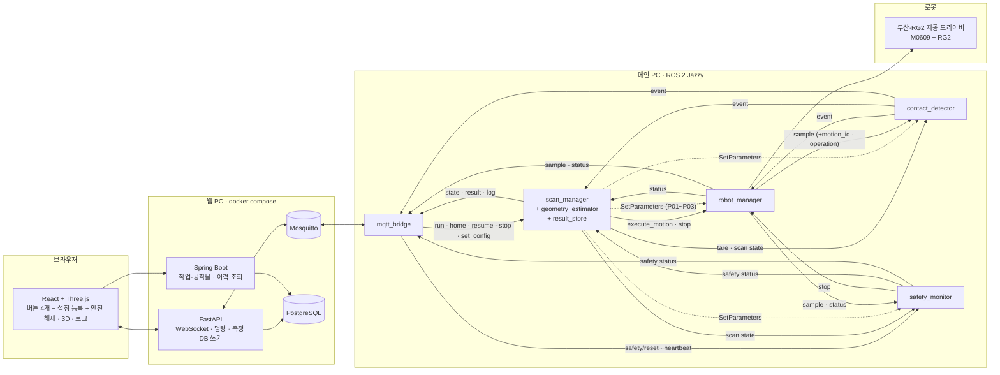

# 아키텍처 요약

출처: BRD 4.6~4.7절. 상세 그림과 연결 표는 `docs/design/`(노드 구성도 v1.1, 간략판 v1.2, 아키텍처 v1.6 drawio)에 있다. 인터페이스의 기준은 `docs/contracts/`다.

## 배치

scan_manager는 `/robot/sample`을 구독하지 않는다(중단 위치는 `ExecuteMotion` Result의 정지 pose). 이름 · 필드 · QoS는 `docs/contracts/ros-interfaces.md`, MQTT는 `docs/contracts/mqtt-schema.md`.

## 노드 책임과 담당
| 구성요소 | 책임 | 담당 |
|---|---|---|
| robot_manager | 이동·하강·슬라이딩·정지·홈 복귀, 순응·힘 제어와 해제, TCP·힘 샘플 발행(실행 중 동작의 `motion_id`·`operation` 포함), 하강 제한 1차 감시, RG2 파지. **DSR API를 부르는 유일한 곳** | 학민 |
| contact_detector | 영점·필터·외력 임계·z 급강하·디바운스. 판정 모드는 샘플의 `operation`에서 얻는다(하강 중 접촉, 밀기 중 소실, 그 밖에는 판정 안 함). 과대 외력 1차 감시. 입력원 robot_force / sim | 현지 |
| safety_monitor | 과대 외력(2차), 하강 제한(2차), 데이터 최신성, heartbeat 감시 → 웹을 거치지 않고 robot_manager에 정지 요청, 래치. 래치 해제는 `/safety/reset`으로만 | 현지 |
| scan_manager | 상면→±X/±Y→형상 계산→홈 복귀(마무리, 정상 완료일 때만) 순서, 방향 전환 이동, 중지·안전복귀·재시작 조정, 설정을 3개 노드로 전파, Base→작업대 좌표 변환(결과만) | 병후 |
| └ geometry_estimator (모듈) | 꼭짓점, 외곽 엣지·경로 후보, 편향 보정, 비정상 검출 | 현지 |
| └ result_store (모듈) | 메인 PC의 측정 원본·진행 기록·설정 보관. 재시작의 원본 | 병후 |
| mqtt_bridge | ROS ↔ MQTT, 명령 ID 중복·만료 검사(중지는 만료 검사 제외)·접수/완료·연결 상태 추적, 단위 변환(m→mm), NaN→null | 의석 (T27은 병후와 공동) |
| contact_scan_interfaces | msg/srv/action 정의 패키지 + QoS 프로파일 모듈 `contact_scan_qos` | 병후 |
| FastAPI / Spring Boot / PostgreSQL / Mosquitto / React | 화면·명령·저장·이력 | 의석 |

## 지켜야 할 경계
- 정지와 접촉 판정은 메인 PC 안에서 끝난다. 웹이 끊겨도 로컬 정지와 원본 보관은 동작한다.
- 웹 DB는 원격 저장·조회용이다. 재시작은 result_store의 로컬 기록을 쓴다.
- 작업 중지 / 홈 안전복귀 / 재시작 / 안전 해제는 독립 명령이다. 스캔 마무리의 홈 복귀는 정상 완료일 때만 하고, 중지·실패 시에는 하지 않는다.
- 화면의 중지 버튼은 안전 등급 기능이 아니다. 최종 안전 수단은 티치펜던트 비상정지와 로봇의 충돌 감지다.
