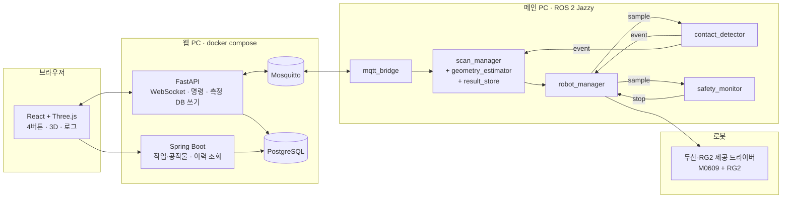

# 아키텍처 요약

출처: BRD v3.0.0 4.6~4.7절. 팀 아키텍처 v1.3 / 설계 요약 v1.1 [E20] 원본을 받으면 이 문서를 교체·보강한다.

## 배치

## 노드 책임과 담당
| 구성요소 | 책임 | 담당 |
|---|---|---|
| robot_manager | 이동·하강·슬라이딩·정지·홈 복귀, 순응·힘 제어와 해제, TCP·힘 샘플 발행, RG2 파지. **DSR API를 부르는 유일한 곳** | 학민 |
| contact_detector | 영점·필터·외력 임계·z 급강하·디바운스. 입력원 robot_force / sim | 현지 |
| safety_monitor | 과대 외력, 하강 제한, 데이터 최신성, heartbeat 감시 → 웹을 거치지 않고 robot_manager에 정지 요청 | 현지 |
| scan_manager | 상면→±X/±Y→형상 계산 순서, 중지·안전복귀·재시작 조정 | 병후 |
| └ geometry_estimator (모듈) | 꼭짓점, 외곽 엣지·경로 후보, 편향 보정, 비정상 검출 | 현지 |
| └ result_store (모듈) | 메인 PC의 측정 원본·진행 기록·설정 보관. 재시작의 원본 | 병후 |
| mqtt_bridge | ROS ↔ MQTT, 명령 ID·접수/완료·연결 상태 추적, 단위 변환 | 병후 |
| contact_scan_interfaces | msg/srv/action 정의 패키지 | 병후 |
| FastAPI / Spring Boot / PostgreSQL / Mosquitto / React | 화면·명령·저장·이력 | 의석 |

## 지켜야 할 경계
- 정지와 접촉 판정은 메인 PC 안에서 끝난다. 웹이 끊겨도 로컬 정지와 원본 보관은 동작한다.
- 웹 DB는 원격 저장·조회용이다. 재시작은 result_store의 로컬 기록을 쓴다.
- 작업 중지 / 홈 안전복귀 / 재시작은 독립 명령이다.
- 화면의 중지 버튼은 안전 등급 기능이 아니다. 최종 안전 수단은 티치펜던트 비상정지와 로봇의 충돌 감지다.
