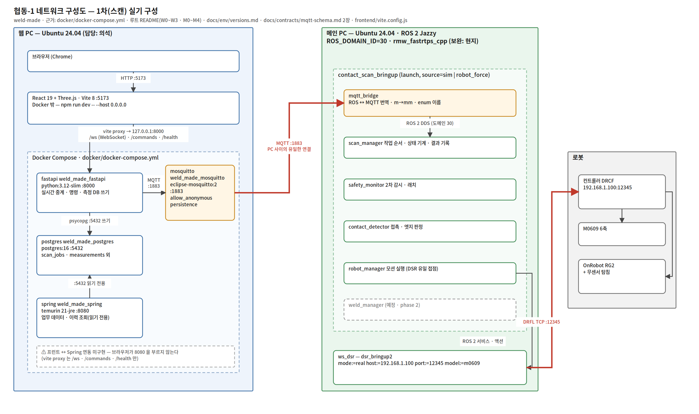

# 02. 네트워크 구성도

근거: `docker/docker-compose.yml` · `docker/.env.example` · `docker/mosquitto/config/mosquitto.conf` · 루트 `README.md`(W0~W3 · M0~M4) · `frontend/vite.config.js` · `frontend/package.json` · `backend/app/Dockerfile` · `backend/spring/Dockerfile` · `backend/app/main.py` · `docs/env/versions.md` · `docs/env/setup-record-20260916.md` · `docs/decisions/0002-web-stack-mqtt.md` · `docs/contracts/mqtt-schema.md` 2장 · `ws_cobot1/src/contact_scan_bringup/launch/bringup.launch.py`

담당: **웹 PC 쪽 = 의석** (이 문서 1~3 · 5장) · **메인 PC · 로봇 쪽 = 현지** (4장, 아래 표시한 자리)



원본: `assets/02-network.drawio` (draw.io 로 열어 편집 → 같은 이름 png 로 내보낸다)

---

## 1. 한눈에

PC **2 대**와 로봇 **1 대**다.

| | 역할 | OS · 런타임 | 담당 |
|---|---|---|---|
| **웹 PC** | 관제 화면 · 명령 접수 · 이력 저장 | Ubuntu 24.04 + Docker | 의석 |
| **메인 PC** | 접촉 판정 · 모션 · 안전 감시 | Ubuntu 24.04 + ROS 2 Jazzy | 현지 · 학민 · 병후 |
| **로봇** | M0609 6축 + OnRobot RG2(무센서 탐침) | 컨트롤러 DRCF | 학민 |

**두 PC 사이의 연결은 MQTT 하나뿐이다.** ROS DDS 는 메인 PC 안에서만 돈다 — 웹 PC 에는 ROS 가 설치돼 있지 않다. 이 구조는 ADR-0002 에서 정한 것이고, 그래서 ROS 와 웹의 접점이 `docs/contracts/mqtt-schema.md` 한 장으로 끝난다.

---

## 2. 웹 PC (의석)

### 2.1 Docker 4 서비스 + Docker 밖 1 개

`docker compose up -d` 로 4 개가 뜨고, **프런트는 Docker 밖에서** `npm run dev` 로 돈다.

| 서비스 | 컨테이너 이름 | 이미지 | 호스트 포트 | 역할 |
|---|---|---|---|---|
| mosquitto | `weld_made_mosquitto` | `eclipse-mosquitto:2` | **1883** | MQTT 브로커. 팀 전체에 1 개뿐 |
| postgres | `weld_made_postgres` | `postgres:16` | **5432** | 측정 · 이력 · 업무 데이터 |
| fastapi | `weld_made_fastapi` | `python:3.12-slim` (빌드) | **8000** | WebSocket 중계 · 명령 발행 · 측정 DB 쓰기 |
| spring | `weld_made_spring` | `gradle:8-jdk21` → `eclipse-temurin:21-jre` | **8080** | 업무 데이터 · 이력 조회 (**읽기 전용**) |
| **(Docker 밖)** frontend | — | Node · Vite 8 · React 19 · Three.js | **5173** | 3D 관제 화면. `npm run dev -- --host 0.0.0.0` |

포트는 전부 `docker/.env` 로 바꿀 수 있다(`MQTT_PORT` · `POSTGRES_PORT` · `FASTAPI_PORT` · `SPRING_PORT`). 위 숫자는 `.env.example` 의 출발값이다.

### 2.2 컨테이너 사이

컨테이너끼리는 compose 기본 네트워크에서 **서비스 이름**으로 서로를 찾는다. 호스트 포트가 아니다.

```
fastapi → mosquitto   MQTT_HOST=mosquitto  MQTT_PORT=1883
fastapi → postgres    DB_HOST=postgres     DB_PORT=5432
spring  → postgres    DB_HOST=postgres     DB_PORT=5432
```

`depends_on` 으로 postgres 가 healthy 가 된 뒤에 fastapi · spring 이 뜬다(`pg_isready`, 5 s 간격 10 회).

### 2.3 브라우저 → 화면 → FastAPI

프런트는 Docker 밖이라 **Vite 개발 서버의 proxy** 를 거쳐 FastAPI 로 간다(`frontend/vite.config.js`).

| 브라우저가 부르는 것 | Vite 가 넘기는 곳 | 쓰임 |
|---|---|---|
| `/ws` (WebSocket) | `ws://127.0.0.1:8000` | ROS → 웹 실시간 스트림 `{topic, payload}` |
| `/commands/...` | `http://127.0.0.1:8000` | 시작 · 중지 · 안전복귀 · 재시작 · 설정 · 래치 해제 |
| `/health` | `http://127.0.0.1:8000` | 상태 확인 |

프런트 코드는 `window.location.host` 로 WebSocket 을 열기 때문에(`App.jsx`), **브라우저가 보는 주소가 곧 Vite 주소**다. FastAPI 주소를 프런트에 따로 넣지 않는다.

> **Spring(8080) 은 아직 프런트와 연결돼 있지 않다.** proxy 에 `/api` 가 없고 `frontend/src` 에 8080 을 부르는 코드가 없다. 이력 조회 API 는 만들어져 있고(`/api/history/scans`) 지금은 `curl` · 브라우저 직접 호출로만 쓴다. 화면 붙이기는 후속이다.

### 2.4 프런트 환경변수

```bash
VITE_BASE_TO_FIXTURE_MM=420.255,-156.675,95.006
VITE_TABLE_ORIGIN_MM=420.255,-156.675,95.006
```

Base 좌표(로봇) ↔ 작업대 좌표(스캔 결과)를 화면에서 맞추는 값이다. 근거는 `docs/contracts/units-frames.md` [v0.1.18 잠정].

### 2.5 실행 순서 (루트 README W0~W3 요약)

| 단계 | 하는 일 | 확인 |
|---|---|---|
| W0 | `git pull` 로 main 동기화 | — |
| W1 | `docker compose up -d` | `/health` · `/db/test` · `/actuator/health` · `nc -vz 127.0.0.1 1883` |
| W2 | MQTT 모니터 `mosquitto_sub` | `cmd/ack` · `scan/state` 가 흐르는지 |
| W3 | `npm ci` → `npm run dev -- --host 0.0.0.0` | 브라우저에서 WebSocket 연결 · 3D 표시 |

W3 는 메인 PC 의 M3 · M4 를 확인한 뒤에 한다.

---

## 3. PC 사이 — MQTT 하나뿐

```
메인 PC  mqtt_bridge  ──── MQTT :1883 ────  웹 PC  mosquitto  ──── 웹 PC  fastapi
```

- 두 PC 는 같은 LAN 에 있고, **메인 PC 가 웹 PC 의 브로커에 접속한다**(브로커는 웹 PC 에만 있다).
- 메인 PC 쪽 주소는 launch 인자로 준다: `ros2 launch contact_scan_bringup bringup.launch.py broker_host:=<웹 PC 주소>` (기본값 `127.0.0.1`). 포트는 `broker_port: 1883`.
- 웹 PC 주소가 바뀌면 **세 곳**을 같이 고친다: 메인 PC 의 `broker_host`, 브라우저 주소(`http://<웹 PC 주소>:5173`), 네트워크 확인 명령(`nc -vz <웹 PC 주소> 1883`).
- 브로커는 지금 **인증 없음**(`allow_anonymous true`)이다. 폐쇄망 · 교육용 전제이며 외부에 열지 않는다.

### 구독 방향 (계약 2장)

| 쪽 | 구독하는 것 |
|---|---|
| FastAPI (웹) | `robot/#` · `scan/#` · `contact/#` · `safety/#` · `cmd/ack` · `hb/ros` · `conn/ros` |
| mqtt_bridge (ROS) | `cmd/scan/+` · `cmd/safety/reset` · `hb/web` · `conn/web` |

- **명령은 전부 retain=false.** retain=true 는 상태 3 종(`robot/status` · `scan/state` · `safety/status`)과 연결 상태(`conn/*`)뿐이다.
- 양쪽 다 LWT 를 쓴다 — mqtt_bridge 는 `conn/ros`, FastAPI 는 `conn/web`. 상대가 죽으면 브로커가 대신 알린다.
- 토픽 · JSON 전문은 `docs/contracts/mqtt-schema.md` 가 유일한 기준이다. 이 문서는 그 요약이다.

---

## 4. 메인 PC · 로봇  ⟵ **현지 보완 자리**

여기는 내가 확인할 수 있는 것만 적었다. **아래 표시한 곳을 현지가 채워 주면 좋겠다.**

### 4.1 확인된 것

| 항목 | 값 | 근거 |
|---|---|---|
| OS / ROS / Python | Ubuntu 24.04 / Jazzy / 3.12 | `docs/env/versions.md` |
| `ROS_DOMAIN_ID` | **30** (조 공용). 노드 시험은 31~39 중 락으로 점유 | `versions.md`, #126 |
| RMW | `rmw_fastrtps_cpp` | `versions.md` |
| Discovery Server | **해제됨** | `setup-record-20260916.md` |
| bringup 노드 5 개 | `robot_manager` · `contact_detector` · `safety_monitor` · `scan_manager` · `mqtt_bridge` | `bringup.launch.py` `NODES` |
| bringup 인자 | `source:=sim\|robot_force`, `broker_host` (mqtt_bridge 에만 적용) | 같은 파일 |
| 로봇 드라이버 | `ws_dsr` — `dsr_bringup2`, `mode:=real host:=192.168.1.100 port:=12345 model:=m0609` | 루트 README M1 |
| 컨트롤러 | 실기 DRCF `GF02120100` · DRFL `GL013303` | `versions.md` |
| `ws_dsr` 소스 | `github.com/ahnisinc/cobot_rg2` @ `4d5657f` | `versions.md` |

### 4.2 현지가 채워 주면 좋을 것

- [ ] **두 PC 의 물리 연결** — 같은 스위치인지 · 유선/무선 · 대역
- [ ] **로봇 네트워크** — 메인 PC 와 컨트롤러가 같은 서브넷인지, 메인 PC 에 NIC 가 2 개인지(사내망 + 로봇망)
- [ ] **방화벽** — 1883 · 12345 · DDS 포트를 따로 연 것이 있는지
- [ ] **DDS 멀티캐스트** — 도메인 30 에 팀원의 Virtual 노드가 같이 보이는 문제가 있었는지
- [ ] **weld_manager**(phase 2) 가 bringup 6 번째 노드로 들어간 뒤의 구성 — 그림의 점선 상자

---

## 5. 주소 · 포트 한 곳에

| 무엇 | 주소 · 포트 | 프로토콜 | 어디에 적혀 있나 |
|---|---|---|---|
| MQTT 브로커 | `<웹 PC 주소>:1883` | MQTT 3.1.1 | `docker/.env` (`MQTT_PORT`) |
| PostgreSQL | `<웹 PC 주소>:5432` | PostgreSQL | `docker/.env` |
| FastAPI | `<웹 PC 주소>:8000` | HTTP · WebSocket | `docker/.env` |
| Spring Boot | `<웹 PC 주소>:8080` | HTTP | `docker/.env` |
| 프런트(Vite) | `<웹 PC 주소>:5173` | HTTP | `npm run dev -- --host` |
| ROS 2 노드 사이 | 메인 PC 안 | DDS (`rmw_fastrtps_cpp`), **도메인 30** | `.bashrc` · `versions.md` |
| 로봇 컨트롤러 | `192.168.1.100:12345` | DRFL (TCP) | `versions.md`, 루트 README M1 |

> **실제 웹 PC 주소는 이 문서에 적지 않는다.** 공개 레포이고, 바뀌면 고칠 곳이 늘어난다. 값은 `docker/.env`(gitignore) 와 실행 시 인자에만 둔다.

---

## 6. 알려진 문제 · 후속

| # | 내용 | 조치 |
|---|---|---|
| 1 | **루트 `README.md` · `docker/README.md` 에 웹 PC 내부 IP 가 그대로 있다** (README 5 곳, docker/README 3 곳). 공개 레포다 | 후속 PR 로 `<웹 PC 주소>` 치환 제안 — 의석 |
| 2 | `docs/env/versions.md` 의 "웹 PC: Mosquitto / PostgreSQL / Python / Java / Node — **TBD(의석)**" 가 비어 있다 | 2.1 표의 값으로 채운다 — 의석 |
| 3 | 프런트 ↔ Spring(8080) 미연동 | 이력 화면 붙이기, 9/29 뒤 후속 |
| 4 | 브로커 인증 없음(`allow_anonymous true`) | 폐쇄망 전제. 외부 공개 시 재검토 |
| 5 | `/docker-entrypoint-initdb.d` 는 **빈 볼륨일 때만** 실행된다 | 기존 `postgres_data` 볼륨에서는 `002_business_schema.sql` 수동 적용 — `backend/spring/README.md` |
| 6 | 그림에 phase 2 `weld_manager` 는 점선(예정) | P2 머지 뒤 실선으로 |
