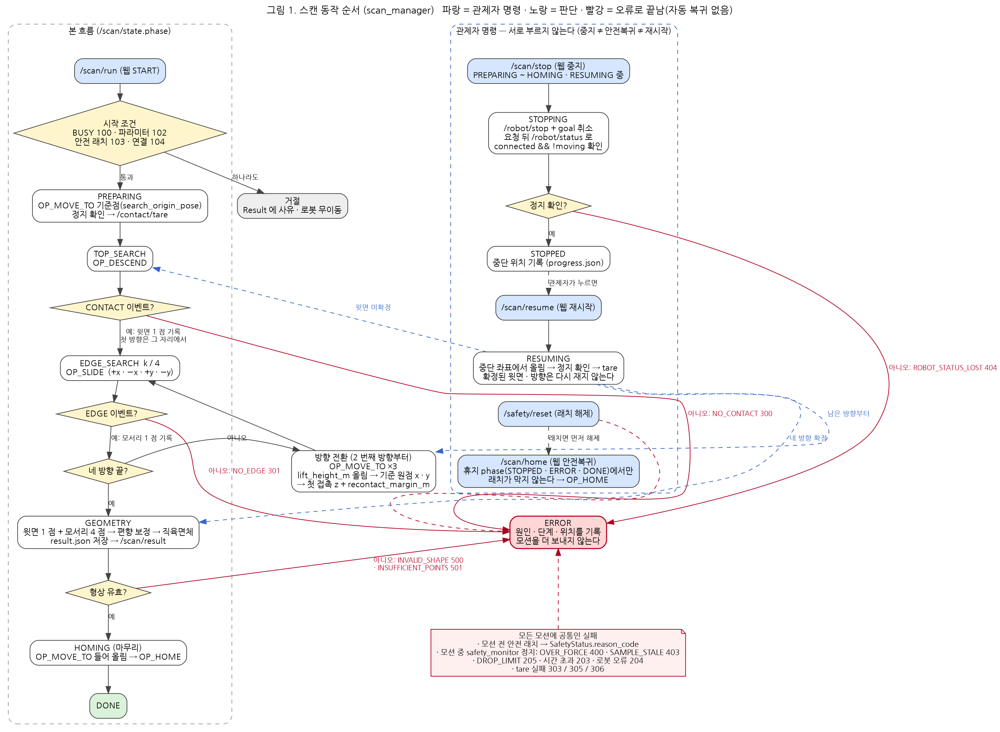
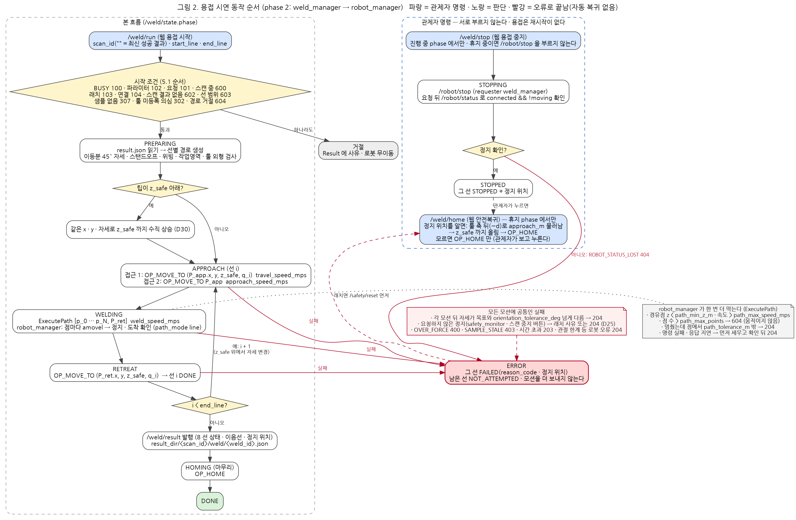

근거: `ws_cobot1/src/scan_manager/README.md`(시퀀스 · 모션 결과 판정 · 재시작) · `docs/contracts/ros-interfaces.md` 5.4 · 7.1~7.4 · phase 2 `docs/phase2/weld-motion.md` 5절 · `weld-ros-interfaces.md` 5.1 · 5.2 · 7.2(PR #184) · weld_manager · robot_manager ExecutePath(PR #191)

# 03. 동작 순서도

작성: 현지 · 2026-09-24. 그림 원본은 Graphviz 텍스트(`.dot`)이고 png 는 거기서 만든다(아래 "그림 파일").

| 그림 | 무엇 | 확인 수준 |
|---|---|---|
| 1. 스캔 | 직육면체를 만져 윗면 1 점 · 모서리 4 점 → 직육면체 · 외곽 엣지 · 경로 후보 (1차 MVP) | **실기 종단 성공**(2026-09-23, PR #179) · Virtual(2026-09-24, 80 s) |
| 2. 용접 시연 | 스캔 결과의 모서리 8 개를 45° 자세 · 스탠드오프 · 위빙으로 따라간다 (phase 2) | **Virtual 만**(2026-09-24, 8 선 완주 242 s). 실기 미실시(9/29 예정) |

두 그림 모두 같은 규칙을 따른다.
- **작업 중지 · 안전복귀 · 재시작은 서로 부르지 않는다**(CLAUDE.md 규칙 3). 중지는 멈춤까지만 확인하고, 홈으로 가거나 이어 가는 것은 관제자가 따로 누른다.
- **실패하면 그 자리에서 멈추고 모션을 더 보내지 않는다.** 자동 홈 복귀는 없다(계약 7.4). 원인 · 단계 · 위치를 기록에 남긴다.
- **정지 완료는 요청 뒤에 찍힌 `/robot/status` 의 `connected && !moving`** 으로만 본다(접수 ≠ 완료).
- 결과 코드는 `ReasonCode`(계약 6.1) 이름과 번호를 그대로 쓴다.

## 그림 1. 스캔

| 단계(`ScanState.phase`) | 하는 일 | 끝나는 조건 · 실패 |
|---|---|---|
| 시작 조건 | `/scan/run` 을 받으면 BUSY 100 → 파라미터 102 → 안전 래치 103 → 연결 104 순으로 본다 | 하나라도 걸리면 거절(로봇 무이동) |
| PREPARING | 기준점(`search_origin_pose`)으로 `OP_MOVE_TO` → 정지 확인 → `/contact/tare` | tare 실패 303 · 305 · 306 → ERROR |
| TOP_SEARCH | `OP_DESCEND` | CONTACT → 윗면 1 점(판정 좌표). 최대 거리까지 없으면 NO_CONTACT 300 |
| EDGE_SEARCH ×4 | 첫 방향은 접촉한 자리에서 바로 `OP_SLIDE`. 2 번째부터 방향 전환 `OP_MOVE_TO` ×3(올림 → 기준 원점 x · y → 첫 접촉 z + 여유) 뒤 `OP_SLIDE` | EDGE → 모서리 1 점. 없으면 NO_EDGE 301 |
| GEOMETRY | 5 점 → 편향 보정 → 직육면체 · 외곽 엣지 · 경로 후보 → `result.json` → `/scan/result` | INVALID_SHAPE 500 · INSUFFICIENT_POINTS 501 |
| HOMING → DONE | 들어 올림 → `OP_HOME` | |
| 공통 | 모든 모션 전에 래치를 본다. 모션 중 safety_monitor 가 멈추면(OVER_FORCE 400 · SAMPLE_STALE 403 · DROP_LIMIT 205) 그 Result 로 ERROR | |

관제자 명령:
- **중지** `/scan/stop` → STOPPING(`/robot/stop` + goal 취소 → 정지 확인) → STOPPED(중단 위치 기록). 확인 못 하면 ROBOT_STATUS_LOST 404 → ERROR.
- **재시작** `/scan/resume`(STOPPED 에서만) → RESUMING: 중단 좌표에서 올림 → 정지 확인 → tare. **확정된 윗면 · 방향은 다시 재지 않고** 남은 단계부터 잇는다(기록 `progress.json` 이 기준).
- **안전복귀** `/scan/home`(휴지 phase 에서만) → `OP_HOME`. 래치가 막지 않는다. 래치를 풀려면 `/safety/reset` 이 따로 있다.

## 그림 2. 용접 시연 (phase 2)

| 단계(`WeldState.phase`) | 하는 일 | 끝나는 조건 · 실패 |
|---|---|---|
| 시작 조건 | `/weld/run`(scan_id `""` = 가장 최근 성공 결과, start_line · end_line)을 받으면 계약 5.1 순서로 본다: BUSY 100 · 파라미터 102 · 요청 101 · **스캔 진행 중 600** · 래치 103 · 연결 104 · 스캔 결과 없음 602 · 선 범위 603 · 샘플 없음 307 · 툴 미등록 의심 302 · 경로 거절 604 | 하나라도 걸리면 거절(로봇 무이동) |
| PREPARING | `result.json` 을 읽어 선마다 경로를 만든다: 두 면 법선을 이등분하는 45° 자세 · 스탠드오프 · 위빙 경유점 · 작업영역 · 툴 외형 검사 | 검사 실패는 시작 전 604 |
| (시작 상승) | 팁이 z_safe 아래면 같은 x · y · 자세로 수직 상승(D30) | |
| APPROACH | 접근 1: z_safe 높이에서 선 i 의 자세로 `OP_MOVE_TO` · 접근 2: 접근점으로 내려감 | |
| WELDING | `ExecutePath` [p_0 … p_N, 후퇴점] — robot_manager 가 점마다 amovel → 정지 · 도착 확인(`path_mode: line`) | 멈췄는데 점에서 3 mm 밖 → 204. robot_manager 도 경유점 z 하한 · 속도 · 점 수를 다시 본다(604) |
| RETREAT | z_safe 로 올라감 → 선 i DONE → 다음 선의 APPROACH | |
| 결과 → HOMING → DONE | `/weld/result`(8 선 상태 · 이음선 · 정지 위치) 발행 · `<result_dir>/<scan_id>/weld/<weld_id>.json` → `OP_HOME` | |
| 공통 | 각 모션 뒤 자세가 목표와 `orientation_tolerance_deg` 넘게 다르면 204. **weld_manager 가 요청하지 않은 정지**(safety_monitor · 스캔 중지 버튼)는 STOPPED 가 아니라 ERROR(D25) | 실패한 선 FAILED, 남은 선 NOT_ATTEMPTED |

관제자 명령:
- **중지** `/weld/stop`(진행 중에만) → STOPPING(`/robot/stop`, requester `weld_manager` → 정지 확인) → STOPPED. **용접은 재시작이 없다**(D7).
- **안전복귀** `/weld/home`(휴지 phase 에서만): 정지 위치를 알면 툴 축 뒤로 `approach_m` 물러남 → z_safe 까지 올림 → `OP_HOME`. 모르면 `OP_HOME` 만 보내므로 관제자가 로봇을 보고 누른다.
- **스캔과 용접은 동시에 돌지 않는다**(D6): 스캔 중 용접 시작은 600. 용접 중 스캔 시작 거절(601)은 scan_manager 쪽 작업(P5)이다.

## 두 흐름의 차이

| | 스캔 | 용접 |
|---|---|---|
| 접촉 | 접촉해서 잰다(CONTACT · EDGE 이벤트로 멈춤) | 접촉하지 않는다(스탠드오프 3 mm). 접촉 이벤트로 멈추지 않고 과대 외력만 멈춘다 |
| 힘 · 순응 제어 | sim 의 힘 제어 밀기(`slide_mode: force`)에서만 켠다(끝나면 반드시 해제). 실기 스텝 모드는 켜지 않는다 | 켜지 않는다(D2). 켜져 있으면 robot_manager 가 경로를 거절 |
| 재시작 | 있다(기록 기준, 확정값 다시 재지 않음) | 없다(D7). 중단 뒤에는 `start_line` 을 정해 새로 시작 |
| 실패 뒤 | 자동 복귀 없음 · 관제자 안전복귀 | 같다 |
| 걸린 시간 | Virtual 80 s · 실기 스텝 모드 438 s(KPI 120 s 불합격, #180) | Virtual 8 선 242 s(점마다 약 0.5 s 멈춤). 실기 미측정 |

## Virtual 에서 순서도가 바뀐 곳 (2026-09-24)
- 용접 선을 옮길 때마다 툴이 같은 쪽으로 90° 씩 돌아 **6 축 관절(J6)이 한계(−360°)를 넘어** L1 · L7 접근에서 멈췄다. 흐름은 그대로 두고 `tool_roll_deg`(선별 툴 축 회전, D24)를 `[0, 0, 180, 180, 0, 0, 180, 180]` 으로 두어 풀었다(sim). 실기 값은 9/29 M1 에서 정한다.
- ExecutePath 의 spline 방식은 응답이 늦어 샘플이 끊기므로(SAMPLE_STALE) 쓰지 않고, 점마다 서는 line 방식만 그림에 넣었다.

## 그림 파일
| 파일 | 설명 |
|---|---|
| `docs/presentation/assets/hyunji/flow-scan.dot` · `.png` | 그림 1 (3019 × 2210 px) |
| `docs/presentation/assets/hyunji/flow-weld.dot` · `.png` | 그림 2 (3341 × 2185 px) |

- 다시 만들기: `dot -Tpng -Gdpi=150 flow-scan.dot -o flow-scan.png`(graphviz 2.43, 글꼴 나눔고딕). drawio 대신 텍스트 원본을 둔 것은 노드 · 코드 이름을 계약 문서와 grep 으로 맞춰 보기 쉽게 하려는 것이다. drawio 가 필요하면 png 를 배경으로 옮겨 그린다.
- 구글 드라이브 `deliverables` 폴더에는 이 md 를 pdf 로, 두 png 를 그대로 올린다.
