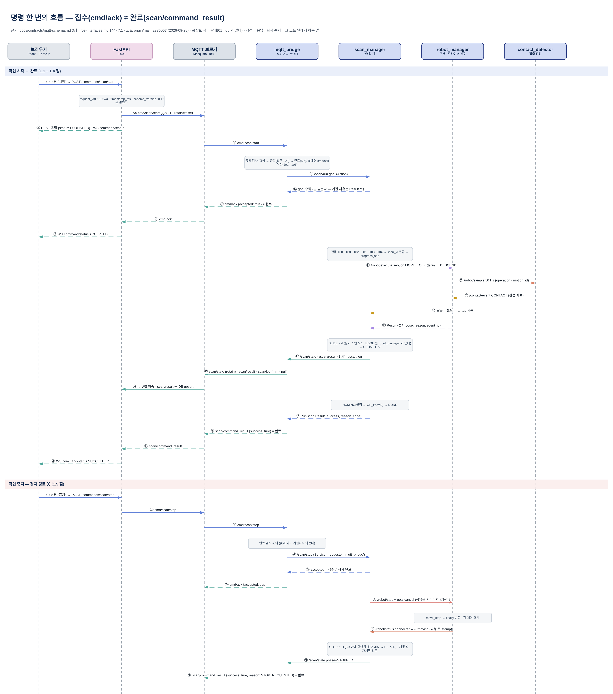

근거: `docs/contracts/ros-interfaces.md` · `mqtt-schema.md` · `units-frames.md` · `CHANGELOG.md`(1차, 최신 v0.1.22) · `docs/phase2/weld-ros-interfaces.md` · `weld-mqtt-schema.md`(phase 2, v0.2.0) · `ws_cobot1/src/contact_scan_interfaces/` · `ws_cobot1/src/*` · `backend/` · `frontend/` · `docker/` (origin/main `2335057`, 2026-09-28) · 형식 출발 `docs/design/contact-scan-interface-spec-integrated-v1.2.md`

# 05. 토픽 · 서비스 · 액션 인터페이스 정의서 (v1.3)

> **문서 상태**: 계약 v0.1.22 · phase 2 v0.2.0 · main `2335057` 대조 (2026-09-28)
> **구속력 있는 원본은 `docs/contracts/` · `docs/phase2/` 다. 이 문서와 다르면 원본이 맞다.** 이 문서는 원본을 시나리오 · 전체 목록 · 구현 대조로 다시 묶은 정리본이다. 타입 전문(3~5장 · 15.6)은 인터페이스 패키지의 `.msg` · `.srv` · `.action` 파일을 그대로 옮겼다(패키지는 계약 문서와 CI 로 동기화된다).
> **v1.3 (2026-09-28, 병후)**: 설계 문서 v1.2(9/18, 계약 v0.1 동결 시점)의 형식을 따라 다시 썼다. v1.2 이후 바뀐 계약 22 개 판(v0.1.1 ~ v0.1.22 중 21 개 · v0.2.0)과 main 코드를 반영하고, 계약과 구현이 다른 곳을 10장에 모았다. 이전 요약본(9/27)은 `archive/v1-matplotlib-graphviz/05-interfaces-summary-20260927.md`.
> 짝 문서: [01 시스템 아키텍처](01-system-architecture.md)(카드별 입력 → 처리 → 출력) · [06 ROS2 노드 구조도](06-node-graph.md)(선 번호 L · P · X · C · W) · 그림 [`05-interfaces.drawio`](05-interfaces.drawio)(명령 흐름 · 정지 경로)

**읽는 순서**
- **Part 1 (0~10장) — ROS 2**: `contact_scan_interfaces` 와 자체 노드 5 개 사이의 Topic · Service · Action · 파라미터 · 공통 정의 · 계약과 구현의 차이.
- **Part 2 (11~14장) — 웹 연동**: 연결 구조 · 저장 책임 · MQTT · Web API 경계 · 공통 규칙.
- **Part 3 (15장) — phase 2 용접**: 추가된 노드 · 타입 · 배타 규칙 · 구현 상태.
- **Part 4 (16~17장) — 이력**: v1.2 → v1.3 에서 바뀐 계약, 이 문서를 고치는 법.



---

# Part 1 — ROS 2

## 0. 문서 정보

### 0.1 기준 문서와 우선순위
| 순위 | 문서 | 역할 |
|---|---|---|
| 1 | `docs/contracts/ros-interfaces.md` · `mqtt-schema.md` · `units-frames.md` (v0.1.22) | 1차 계약. 타입 전문 · 연결 표 · 동작 규칙 · 단위와 프레임 |
| 1 | `docs/phase2/weld-ros-interfaces.md` · `weld-mqtt-schema.md` · `weld-motion.md` (v0.2.0) | phase 2 계약 |
| 2 | `ws_cobot1/src/contact_scan_interfaces/` (msg 15 · srv 6 · action 6) | 계약의 타입 전문을 옮긴 파일. 문서와 어긋나면 `test/test_contract_sync.py` 가 CI 에서 실패한다 |
| 3 | 코드 (origin/main `2335057`) | 이 문서의 "구현" 표기의 근거 |
| 참고 | `docs/BRD.md` v3.2.0 | 요구사항 절 번호(4.x.x · TR · US) |
| 참고 | `docs/design/contact-scan-interface-spec-integrated-v1.2.md` | 형식 · 설계 배경. 계약과 다르면 계약 |

### 0.2 표기
| 표기 | 뜻 |
|---|---|
| (표시 없음) | 계약에 있고 main 코드에도 있다 |
| **계약만** | 계약에는 있고 main 코드에는 없다. 10장에 모았다 |
| **[P2]** | phase 2(용접). 계약은 main, 구현은 대부분 머지 전이다(15장) |
| **[v0.1.x]** | 그 계약 판에서 더하거나 바꾼 것 |

- 수치는 **설계 출발값이거나 실측으로 조정한 yaml 값**이며 계약이 아니다. 값은 `contact_scan_bringup/config/real.yaml` · `sim.yaml` 에만 둔다(CLAUDE.md 규칙 7). 이 문서의 값은 2026-09-28 real / sim 이다.
- 두산 · RG2 드라이버와 MQTT 브로커는 정의하지 않고 이름과 방향만 적는다(8장).

### 0.3 패키지 · 단위 · 프레임 규칙
| 항목 | 규칙 |
|---|---|
| 정의 패키지 | `contact_scan_interfaces`(ament_cmake, msg · srv · action 전용 · 실행 노드 아님). QoS 는 이 패키지가 설치하는 Python 모듈 `contact_scan_qos` 한 곳 |
| 실행 패키지 | 노드별 패키지(`scan_manager` · `robot_manager` · `contact_detector` · `safety_monitor` · `mqtt_bridge` + `contact_scan_bringup`) · 실행 파일명 = 노드명 · **네임스페이스 없음**(이름은 절대 이름). [P2] `weld_manager` 가 6 번째 |
| 단위 | ROS 안은 길이 m · 각도 rad(자세는 quaternion) · 힘 N · 토크 N·m · 시간 s. **웹 표시는 mm**, 변환은 mqtt_bridge 한 곳. 두산 posx(mm · deg ZYZ) ↔ m · quaternion 변환은 robot_manager 한 곳 |
| 시각 | `builtin_interfaces/Time`, 메인 PC ROS 시계. TCP 와 힘은 **취득 시각을 각각** 싣는다(`pose_stamp` · `force_stamp`, 동시 취득으로 보지 않는다) |
| 프레임 | 샘플 · 이벤트 · 모션 = Base(`base_link`, 가칭). `ScanResult` = 작업대 좌표(`workpiece_fixture`, 가칭). 변환은 scan_manager 한 곳(평행 이동 `base_to_fixture`) |
| 무효 값 | 측정하지 못한 float 는 **`NaN` + 짝 `*_valid=false`**. 0 을 넣지 않는다. 받는 쪽은 `*_valid` 로만 판단한다. MQTT 는 `null`, Python 은 `None` (TR-10) |
| ID 없음 | 숫자 ID 는 `0`, 문자열 ID 는 `""` |
| 접수 ≠ 완료 | `accepted` · `success` 응답은 접수 · 처리 여부다. 로봇 정지의 **완료**는 `/robot/status` 의 `connected && !moving` 으로만 본다 |
| 독립 명령 | 작업 중지 · 안전복귀 · 재시작 · 안전 해제는 서로 독립이다. 중지가 홈 복귀 · 재시작을 부르지 않는다. 실패해도 자동 홈 복귀는 없다 |

---

## 1. 입출력 흐름 (시나리오별)

표기: `[웹]` = 브라우저 → FastAPI → MQTT · `T` Topic · `S` Service · `A` Action. 들여쓴 줄은 그 단계를 하는 노드다. 값은 2026-09-28 real.yaml.

### 1.1 작업 시작 (US-01 · 4.1.3 · 4.1.5 · 4.2.1)
```
[웹] 버튼 "시작" → POST /commands/scan/start → MQTT cmd/scan/start {schema_version, request_id, timestamp_ms, payload}
  ↓ mqtt_bridge   공통 검사(형식 → 중복 → 만료). 실패면 cmd/ack accepted=false (101 · 106)
/scan/run (A · Goal {request_id, use_override, config_override})
  ↓               goal 수락 → cmd/ack accepted=true (접수일 뿐이다)
  ↓ scan_manager  관문: BUSY 100 → 세 노드 값 되읽기 · 쌍 불일치 108 → 값 합치기(yaml ← SetConfig ← override) · 검사 102
                        → [P2] 용접 중 601 → /safety/status 미수신 · 끊김 · 래치 103 → /robot/status 미수신 · 끊김 · 미연결 104
                  거절도 goal 을 받은 뒤 Result(success=false, reason_code)로 끝낸다 → scan/command_result 로 온다
                  통과: scan_id 발급 → progress.json 을 디스크에 쓴 뒤 → /scan/state phase=PREPARING
/robot/execute_motion (A · OP_MOVE_TO search_origin_pose)      → Result {pose, reason=TARGET_REACHED}
  ↓ scan_manager  정지 확인(/robot/status connected · !moving)
/contact/tare (S · duration_s=0 → tare_duration_s 1.5 s)        → success · offset(F₀) · error(302 · 305 · 306 · 307)
/robot/execute_motion (A · OP_DESCEND, max_distance = max_descend_m 50 mm, 3 mm/s) → /scan/state phase=TOP_SEARCH
```

### 1.2 윗면 접촉 — DESCEND (4.1.1 · 4.1.4 · 4.2.1)
```
robot_manager   /robot/sample (T · operation=OP_DESCEND · motion_id)   설정 50 Hz · 실기 약 43 Hz
  ↓ contact_detector  이동 기준 F₀ = 최근 [t−1.0, t−0.3] s 외력 평균 (출발 5.5 s 안은 tare F₀ + 6 N 기준) [v0.1.12]
                      |F − F₀| > contact_threshold_n(3 N) 이 debounce_n(3) 회 연속 → CONTACT 확정
/contact/event (T · TYPE_CONTACT · pose = 조건이 처음 성립한 샘플 · detect_stamp = 확정 샘플) [v0.1.5]
  ├→ robot_manager   motion_id 대조 · 지금 goal 이 DESCEND → move_stop → Result {pose(정지 좌표), reason=CONTACT, event_id}
  ├→ scan_manager    Result.event_id 로 짝을 맞춘다 → 판정 z = 윗면 z_top (정지 좌표와 구분)
  └→ mqtt_bridge     contact/event (화면 · DB)
미접촉으로 max_descend_m 도달 → Result MAX_DISTANCE → NO_CONTACT(300) → phase=ERROR
```

### 1.3 모서리 — SLIDE, 방향 4 개 (4.1.2 · 4.2.2 · 4.2.6 · 4.5.4)
```
scan_manager    방향 순서 direction_order = +X → −X → +Y → −Y
                첫 방향: 그 자리에서 바로 OP_SLIDE
                다음 방향: OP_MOVE_TO 세 번 — z + lift_height_m(50 mm) → 원점 x · y → 첫 접촉 z + recontact_margin_m(1 mm)
                           까지 저속(recontact_speed_mps 2 mm/s). 재하강(DESCEND)은 없다 [7.3 절]
/robot/execute_motion (A · OP_SLIDE · direction · max_distance = max_slide_m 60 mm)
  ↓ robot_manager  slide_mode = step (실기 기본) [v0.1.15]
                     1 mm 들어 F₀ → 누름 → 0.5 mm 씩 긁고 멈춰 힘을 읽어 ΔFz 를 3 ~ 7 N 으로 유지
                     → 힘이 빠지면 0.5 mm 더 내려 확인 → 0.1 mm 로 다듬기
                     → /contact/event TYPE_EDGE (source="robot_step", event_id ≥ 2³²) → Result reason=EDGE
                   slide_mode = force (sim) — 순응 + −z 목표 힘(slide_target_force_n) → contact_detector 의 z 추세선 EDGE
                   하강 제한: SLIDE 첫 샘플 z 기준 > drop_limit_m(5 mm) → 1 차 robot_manager 즉시 정지(205)
                              > 5 + 5 mm → 2 차 safety_monitor 정지 + 래치 [v0.1.21]
scan_manager    EDGE 짝 → 좌표 기록 → progress n/4 → 다음 방향
```

### 1.4 형상 계산 · 마무리 (4.2.4 · 4.3 · 4.4.7)
```
EDGE 4/4 → GEOMETRY  편향 보정 d = √(2rδ − δ²) (r = tip_radius_m 2 mm, δ = 판정의 z_drop) + 속도 × 지연(스텝 모드는 0)
                     → 윗면 사각형 · 외곽 엣지 · 경로 후보 4 · 지지면 투영 직육면체(꼭짓점 8 · 모서리 12)
                     → result_store result.json → /scan/result (T · 1 회, 발행할 때마다 stamp 새로)
         → HOMING    OP_MOVE_TO(정지 좌표 z + lift) → OP_HOME(home_joint_deg)
         → DONE      RunScan Result → mqtt_bridge → scan/command_result
형상 실패(500 · 501) → ERROR, 자동 복귀 없음 · 마무리 복귀 실패 → 측정은 그대로 유효, RunScan.success=false
```

### 1.5 작업 중지 — 정지 경로 ① (US-04 · 4.5.1 · 4.2.3)
```
[웹] 버튼 "중지" → cmd/scan/stop (만료 검사 제외 — 중지는 늦게 도착해도 거절하지 않는다)
  ↓ mqtt_bridge   /scan/stop (S · requester='mqtt_bridge', reason=200) → cmd/ack (accepted = 접수)
  ↓ scan_manager  STOPPING → /robot/stop (S · 응답을 기다리지 않는다) + ExecuteMotion goal cancel 을 함께
  ↓ robot_manager move_stop (force 모드면 release_force 먼저) → Result STOP_REQUESTED · finally 순응 · 힘 제어 해제
  ↓ scan_manager  요청 뒤 stamp 의 /robot/status connected && !moving 확인(stop_confirm_timeout_s 5 s)
                  → STOPPED (중단 위치 · 확정 측정값 보존) · 확인 못 하면 STOP_UNCONFIRMED(407) → ERROR [v0.1.21]
  ↓ mqtt_bridge   /scan/state 가 STOPPED → scan/command_result success (ERROR 면 실패, 코드 = 마지막 ERROR 로그)
홈 복귀 · 재시작을 부르지 않는다.
```

### 1.6 안전복귀 (US-11 · 4.4.9) [v0.1.21]
```
[웹] 버튼 "안전복귀" → cmd/scan/home → /scan/home (A · ReturnHome)
  ↓ scan_manager  접수: BUSY 100 · 복귀 파라미터 102 · /robot/status 104
                  (래치 · 용접 · /safety/status 끊김은 막지 않는다 — 래치 때문에 돌아오지 못하면 안 된다)
                  ① 손상 의심? 직전 실패 또는 지금 래치의 사유가 400 · 205 · 402 → 107 (사람이 조그)
                  ② 지금 위치를 아는가? 마지막 유효 /robot/sample 이 pose_max_age_s(1 s) 안 → 아니면 107
                  ③ 수직 올림 OP_MOVE_TO (x · y · 자세 그대로, z + lift_height_m)
                  ④ 올림이 TARGET_REACHED? 아니면 HOME 을 보내지 않고 그 사유로 끝낸다
                  ⑤ OP_HOME → 출발했던 휴지 phase 로
```
계약 7.5 의 순서는 ① 위치 → ② 손상 의심이고 코드는 손상 → 위치 순이다. 둘 다 107 이라 결과는 같고 `detail` 문구만 다르다(10장).

### 1.7 재시작 (US-12 · 4.4.8 · TR-08) [v0.1.21]
```
[웹] 버튼 "재시작" → cmd/scan/resume {scan_id: "" = 가장 최근} → /scan/resume (A · Resume)
  ↓ scan_manager  접수: BUSY 100 → 세 노드 값 되읽기 · 쌍 불일치 108 → 기록 못 한 안전복귀 107 → 파라미터 102
                  → STOPPED · ERROR 가 아니면 105 → [P2] 용접 중 601 → 래치 103 → 로봇 104
                  → 기록 검사: 기록 없음 105 · ERROR 는 허용 목록 403 · 404 · 407 만(사람이 /safety/reset 한 뒤, 그 밖 107)
                    · 안전복귀 뒤면 107 (중단 위치 재접근 절차 TBD) → 지금 TCP pose 를 모르면 107 로 접수 전 거절
                  RESUMING → 지금 자리 수직 올림 → 정지 확인 → tare → 원점 x · y → 첫 접촉 z + 1 mm → 남은 방향만 SLIDE
                  확정 측정값은 다시 재지 않는다 · GEOMETRY 에서 멈췄으면 result.json 재발행 또는 다시 계산
```
재시작의 원본은 웹 DB 가 아니라 메인 PC 의 `progress.json` 이다(4.4.7). 자동 재개는 없다.

### 1.8 안전 이상 — 정지 경로 ③ (4.5.3 · TR-07)
```
robot_manager   /robot/sample · /robot/status → safety_monitor
  ↓ safety_monitor  조건(하나라도): OVER_FORCE 400 |F| > over_force_n(30 N) · DROP_LIMIT 205 SLIDE 첫 z 기준 > 5 + 5 mm
                                    · SAMPLE_STALE 403 샘플 끊김 > 500 ms · ROBOT_STATUS_LOST 404 상태 끊김 > 500 ms
                    → 래치(첫 원인 유지) → /robot/stop (S · requester='safety_monitor', reason = 그 사유) — 웹 경유 없음
  ↓ robot_manager   정지 → ExecuteMotion Result.reason_code = 그 사유 → scan_manager 는 실패 처리(ERROR)
/safety/status (T · level=STOP · latched · reason_code) → scan_manager(시작 · 재시작 거절 103) · mqtt_bridge(화면)
정지 확인 0.6 s 안에 안 되면 2 s 마다 다시 요청하고 detail 에 "물리 비상정지가 필요할 수 있다"를 싣는다
```

### 1.9 과대 외력 — 정지 경로 ② (4.5.3 · 위험 4)
```
contact_detector  모든 operation 에서 원시 |F| > over_force_n(30 N) → /contact/event TYPE_OVER_FORCE (초과 구간마다 1 회)
  ├→ robot_manager   motion_id 대조 없이 우선 정지 → Result OVER_FORCE
  ├→ scan_manager    실패 처리 · 원인 · 위치 · 단계 기록
  └→ mqtt_bridge     화면
safety_monitor 도 같은 조건을 따로 감시해 래치한다(1.8, 두 겹 — 7.6 절)
```

### 1.10 안전 래치 해제
```
[웹] 버튼 "안전 해제"(래치가 아닌 것이 확인되면 꺼진다 · safety/status 미수신이면 켜져 있다) → cmd/safety/reset → /safety/reset (S · ResetSafety)
  ↓ safety_monitor  지금 참인 조건이 있는가? → 있으면 CONDITION_ACTIVE(406) 거절 + 남은 조건 이름
                    없으면 래치 · 원인 · 정지 추적 초기화 → success (로봇은 움직이지 않는다)
/safety/status (T · latched=false) → scan_manager(시작 · 재시작 허용) · mqtt_bridge
set_config · safety/reset 은 cmd/ack 가 곧 결과다(scan/command_result 없음)
```

### 1.11 설정 등록 (US-05) — 화면 버튼은 아직 없다(TR-05)
```
[웹] POST /commands/scan/set_config {payload: mm 단위 설정 키} → cmd/scan/set_config
  ↓ mqtt_bridge   보낸 키만 *_set=true, mm → m · 모르는 키는 거절 → /scan/set_config (S · SetConfig)
  ↓ scan_manager  휴지 phase 에서만(아니면 100) · 범위 검사(102, 하나라도 틀리면 아무것도 적용하지 않는다)
                  → 자기 값 반영 → SetParameters 로 전파 P03 safety_monitor → P02 contact_detector → P01 robot_manager
                  → GetParameters 로 되읽기 → 어긋나면 PARAM_SET_FAILED(108)
  ↓               응답 applied = 되읽은 실제 값 → cmd/ack (applied 는 mm)
```

---

## 2. 전체 목록

"06" 열은 [06 노드 구조도](06-node-graph.md) 연결 표의 번호다.

### 2.1 Topic
| 이름 | 타입 | 발행 | 구독 | QoS | 빈도 | 06 |
|---|---|---|---|---|---|---|
| `/robot/sample` | `RobotSample` | robot_manager | contact_detector · safety_monitor · mqtt_bridge · scan_manager [v0.1.21] · [P2] weld_manager | SENSOR | 설정 50 Hz · 실기 약 43 Hz · Virtual 37.6 ~ 49.8 Hz | L13 · L14 · L15 · L30 · W11 |
| `/robot/status` | `RobotStatus` | robot_manager | scan_manager · safety_monitor · mqtt_bridge · [P2] weld_manager | STATE | 10 Hz + 바뀔 때 (Virtual 9.3 ~ 9.8 Hz) | L16 · L17 · L18 · W09 |
| `/contact/event` | `ContactEvent` | contact_detector · robot_manager(스텝 EDGE) [v0.1.15] | robot_manager · scan_manager · mqtt_bridge | EVENT | 판정 확정 때 1 회 | L19 ~ L21 · L28 · L29 |
| `/scan/state` | `ScanState` | scan_manager | contact_detector · mqtt_bridge · safety_monitor(**계약만**) · [P2] weld_manager | STATE | 바뀔 때 + 1 s | L06 · L09 · L10 · W08 |
| `/scan/result` | `ScanResult` | scan_manager | mqtt_bridge | STATE | 작업 끝에 1 회(실패 · 중단 포함) | L07 |
| `/scan/log` | `ScanLog` | scan_manager | mqtt_bridge | LOG | 사건마다 | L08 |
| `/safety/status` | `SafetyStatus` | safety_monitor | scan_manager · mqtt_bridge · [P2] weld_manager | STATE | 바뀔 때 + 1 s | L24 · L25 · W10 |
| `/web/heartbeat` | `WebHeartbeat` | mqtt_bridge | safety_monitor(**계약만**) | HEARTBEAT | MQTT `hb/web` 을 받았을 때만 — 웹이 보내지 않아 **실제로는 나가지 않는다** | L26 |
| `/dsr01/joint_states` | `sensor_msgs/JointState` | 두산 `joint_state_broadcaster` · `joint_state_publisher` | mqtt_bridge | SENSOR | 드라이버 주기 → MQTT 20 Hz · **표시 전용** [v0.1.19 · v0.1.20] | P04 |
| [P2] `/weld/state` | `WeldState` | weld_manager | scan_manager(#204, main) · mqtt_bridge(계약만) | STATE | 바뀔 때 + 1 s | W04 · W07 |
| [P2] `/weld/result` | `WeldResult` | weld_manager | mqtt_bridge(계약만) | STATE | 작업 끝에 1 회 | W05 |
| [P2] `/weld/log` | `ScanLog` | weld_manager | mqtt_bridge(계약만) | LOG | 사건마다 | W06 |

### 2.2 Service
| 이름 | 타입 | 서버 | 클라이언트 | 뜻 | 06 |
|---|---|---|---|---|---|
| `/robot/stop` | `StopRobot` | robot_manager | scan_manager · safety_monitor · [P2] weld_manager | 로봇 정지 요청. `requester` · `reason` 을 남긴다. 접수 ≠ 정지 완료 | L22 · L23 · W14 |
| `/contact/tare` | `TareForce` | contact_detector | scan_manager | 외력 기준값 F₀(무접촉 · 정지). 툴 등록 점검 겸용 [v0.1.12] | L12 |
| `/scan/stop` | `StopScan` | scan_manager | mqtt_bridge | 작업 중지 요청 | L04 |
| `/scan/set_config` | `SetConfig` | scan_manager | mqtt_bridge | 설정 등록. 동작 중 거절 | L05 |
| `/safety/reset` | `ResetSafety` | safety_monitor | mqtt_bridge | 안전 래치 해제. 조건이 사라졌을 때만. 로봇을 움직이지 않는다 | L27 |
| [P2] `/weld/stop` | `StopWeld` | weld_manager | mqtt_bridge(계약만) | 용접 중지 | W03 |

### 2.3 Action
| 이름 | 타입 | 서버 | 클라이언트 | 뜻 | 06 |
|---|---|---|---|---|---|
| `/scan/run` | `RunScan` | scan_manager | mqtt_bridge | 새 작업 시작 | L01 |
| `/scan/home` | `ReturnHome` | scan_manager | mqtt_bridge | 안전복귀 = 홈(시작 위치) | L02 |
| `/scan/resume` | `Resume` | scan_manager | mqtt_bridge | 재시작 — **별도 Action** | L03 |
| `/robot/execute_motion` | `ExecuteMotion` | robot_manager | scan_manager · [P2] weld_manager | 단위 모션 1 개(MOVE_TO · DESCEND · SLIDE · HOME). Result = 정지 pose + 사유 | L11 · W13 |
| [P2] `/weld/run` | `RunWeld` | weld_manager | mqtt_bridge(계약만) | 용접 시작 | W01 |
| [P2] `/weld/home` | `ReturnHome` | weld_manager | mqtt_bridge(계약만) | 용접의 안전복귀(1 차 타입 재사용) | W02 |
| [P2] `/robot/execute_path` | `ExecutePath` | robot_manager(PR #191 머지 전) | weld_manager | 경유점을 차례로 지나는 직선 이동. 접촉 판정 · 힘 제어 없음 | W12 |

### 2.4 하위 메시지 (다른 메시지 안에서만 쓴다 · 토픽 없음)
| 타입 | 쓰는 곳 |
|---|---|
| `ScanConfig` | `SetConfig` 요청 · 응답(`applied`) · `RunScan` goal(`config_override`) · `ScanResult.config` |
| `Segment` | `ScanResult.edges[12]` · `path_candidates[4]` |
| `ReasonCode` | 상수 전용(7.2 절). `reason` · `error` · `reason_code` · `code` 필드가 모두 이 표를 쓴다 |
| [P2] `WeldConfig` · `WeldLine` | `RunWeld` goal · `WeldResult.lines[8]` |

### 2.5 표준 ROS 인터페이스 (자체 정의 없음)
| # | 경로 | 타입 | 전파하는 값 |
|---|---|---|---|
| P01 | scan_manager → `/robot_manager/set_parameters` | `rcl_interfaces/srv/SetParameters` | `slide_target_force_n`(← `ScanConfig.target_force_n`) · `drop_limit_m` |
| P02 | scan_manager → `/contact_detector/set_parameters` | 같음 | `contact_threshold_n` · `edge_drop_m` · `debounce_n` · `over_force_n` |
| P03 | scan_manager → `/safety_monitor/set_parameters` | 같음 | `over_force_n` · `drop_limit_m` (두 겹 감시의 같은 값) |
| — | scan_manager → `*/get_parameters` | `rcl_interfaces/srv/GetParameters` | 기동 · START · RESUME 직전과 SetConfig 뒤 되읽기(쌍이 어긋나면 108) |
| P04 | 두산 드라이버 → mqtt_bridge `/dsr01/joint_states` | `sensor_msgs/msg/JointState` | 표시 전용 관절값 |

`slide_target_force_n` 은 `set_desired_force` 에 `DR_FC_MOD_REL` 로 실린다. 기준이 호출 시점의 힘이므로 **tare 대비 절대 누름이 아니다**(계약 2.4 절). 실기 기본인 스텝 모드에서는 이 값 대신 `step_follow_lo_n` · `step_follow_hi_n`(3 ~ 7 N) 띠를 쓴다.

### 2.6 외부 (정의하지 않음 · 8장)
두산 `dsr_msgs2` 서비스 · OnRobot RG2 · MQTT 브로커.

---

## 3. 메시지 (msg)

메시지마다 **누가 채우는지와 받는 쪽이 지킬 규칙**을 몇 줄 적고, 타입 전문을 붙인다.

### 3.1 `RobotSample` — `/robot/sample`
- robot_manager 가 50 Hz 타이머로 posx → tool_force → (5 회마다) robot_state 를 **한 줄로 차례로** 불러 만든다(동시 호출하면 드라이버가 멈췄다). 그래서 `pose_stamp` 와 `force_stamp` 가 2 ~ 16 ms 떨어진다.
- `motion_id` · `operation` = 지금 실행 중인 goal 의 값. contact_detector 는 판정 모드를, safety_monitor 는 SLIDE 첫 샘플(하강 제한 기준 z)을 여기서 얻는다. [P2] ExecutePath 중에는 `operation=5 (WELD_PATH)`.
- 평균이 아니라 **공백 꼬리**가 최신성 한계를 정한다(9/20 Virtual 통합 세션 342 · 340 · 201 ms, 9/21 ~ 22 실기 최대 687 ms 공백 — 계약 6.3 절).

```
# msg/RobotSample.msg  (contact_scan_interfaces, 그대로 옮김)
# TCP pose + 외력 통합 샘플. 각 취득 시각을 별도 보존한다 (BRD 4.1.6).
# operation: robot_manager 가 지금 실행 중인 ExecuteMotion goal 의 종류. ExecuteMotion.action 의 OP_* 와 같은 값.
uint8 OP_NONE=0
uint8 OP_MOVE_TO=1
uint8 OP_DESCEND=2
uint8 OP_SLIDE=3
uint8 OP_HOME=4
uint8 OP_WELD_PATH=5                # ExecutePath 실행 중 (phase 2). ExecuteMotion goal 에는 쓰지 않는다

uint64 sample_id                    # robot_manager 발급, 발행마다 +1
string frame_id                     # pose · wrench 의 기준 프레임 ('base_link' 가칭)
geometry_msgs/Pose pose             # TCP pose. m, quaternion
builtin_interfaces/Time pose_stamp  # get_current_posx 응답을 받은 시각
geometry_msgs/Wrench wrench         # 외력 추정. N, N·m. get_tool_force(ref=DR_BASE)
builtin_interfaces/Time force_stamp # get_tool_force 응답을 받은 시각
bool valid                          # 두 값 모두 정상 취득이면 true
uint32 motion_id                    # 실행 중인 goal 의 motion_id. 없으면 0
uint8 operation                     # 실행 중인 goal 의 종류. 없으면 OP_NONE
```

### 3.2 `RobotStatus` — `/robot/status`
- `moving` = 최근 0.3 s 창 안의 TCP 위치 변화 > 0.2 mm (위치를 모르면 이동 중). `get_robot_state` 는 Virtual 에서 이동 중에도 STANDBY 를 돌려줘 쓰지 않는다(v0.1.4).
- **정지 완료의 유일한 근거**: 요청보다 뒤의 `stamp` 로 `connected && !moving`.
- [v0.1.21] SLIDE 누름 목표 6 개(`slide_mode` · `slide_force_*` · `step_press_lo/hi_n`)를 따로 싣는다 — 서로 기준이 다른 값을 섞지 않으려고.
- `error` · `error_code` 는 필드만 있고 지금은 늘 `false` · `OK` 다(**계약만**, 10장).

```
# msg/RobotStatus.msg  (contact_scan_interfaces, 그대로 옮김)
builtin_interfaces/Time stamp
bool connected              # dsr_controller2 서비스 응답 가능
bool moving                 # 정지 완료 = connected && !moving
bool error
uint16 error_code           # ReasonCode, 0 = 없음
bool compliance_active      # 순응 제어(task_compliance_ctrl) 켜짐
bool force_ctrl_active      # 힘 제어(set_desired_force) 켜짐
uint32 motion_id            # 실행 중인 goal. 없으면 0
uint8 operation             # RobotSample.OP_* 와 같은 값

# SLIDE 의 누름 목표. 서로 다른 세 값을 섞지 않으려고 따로 싣는다 (v0.1.21)
string slide_mode                 # 'force' = 순응 · 힘 제어(REL), 'step' = 위치 제어 스텝. 그 밖은 ''
float64 slide_force_setpoint_n    # force 모드 설정 증분 힘(DR_FC_MOD_REL). step 모드 · 모름이면 NaN
float64 slide_force_baseline_n    # 이번 SLIDE 를 시작한 시점의 기준 Fz. 모르면 NaN
float64 slide_force_estimate_n    # 추정 최종 누름 = 기준 + 설정. **추정값이며 실측이 아니다.** 모르면 NaN
float64 step_press_lo_n           # step 모드 목표 누름 ΔFz 하한. force 모드 · 모름이면 NaN
float64 step_press_hi_n           # step 모드 목표 누름 ΔFz 상한. force 모드 · 모름이면 NaN

string detail
```

### 3.3 `ContactEvent` — `/contact/event`
- 판정 확정 즉시 1 회. `pose` · `wrench` · `sample_id` 는 **조건이 처음 성립한 샘플**, `detect_stamp` · `force_delta_n` 은 확정(N 번째) 샘플의 값이다(v0.1.5).
- `motion_id` 는 판정 샘플의 값을 복사한다. robot_manager 는 이 값을 지금 goal 과 대조해 **자기 goal 의 이벤트일 때만** 멈춘다. OVER_FORCE 는 대조 없이 멈춘다.
- 스텝 모드 EDGE 는 robot_manager 가 낸다: `source="robot_step"` · `event_id ≥ 2³²` · `z_drop_valid=true` · `debounce_count=1` [v0.1.15].
- DB 중복 키 = (`scan_id`, `event_id`).

```
# msg/ContactEvent.msg  (contact_scan_interfaces, 그대로 옮김)
uint8 TYPE_CONTACT=0        # 접촉 발생 확정
uint8 TYPE_EDGE=1           # 접촉 소실 확정 = BRD 의 "엣지"
uint8 TYPE_OVER_FORCE=2     # 과대 외력

uint64 event_id             # contact_detector 발급, 발행마다 +1
string scan_id              # /scan/state 에서 받은 현재 scan_id. 없으면 ""
uint32 motion_id            # 판정에 쓴 RobotSample.motion_id 를 그대로 복사
uint64 sample_id            # 판정 샘플(= 조건이 처음 성립한 샘플)의 RobotSample.sample_id
uint8 type
string source               # 'robot_force' | 'sim' | 'robot_step' (robot_manager 스텝 모드 SLIDE 의 EDGE, v0.1.15)
string frame_id             # RobotSample 과 동일
geometry_msgs/Pose pose     # 판정 샘플의 TCP pose (≠ 확정 샘플, ≠ 정지 완료 좌표)
geometry_msgs/Wrench wrench # 판정 샘플의 외력
builtin_interfaces/Time pose_stamp     # 판정 샘플의 값
builtin_interfaces/Time force_stamp    # 판정 샘플의 값
builtin_interfaces/Time detect_stamp   # 판정을 확정한 시각 (확정 샘플. 연속 N 번째)
float64 force_delta_n       # 확정 샘플의 |F − F0|. OVER_FORCE 는 원시 |F|
float64 z_drop_m            # EDGE 판정 샘플의 실제 z 하강량. 그 외 type 은 NaN
bool z_drop_valid
uint8 debounce_count        # 판정을 확정한 연속 횟수
```

### 3.4 `ScanState` — `/scan/state`
- 바뀌면 즉시 + `state_publish_period_s`(1 s) 주기. contact_detector 는 `scan_id` 만 쓴다(판정 모드는 샘플의 `operation`).
- `PHASE_HOMING` 은 관제자의 안전복귀와 스캔 마무리가 같이 쓴다. `progress/total` 은 모서리 n/4.

```
# msg/ScanState.msg  (contact_scan_interfaces, 그대로 옮김)
uint8 PHASE_IDLE=0          # 대기
uint8 PHASE_PREPARING=1     # 시작 조건 점검 · tare
uint8 PHASE_TOP_SEARCH=2    # 윗면 탐색
uint8 PHASE_EDGE_SEARCH=3   # 모서리 탐색 n/4 (밀기 + 방향 전환 이동)
uint8 PHASE_GEOMETRY=4      # 형상 생성
uint8 PHASE_DONE=5          # 완료
uint8 PHASE_ERROR=6         # 오류 (실패 · 안전 이상)
uint8 PHASE_STOPPING=7      # 중지 요청 접수 · 정지 완료 대기
uint8 PHASE_STOPPED=8       # 중단됨
uint8 PHASE_HOMING=9        # 홈 복귀 진행 (안전복귀 · 스캔 마무리 공용)
uint8 PHASE_RESUMING=10     # 재시작 진행
uint8 DIR_NONE=0
uint8 DIR_POS_X=1
uint8 DIR_NEG_X=2
uint8 DIR_POS_Y=3
uint8 DIR_NEG_Y=4

builtin_interfaces/Time stamp
string scan_id              # IDLE 이면 ""
uint8 phase
uint8 direction             # 모서리 탐색 중에만 유효
uint8 progress              # 확보한 모서리 수 n (0~4)
uint8 progress_total        # 4
uint32 motion_id            # 진행 중 ExecuteMotion goal. 없으면 0
```

### 3.5 `ScanResult` · `Segment` — `/scan/result`
- GEOMETRY 끝에 1 회 발행하고 복귀를 기다리지 않는다. 실패 · 중단이면 확보한 값만 유효한 부분 결과(나머지 NaN + `*_valid=false`)를 낸다.
- 꼭짓점 · 모서리 · 경로 후보의 **순서 규약**은 계약 3.5 절. `box_valid=false` 면 세 배열은 통째로 무효다.
- 같은 `scan_id` 로 두 번 나갈 수 있다(재시작). mqtt_bridge 는 `(scan_id, stamp)` 로 한 번만 반영한다.

```
# msg/ScanResult.msg  (contact_scan_interfaces, 그대로 옮김)
# ScanResult.msg — 미측정값은 NaN + *_valid=false (0 금지)
string scan_id
builtin_interfaces/Time stamp
bool success
uint16 reason_code          # ReasonCode. 성공 = 0
string detail
string frame_id             # 아래 좌표의 기준 ('workpiece_fixture' 가칭)

float64 z_top               # 윗면 높이 (편향 보정 후)
bool z_top_valid
float64 x_pos
bool x_pos_valid
float64 x_neg
bool x_neg_valid
float64 y_pos
bool y_pos_valid
float64 y_neg
bool y_neg_valid

float64 width               # x_pos - x_neg
float64 length              # y_pos - y_neg
float64 height              # z_top - support_z
bool dims_valid
float64 support_z
bool support_z_valid

geometry_msgs/Point[8] vertices
bool box_valid              # vertices · edges · path_candidates 유효
Segment[12] edges
Segment[4] path_candidates  # 윗면 네 변 = 외곽 엣지·경로 후보 (용접 이음 판정 아님)

ScanConfig config           # 적용 설정 스냅샷
builtin_interfaces/Time started_at
builtin_interfaces/Time finished_at   # 형상 생성(GEOMETRY)이 끝난 시각. 마무리 홈 복귀 시간은 포함하지 않는다
```

```
# msg/Segment.msg  (contact_scan_interfaces, 그대로 옮김)
# Segment.msg
geometry_msgs/Point start   # m
geometry_msgs/Point end     # m
float64 length              # m
bool valid
```

### 3.6 `ScanLog` — `/scan/log`
- 시작 · 확정 · 무시한 이벤트 · 거절 · 실패 · 중지 · 끊김을 시간순으로. `code` 는 ReasonCode. [P2] `/weld/log` 도 같은 타입(`scan_id` 칸에 `weld_id`).

```
# msg/ScanLog.msg  (contact_scan_interfaces, 그대로 옮김)
uint8 LEVEL_INFO=0
uint8 LEVEL_WARN=1
uint8 LEVEL_ERROR=2

builtin_interfaces/Time stamp
string scan_id
uint8 level
uint8 phase                 # ScanState.PHASE_*
uint8 direction             # ScanState.DIR_*
uint32 motion_id
uint16 code                 # ReasonCode, 0 = 정보
string message
string frame_id
geometry_msgs/Pose pose     # 관련 좌표 (판정 좌표인지 정지 좌표인지 message 에 명시)
bool pose_valid
```

### 3.7 `SafetyStatus` — `/safety/status`
- 바뀌면 즉시 + 1 s. `level` = 래치 또는 정지 필요 조건이면 STOP, 조건만 있으면 WARN, 없으면 OK.
- `reason_code` 는 래치 원인이 먼저, 없으면 OVER_FORCE > DROP_LIMIT > SAMPLE_STALE > ROBOT_STATUS_LOST 순. `stop_required` = 정지를 요청한 적 있음, `stop_confirmed` = 그 뒤 정지를 확인함.

```
# msg/SafetyStatus.msg  (contact_scan_interfaces, 그대로 옮김)
uint8 LEVEL_OK=0
uint8 LEVEL_WARN=1
uint8 LEVEL_STOP=2

builtin_interfaces/Time stamp
uint8 level
uint16 reason_code          # ReasonCode 4xx. OK = 0
bool stop_required          # 이 상태에서 /robot/stop 을 요청했음
bool stop_confirmed         # 요청한 정지가 /robot/status 로 확인됨
bool latched                # true 면 scan_manager 는 시작·재시작을 거절
uint32 motion_id            # 이상 판정 시점의 RobotSample.motion_id. 없으면 0
geometry_msgs/Point position  # 이상 판정 시점의 TCP 위치 (RobotSample.frame_id 기준)
bool position_valid
string detail               # 예: "force 32.1 N > 30 N"
```

### 3.8 `WebHeartbeat` — `/web/heartbeat` (**계약만**)
- mqtt_bridge 는 `hb/web` 을 **실제로 받았을 때만** 발행한다(자체 생성 금지). 웹이 `hb/web` 을 보내지 않고 safety_monitor 도 구독하지 않아 지금은 쓰이지 않는다. 만료 조치(warn · stop)는 계약 9장 TBD.

```
# msg/WebHeartbeat.msg  (contact_scan_interfaces, 그대로 옮김)
string session_id
uint32 seq
builtin_interfaces/Time stamp           # 웹 발신 시각 (웹 PC 시계)
builtin_interfaces/Time received_stamp  # mqtt_bridge 수신 시각 (ROS 시계). 만료 판정은 이 값 기준
```

### 3.9 `ScanConfig` (하위)
- `*_set=true` 인 항목만 적용한다(부분 갱신). 접촉 판정 값은 contact_detector(P02), 모션 값은 scan_manager 가 ExecuteMotion goal 에, 힘 값은 robot_manager(P01)로 간다. `over_force_n` · `drop_limit_m` 은 safety_monitor(P03)에도.

```
# msg/ScanConfig.msg  (contact_scan_interfaces, 그대로 옮김)
# *_set=true 인 항목만 적용 (부분 갱신). 값은 설계 출발값이며 실측으로 조정한다.
# 접촉 판정 → contact_detector (over_force_n 은 safety_monitor 에도)
float64 contact_threshold_n
bool    contact_threshold_set
float64 edge_drop_m
bool    edge_drop_set
uint8   debounce_n
bool    debounce_set
float64 over_force_n
bool    over_force_set
# 모션 → scan_manager 가 ExecuteMotion goal 에 실음
float64 descend_speed_mps
bool    descend_speed_set
float64 slide_speed_mps
bool    slide_speed_set
float64 max_descend_m
bool    max_descend_set
float64 max_slide_m
bool    max_slide_set
float64 motion_timeout_s
bool    motion_timeout_set
float64 lift_height_m
bool    lift_height_set
# 힘/순응 → robot_manager (drop_limit_m 은 safety_monitor 에도)
float64 target_force_n     # robot_manager 파라미터 slide_target_force_n 으로 전파 (P01). 숫자는 그대로 전달된다
                           #   기준은 DR_FC_MOD_REL: set_desired_force 호출 시점의 힘에 더해지는 값이다.
                           #   tare 대비 절대 누름 힘이 아니다. SLIDE 가 어디서 시작하느냐에 따라 실제 누름이 다르다:
                           #   첫 방향은 DESCEND 접촉 자리에서 바로 밀므로 접촉력 + 이 값,
                           #   2~4 방향과 재시작은 방향 전환(7.3)으로 윗면 recontact_margin_m 위에서 시작하므로 ~ 이 값.
                           #   REL 유지 여부는 실기 뒤에 정한다 (#73)
bool    target_force_set
float64 drop_limit_m
bool    drop_limit_set
```

---

## 4. 서비스 (srv)

### 4.1 `StopRobot` — `/robot/stop` · `StopScan` — `/scan/stop`
- `accepted` 는 접수다. robot_manager 는 연결이 없으면 `accepted=false` + 104, 있으면 요청을 보관하고 정지를 확인했을 때만 지운다(남아 있으면 새 goal 을 거절한다).
- safety_monitor 는 `reason` 에 사유(205 · 400 · 403 · 404)를 싣고, robot_manager 는 그것을 `ExecuteMotion.Result.reason_code` 로 돌려준다 — 안전복귀의 손상 의심 판정이 이 값을 읽는다(계약 7.5).

```
# srv/StopRobot.srv  (contact_scan_interfaces, 그대로 옮김)
# StopRobot.srv  (/robot/stop)
string request_id
string requester            # 요청한 노드 이름 ('scan_manager' | 'safety_monitor')
uint16 reason               # ReasonCode
string detail
---
bool accepted               # 접수 ≠ 정지 완료
uint16 reason_code
string detail
```

```
# srv/StopScan.srv  (contact_scan_interfaces, 그대로 옮김)
# StopScan.srv  (/scan/stop)
string request_id           # MQTT cmd/scan/stop 의 request_id
string requester            # 'mqtt_bridge'
uint16 reason               # 웹 요청은 STOP_REQUESTED
string detail
---
bool accepted               # 접수. 정지 완료는 /scan/state.phase == STOPPED
uint16 reason_code
string detail
```

### 4.2 `TareForce` — `/contact/tare`
- 요청 `duration_s=0` 이면 `tare_duration_s`(1.5 s). 판정 순서: 샘플 없음 307 → 부족 306 → RMS > `tare_max_std_n`(1 N) 305 → |F₀| > `tare_max_force_n`(6 N) 302(툴 등록 의심).
- 계약 4.2 의 304 · 403 은 지금 코드가 내지 않는다(10장).

```
# srv/TareForce.srv  (contact_scan_interfaces, 그대로 옮김)
float32 duration_s          # 0 = 파라미터 tare_duration_s
string scan_id
---
bool success
geometry_msgs/Wrench offset # 저장한 기준값 F0
uint16 error                # ReasonCode, 0 = 없음
string detail
uint32 sample_count
float64 baseline_norm_n     # 무접촉 외력 크기 |F0|. 툴 무게 등록 점검(BRD 4.1.5)에 사용
float64 std_norm_n          # 구간 중 외력 크기의 표준편차
```

### 4.3 `SetConfig` — `/scan/set_config`
- 휴지 phase 에서만. 하나라도 범위 밖이면 102 로 전체를 거절한다. `applied` = 되읽은 실제 값(모르는 값은 NaN + `*_set=false`).

```
# srv/SetConfig.srv  (contact_scan_interfaces, 그대로 옮김)
string request_id
ScanConfig config           # *_set = true 인 항목만 적용
---
bool success
uint16 reason_code          # BUSY / INVALID_VALUE / PARAM_SET_FAILED
string detail
ScanConfig applied          # 적용 후 전체 값 (모든 *_set = true)
```

### 4.4 `ResetSafety` — `/safety/reset`
- 참인 조건이 남아 있으면 `CONDITION_ACTIVE(406)` + 남은 조건 이름. 래치가 없어도 성공(멱등). 정지 확인 여부는 보지 않는다.

```
# srv/ResetSafety.srv  (contact_scan_interfaces, 그대로 옮김)
string request_id
string detail               # 관제자 메모 (선택)
---
bool success
uint16 reason_code          # CONDITION_ACTIVE / INVALID_REQUEST
string detail
```

---

## 5. 액션 (action)

### 5.1 `RunScan` — `/scan/run`
- scan_manager 는 goal 을 **늘 받고**, 거절 사유는 Result(`success=false` + 1xx)로 돌려준다. 그래서 웹은 `cmd/ack accepted=true` 뒤 `scan/command_result` 로 거절을 받는다(10장). Feedback 은 보내지 않는다 — 진행은 `/scan/state` 로 본다. cancel 은 거절한다(중지는 `/scan/stop`).
- `Result.success` 는 마무리 복귀까지 포함한다. 측정 성공 여부는 `result.success`(ScanResult).

```
# action/RunScan.action  (contact_scan_interfaces, 그대로 옮김)
string request_id
bool use_override
ScanConfig config_override
---
string scan_id
bool success                # 명령 전체(마무리 홈 복귀 포함)의 성공 여부
uint16 reason_code
string detail
ScanResult result           # /scan/result 와 같은 내용. result.success 는 측정의 성공 여부
---
ScanState state
```

### 5.2 `ReturnHome` — `/scan/home` · [P2] `/weld/home`
```
# action/ReturnHome.action  (contact_scan_interfaces, 그대로 옮김)
string request_id
---
bool success
uint16 reason_code
string detail
geometry_msgs/Pose final_pose
string frame_id
---
geometry_msgs/Pose pose
string frame_id
```

### 5.3 `Resume` — `/scan/resume`
- `scan_id=""` 이면 가장 최근 기록. 허용 조건은 1.7 절.

```
# action/Resume.action  (contact_scan_interfaces, 그대로 옮김)
string request_id
string scan_id              # "" = 가장 최근 중단 작업
---
string scan_id
bool success
uint16 reason_code
string detail
ScanResult result
---
ScanState state
```

### 5.4 `ExecuteMotion` — `/robot/execute_motion`
- 한 번에 하나. 실행 중 · 미연결 · 처리 안 된 정지 요청(OP_HOME 은 예외 — 출발 전에 정지를 한 번 더 시도한다, #115) · 값 오류면 goal 을 REJECT 한다(ROS 2 거절에는 사유 필드가 없어 로그에만 남는다).
- `OP_HOME` 의 목적지는 계약 주석은 `home_pose`, 코드는 관절각 파라미터 `home_joint_deg` 다(10장).
- Result 의 `pose` 는 **정지 좌표**(마지막 유효 샘플)다. 측정값은 `event_id` 가 가리키는 ContactEvent 의 판정 좌표를 쓴다. `compliance_released` 는 finally 의 해제 결과.
- Feedback: pose · distance_travelled · elapsed, 0.1 s 주기.

```
# action/ExecuteMotion.action  (contact_scan_interfaces, 그대로 옮김)
uint8 OP_NONE=0             # goal 에는 쓰지 않는다 (RobotSample · RobotStatus 표시용)
uint8 OP_MOVE_TO=1          # 지정 좌표로 이동. 접촉 판정 없음
uint8 OP_DESCEND=2          # -z 저속 하강. CONTACT 로 정상 종료
uint8 OP_SLIDE=3            # 윗면을 누른 채 수평 이동. EDGE 로 정상 종료
uint8 OP_HOME=4             # 홈위치(파라미터 home_pose)로 이동
uint8 OP_WELD_PATH=5        # goal 에는 쓰지 않는다 (ExecutePath 실행 중 표시용, phase 2). 받으면 거절
uint8 DIR_NONE=0            # ScanState.DIR_* 와 같은 값
uint8 DIR_POS_X=1
uint8 DIR_NEG_X=2
uint8 DIR_POS_Y=3
uint8 DIR_NEG_Y=4

string scan_id
uint32 motion_id            # scan_manager 발급, scan 안에서 1부터 증가
uint8 operation
geometry_msgs/Pose target   # MOVE_TO 만 사용
string frame_id             # target 의 프레임
uint8 direction             # SLIDE 만 사용. Base 축 기준
float64 speed               # m/s
float64 max_distance        # m (DESCEND · SLIDE)
builtin_interfaces/Duration timeout
---
uint8 REASON_TARGET_REACHED=0
uint8 REASON_CONTACT=1
uint8 REASON_EDGE=2
uint8 REASON_MAX_DISTANCE=3
uint8 REASON_TIMEOUT=4
uint8 REASON_STOP_REQUESTED=5
uint8 REASON_CANCELED=6
uint8 REASON_OVER_FORCE=7
uint8 REASON_ROBOT_ERROR=8
uint8 REASON_REJECTED=9

geometry_msgs/Pose pose         # 정지 시점 pose = 중단 위치의 출처
string frame_id
builtin_interfaces/Time pose_stamp
uint8 reason
uint16 reason_code              # ReasonCode
string detail
uint64 event_id                 # 종료 원인이 된 ContactEvent. 없으면 0
float64 distance_travelled
bool compliance_released        # 순응·힘 제어 해제 확인. 항상 true 여야 한다
---
geometry_msgs/Pose pose
string frame_id
builtin_interfaces/Time pose_stamp
float64 distance_travelled
builtin_interfaces/Duration elapsed
```

---

## 6. ROS 파라미터 (노드별)

**[계약]** = `ros-interfaces.md` 6.4 절에 이름이 있는 것(SetConfig 가 이름으로 전파하므로 바꾸지 않는다). 값은 real / sim, 하나만 적었으면 둘이 같다. scan_manager · contact_detector · safety_monitor 는 필수 파라미터에 **코드 기본값이 없다**(yaml 에 없으면 기동 · START 를 거절한다). robot_manager 는 `slide_target_force_n` · `drop_limit_m` · `home_joint_deg` · `compliance_stiffness` · `arrival_tolerance_m` · `step_*` 만 기본값이 없고 나머지는 코드 기본값이 있다(예: `motion_timeout_s` 60 · `slide_mode` force — yaml 이 덮는다).

### 6.1 scan_manager
| 이름 | real / sim | 뜻 |
|---|---|---|
| `descend_speed_mps` [계약] | 0.003 / 0.005 | DESCEND 속도(저속 등속) |
| `slide_speed_mps` [계약] | 0.005 / 0.010 | SLIDE 속도(편향 보정의 v) |
| `max_descend_m` [계약] | 0.050 / 0.080 | 미접촉 실패 한계 |
| `max_slide_m` [계약] | 0.060 / 0.080 | 미소실 실패 한계 |
| `motion_timeout_s` [계약] | 120.0 / 30.0 | 단위 모션 제한(스텝 SLIDE 는 방향당 50 ~ 70 s) |
| `lift_height_m` [계약] | 0.05 | 방향 전환 · 마무리 · 안전복귀의 올림 |
| `move_speed_mps` · `recontact_speed_mps` · `recontact_margin_m` | 0.030 · 0.002 · 0.001 / 0.05 · 0.005 · 0.001 | MOVE_TO 속도 · 다시 닿기 저속 · 목표 = 첫 접촉 z + margin (SetConfig 대상 아님) |
| `search_origin_pose` · `base_to_fixture` · `support_z_m` | real [0.420255, −0.156675, 0.218, q] · [0.420255, −0.156675, 0.095006] · 0.002 | 기준점(Base) · 작업대 원점 · 지지면 높이 (units-frames, v0.1.18 잠정) |
| `tip_radius_m` · `detect_latency_s` · `edge_round_radius_m` · `edge_bias_offset_m` | 0.002 · 0.0 · 0.0 · 0.0 / 0.000225 · 0.020 · 0 · 0 | 편향 보정 r · t · 모서리 R · 나머지 편향 |
| `result_dir` · `result_frame_id` · `motion_frame_id` · `direction_order` | `~/scan_results/real` · `workpiece_fixture` · `base_link` · [POS_X, NEG_X, POS_Y, NEG_Y] | result_store 경로(절대, #187) · 프레임 · 탐색 순서 |
| `event_wait_timeout_s` · `stop_confirm_timeout_s` · `server_wait_timeout_s` | 1.0 · 5.0 · 2.0 | Result → 이벤트 대기 · 정지 확인 · 상대 서버 대기 |
| `safety_status_timeout_s` · `robot_status_timeout_s` · `pose_max_age_s` | 5.0 · 2.0 · 1.0 / 5.0 · 2.0 · 2.0 | 끊김 한도 · "지금 위치를 안다"의 한도 |
| `state_publish_period_s` · [P2] `weld_state_timeout_s` | 1.0 · 5.0 | 상태 주기 · `/weld/state` 끊김이면 용접 없음으로 본다 |

### 6.2 robot_manager
| 이름 | real / sim | 뜻 |
|---|---|---|
| `slide_target_force_n` [계약] | 3.0 | force 모드 −z 목표 힘(REL). 필수 |
| `drop_limit_m` [계약] | 0.005 | 하강 제한 1 차. safety_monitor 와 같은 값 |
| `home_joint_deg` · `home_speed_deg_s` | [−21.19, 15.24, 52.97, −0.08, 111.80, −15.14] · 20 / [−24.14, …, −204.84] · 30 | OP_HOME 목적지(v0.1.18 새 홈) |
| `slide_mode` | **step** / force | SLIDE 방식 [v0.1.15] |
| `step_*` (20 개) | coarse 0.5 mm · fine 0.1 mm · z 0.05 mm · follow 3 ~ 7 N · release 2.5 N · max_force 12 N · side_hit 8 N · drop 0.5 mm … | 스텝 모드 전용. `step_press_max_m + step_drop_m < drop_limit_m` 강제 |
| `compliance_stiffness` · `release_force_time_s` | [3000 ×3, 200 ×3] · 0.3 | force 모드 순응 강성 · 해제 램프 |
| `arrival_tolerance_m` · `arrival_grace_s` · `moved_min_m` · `move_restart_max` | 0.003 · 1.0 · 0.001 · 1 | MOVE_TO 도착 판정 · 출발 안 하면 다시 보내기 |
| `sample_rate_hz` · `status_rate_hz` · `moving_eps_m` · `moving_window_s` | 50 · 10 · 0.0002 · 0.3 | 발행 주기 · moving 판정(바꾸면 정지 확인 시점이 같이 바뀐다) |
| `frame_id` · `dsr_namespace` · `service_timeout_s` · `slow_call_warn_s` · `motion_timeout_s` | base_link · dsr01 · 0.5 · 0.15 · 120 | |
| [P2] `path_mode` · `path_max_points` · `path_max_speed_mps` · `path_min_z_m` · `path_acc_ratio` | line · 100 · 0.100 · 0.100 / 0.403 · 4.0 | ExecutePath (#191 머지 전) |

### 6.3 contact_detector
| 이름 | real / sim | 뜻 |
|---|---|---|
| `contact_threshold_n` [계약] | 3.0 | CONTACT 임계 \|F − F₀\| |
| `edge_drop_m` [계약] | 0.0005 | EDGE z 하강 임계 |
| `debounce_n` [계약] | 3 | 연속 N 회 |
| `over_force_n` [계약] | 30.0 | 원시 \|F\| 과대 외력(safety_monitor 와 같은 값) |
| `source` | robot_force / sim | 입력원(실행 중 변경 거절) |
| `over_force_debounce_n` | 1 | OVER_FORCE 연속 횟수 |
| `descend_ref_*` · `descend_hold_threshold_n` | 1.0 · 0.3 s · 10 · 5.5 s · 6.0 N | DESCEND 이동 기준 [v0.1.12] |
| `edge_arm_*` · `edge_trend_*` | still 0.2 s / 0.1 mm · travel 0.5 mm · 추세 0.5 s · 10 점 | EDGE 판정 켜기 · z 추세선 |
| `edge_force_drop_n` · `edge_force_window_s` · `edge_force_lag_s` · `edge_force_settle_s` | 0.0(꺼짐) · 0.5 · 0.1 · 1.5 | 힘 꺾임 EDGE [v0.1.13] |
| `stale_age_ms` | 100 / 200 | 묵은 샘플 버림 · EDGE 공백 기준 |
| `tare_duration_s` · `tare_min_samples` · `tare_max_std_n` · `tare_max_force_n` | 1.5 · 30 · 1.0 / 0.3 · 6.0 | tare |
| sim 전용 7 개 | 가상 박스 100 × 60 × 40 mm 등 | `source=sim` 일 때만 |

### 6.4 safety_monitor
| 이름 | real / sim | 뜻 |
|---|---|---|
| `over_force_n` [계약] · `drop_limit_m` [계약] | 30.0 · 0.005 | 두 겹 감시 2 차(1 차와 같은 값) |
| `drop_limit_margin_m` | 0.005 | 2 차만의 여유(계약 이름 아님 · SetConfig 대상 아님) [v0.1.21] |
| `sample_stale_ms` · `robot_status_timeout_ms` | 500 · 500 / 500 · 1000 | 끊김 한도 (real 500 은 v0.1.16 예외 결정) |
| `startup_grace_s` · `confirm_n` | 3.0 · 1 | 기동 유예 · 연속 확정 수 |
| `stop_confirm_timeout_s` · `stop_retry_period_s` | 0.6 · 2.0 | 정지 확인 · 다시 요청 |
| `status_publish_period_s` · `check_period_s` | 1.0 · 0.05 | |

### 6.5 mqtt_bridge
계약 6.4 절에 없다. `mqtt-schema.md` 에 이름이 나오는 것은 [MQTT 계약].
| 이름 | 값 | 뜻 |
|---|---|---|
| `broker_host` · `broker_port` | launch 인자 · 1883 | |
| `topic_prefix` [MQTT 계약] | `""` | 웹은 접두사 없는 토픽을 전제로 한다 |
| `dedup_cache_size` [MQTT 계약] · `cmd_expiry_s` [MQTT 계약] | 100 · 5.0 | 중복 · 만료 검사 |
| `sample_publish_hz` · `joint_publish_hz` · `joint_state_topic` | 10 · 20 · `/dsr01/joint_states` | 표시 솎기 |
| `heartbeat_hz` · `keepalive_s` | 1 · 60 | `hb/ros` · MQTT keepalive |

mqtt_bridge 는 위 값에 코드 기본값을 둔다(다른 노드와 다르다). `config/mqtt_bridge.yaml` 은 설치되지만 bringup 이 싣지 않는다.

---

## 7. 공통 정의

### 7.1 enum (정의 위치 한 곳, 다른 메시지는 같은 값)
| 이름 | 정의 | 값 |
|---|---|---|
| phase | `ScanState.PHASE_*` | 0 IDLE · 1 PREPARING · 2 TOP_SEARCH · 3 EDGE_SEARCH · 4 GEOMETRY · 5 DONE · 6 ERROR · 7 STOPPING · 8 STOPPED · 9 HOMING · 10 RESUMING |
| direction | `ScanState.DIR_*` = `ExecuteMotion.DIR_*` | 0 NONE · 1 POS_X · 2 NEG_X · 3 POS_Y · 4 NEG_Y |
| operation | `ExecuteMotion.OP_*` = `RobotSample.OP_*` | 0 NONE · 1 MOVE_TO · 2 DESCEND · 3 SLIDE · 4 HOME · 5 WELD_PATH [P2, goal 에는 쓰지 않는다] |
| 동작 종료 사유 | `ExecuteMotion.REASON_*` | 0 TARGET_REACHED · 1 CONTACT · 2 EDGE · 3 MAX_DISTANCE · 4 TIMEOUT · 5 STOP_REQUESTED · 6 CANCELED · 7 OVER_FORCE · 8 ROBOT_ERROR · 9 REJECTED |
| 이벤트 종류 | `ContactEvent.TYPE_*` | 0 CONTACT · 1 EDGE · 2 OVER_FORCE |
| 안전 수준 | `SafetyStatus.LEVEL_*` | 0 OK · 1 WARN · 2 STOP |
| 로그 수준 | `ScanLog.LEVEL_*` | 0 INFO · 1 WARN · 2 ERROR |
| [P2] 용접 phase | `WeldState.PHASE_*` | 0 IDLE · 1 PREPARING · 2 APPROACH · 3 WELDING · 4 RETREAT · 5 DONE · 6 ERROR · 7 STOPPING · 8 STOPPED · 9 HOMING |
| [P2] 선 상태 | `WeldLine.STATUS_*` | 0 NOT_ATTEMPTED · 1 DONE · 2 FAILED · 3 STOPPED · 4 SKIPPED |

MQTT 에서는 숫자 대신 이름 문자열로 보낸다. mqtt_bridge 의 이름 표에 없는 값은 버리지 않고 `"UNKNOWN_<값>"` [v0.1.22].

### 7.2 ReasonCode (`uint16`, 번호는 추가만)
"내는 곳"은 main 코드에서 그 코드를 만드는 노드다(받은 코드를 그대로 전달하는 경우는 뺐다).
| 범위 | 코드 | 이름 | 뜻 | 내는 곳 |
|---|---|---|---|---|
| 0 | 0 | `OK` | 정상 · 사유 없음 | 모두 |
| 1xx 요청 거절 | 100 | `BUSY` | 동작 중 | scan_manager · contact_detector(tare) · mqtt_bridge(goal 거절) · [P2] weld_manager |
| | 101 | `INVALID_REQUEST` | 필드 누락 · 형식 오류 · 만료 | mqtt_bridge · [P2] weld_manager(/scan/state 없음) |
| | 102 | `INVALID_VALUE` | 범위 밖 설정값 | scan_manager · robot_manager(start_z 없음) · [P2] weld_manager |
| | 103 | `SAFETY_LATCHED` | 안전 래치 중 | scan_manager · [P2] weld_manager |
| | 104 | `ROBOT_DISCONNECTED` | 드라이버 미연결 | scan_manager · robot_manager · [P2] weld_manager |
| | 105 | `NO_RESUMABLE_SCAN` | 재개할 기록 없음 | scan_manager |
| | 106 | `DUPLICATE_REQUEST` | request_id 중복 | mqtt_bridge |
| | 107 | `NOT_SUPPORTED` | 미구현 절차 · 안전복귀 · 재시작의 멈춤 | scan_manager · mqtt_bridge(서버 없음 · 모르는 명령) |
| | 108 | `PARAM_SET_FAILED` | 다른 노드 파라미터 갱신 실패 · 쌍 불일치 | scan_manager |
| 2xx 동작 종료 | 200 | `STOP_REQUESTED` | 작업 중지 요청 | scan_manager · robot_manager · mqtt_bridge |
| | 201 | `CANCELED` | Action 취소 | robot_manager · scan_manager(노드 종료) |
| | 202 | `MAX_DISTANCE` | 최대 이동 거리 안 미접촉 · 미소실 | (Result 의 REASON 으로 쓰고 코드는 300 · 301) |
| | 203 | `TIMEOUT` | 제한 시간 초과 | robot_manager · scan_manager |
| | 204 | `ROBOT_ERROR` | 드라이버 · 로봇 오류 | robot_manager · scan_manager · mqtt_bridge(기본값) |
| | 205 | `DROP_LIMIT` | 하강량 제한 도달 | robot_manager(1 차) · safety_monitor(2 차) |
| 3xx 접촉 · 툴 | 300 | `NO_CONTACT` | DESCEND 미접촉 | robot_manager · scan_manager |
| | 301 | `NO_EDGE` | SLIDE 미소실 | robot_manager · scan_manager |
| | 302 | `TOOL_REG_SUSPECT` | 무접촉 외력 허용치 초과 | contact_detector · [P2] weld_manager |
| | 303 | `TARE_FAILED` | 기준값 설정 실패(세분 코드 밖) | scan_manager |
| | 304 | `ROBOT_MOVING` | 정지 조건 미충족 | scan_manager |
| | 305 | `TARE_UNSTABLE` | 구간 중 외력 불안정 | contact_detector |
| | 306 | `TARE_TIMEOUT` | 샘플 수 미달 | contact_detector · scan_manager |
| | 307 | `NO_SAMPLE` | `/robot/sample` 이 안 들어옴 | contact_detector · [P2] weld_manager |
| 4xx 안전 | 400 | `OVER_FORCE` | 과대 외력 | safety_monitor · robot_manager(OVER_FORCE 이벤트 · 스텝 12 N 중단) |
| | 401 | `OVER_SPEED` | 속도 한계 | **계약만** |
| | 402 | `OUT_OF_WORKSPACE` | 작업영역 · 하강 한계 | **계약만** |
| | 403 | `SAMPLE_STALE` | 샘플 최신성 위반 | safety_monitor |
| | 404 | `ROBOT_STATUS_LOST` | 로봇 상태 미수신 | safety_monitor |
| | 405 | `HB_EXPIRED` | 웹 heartbeat 만료 | **계약만** |
| | 406 | `CONDITION_ACTIVE` | 래치 해제 요청 때 조건이 아직 참 | safety_monitor |
| | 407 | `STOP_UNCONFIRMED` | 정지 요청 뒤 완료 확인 못 함 [v0.1.21] | scan_manager |
| 5xx 형상 | 500 | `INVALID_SHAPE` | 폭 0 이하 · 높이 음수 | scan_manager(geometry_estimator 매핑) |
| | 501 | `INSUFFICIENT_POINTS` | 5 점 미확보 | scan_manager |
| 6xx 용접 [P2] | 600 | `SCAN_ACTIVE` | 스캔 중이라 용접 시작 거절 | weld_manager |
| | 601 | `WELD_ACTIVE` | 용접 중이라 스캔 시작 · 재시작 거절 | scan_manager (#204, main) |
| | 602 | `NO_SCAN_RESULT` | 용접할 스캔 결과 없음 · 무효 | weld_manager |
| | 603 | `LINE_OUT_OF_RANGE` | `start_line` 이 0 ~ 7 밖 | weld_manager |
| | 604 | `PATH_REJECTED` | 경로 거절(점 수 · 속도 · 프레임 · 작업영역 · z) | robot_manager(PR #191, main 아님) · weld_manager |

```
# msg/ReasonCode.msg  (contact_scan_interfaces, 그대로 옮김)
# ReasonCode.msg — 상수 전용. reason · error · reason_code · code 필드는 모두 이 표를 쓴다.
# 출처: docs/contracts/ros-interfaces.md 6.1절. v0.1 이후 번호는 추가만 하고 바꾸지 않는다.

# 0
uint16 OK=0                     # 정상 / 사유 없음

# 1xx 요청 거절
uint16 BUSY=100                 # 동작 중
uint16 INVALID_REQUEST=101      # 필드 누락 · 형식 오류 · 만료
uint16 INVALID_VALUE=102        # 범위 밖 설정값
uint16 SAFETY_LATCHED=103       # 안전 래치 중
uint16 ROBOT_DISCONNECTED=104   # 드라이버 미연결
uint16 NO_RESUMABLE_SCAN=105    # 재개할 기록 없음
uint16 DUPLICATE_REQUEST=106    # request_id 중복
uint16 NOT_SUPPORTED=107        # 미구현 절차
uint16 PARAM_SET_FAILED=108     # 다른 노드 파라미터 갱신 실패

# 2xx 동작 종료
uint16 STOP_REQUESTED=200       # 작업 중지 요청
uint16 CANCELED=201             # Action 취소
uint16 MAX_DISTANCE=202         # 최대 이동 거리 안 미접촉 · 미소실
uint16 TIMEOUT=203              # 제한 시간 초과
uint16 ROBOT_ERROR=204          # 드라이버 · 로봇 오류
uint16 DROP_LIMIT=205           # 하강량 제한 도달

# 3xx 접촉 · 툴
uint16 NO_CONTACT=300           # DESCEND 미접촉
uint16 NO_EDGE=301              # SLIDE 미소실
uint16 TOOL_REG_SUSPECT=302     # 무접촉 외력 허용치 초과
uint16 TARE_FAILED=303          # 기준값 설정 실패 (아래 세분 코드에 해당하지 않는 경우)
uint16 ROBOT_MOVING=304         # 정지 조건 미충족
uint16 TARE_UNSTABLE=305        # 구간 중 외력이 불안정
uint16 TARE_TIMEOUT=306         # 제한 시간 안에 샘플 수 미달
uint16 NO_SAMPLE=307            # /robot/sample 이 들어오지 않음

# 4xx 안전
uint16 OVER_FORCE=400           # 과대 외력
uint16 OVER_SPEED=401           # 속도 한계
uint16 OUT_OF_WORKSPACE=402     # 작업영역 · 하강 한계
uint16 SAMPLE_STALE=403         # 샘플 최신성 위반
uint16 ROBOT_STATUS_LOST=404    # 로봇 상태 미수신
uint16 HB_EXPIRED=405           # 웹 heartbeat 만료
uint16 CONDITION_ACTIVE=406     # 래치 해제 요청 시 조건이 아직 참
uint16 STOP_UNCONFIRMED=407     # 정지를 요청했지만 완료(connected && !moving)를 확인하지 못함

# 5xx 형상
uint16 INVALID_SHAPE=500        # 폭 0 이하 · 높이 음수
uint16 INSUFFICIENT_POINTS=501  # 5점 미확보
# 6xx 용접 (phase 2, docs/phase2/weld-ros-interfaces.md)
uint16 SCAN_ACTIVE=600          # 스캔이 진행 중이라 용접 시작 거절
uint16 WELD_ACTIVE=601          # 용접이 진행 중이라 스캔 시작 · 재시작 거절
uint16 NO_SCAN_RESULT=602       # 용접할 스캔 결과가 없거나 무효 (box_valid=false)
uint16 LINE_OUT_OF_RANGE=603    # start_line 이 0~7 밖
uint16 PATH_REJECTED=604        # robot_manager 가 경로를 거절 (점 수 · 속도 · 프레임 · 작업영역)
```

### 7.3 ID 규칙
| ID | 자료형 | 발급 | 형식 |
|---|---|---|---|
| `request_id` | string | FastAPI(웹 명령) · 요청 노드(로컬 정지: `safety_monitor-<n>`) | UUID v4. mqtt_bridge 가 중복 · 만료를 거절 |
| `scan_id` | string | scan_manager | `YYYYMMDD-HHMMSS-xxxx`. result_store 폴더 이름 · DB 키 |
| `motion_id` | uint32 | scan_manager ([P2] weld_manager) | scan 안에서 1 부터 증가. 0 = 없음 |
| `sample_id` | uint64 | robot_manager | 프로세스 안 단조 증가 |
| `event_id` | uint64 | contact_detector(1 부터) · robot_manager(스텝, 2³² 부터) | DB 중복 키 = (`scan_id`, `event_id`) |
| `session_id` | string | FastAPI | 웹 세션 UUID (명령에서는 선택) |
| [P2] `weld_id` | string | weld_manager | `/weld/log` · ExecuteMotion goal 의 `scan_id` 칸에 싣는다 |

### 7.4 QoS 프로파일 (`contact_scan_qos`, 발행 · 구독 양쪽이 import)
| 프로파일 | Reliability | Durability | History | 쓰는 토픽 |
|---|---|---|---|---|
| `SENSOR` | BEST_EFFORT | VOLATILE | KEEP_LAST 5 | `/robot/sample` · `/dsr01/joint_states` |
| `STATE` | RELIABLE | TRANSIENT_LOCAL | KEEP_LAST 1 | `/robot/status` · `/scan/state` · `/scan/result` · `/safety/status` · [P2] `/weld/state` · `/weld/result` |
| `EVENT` | RELIABLE | VOLATILE | KEEP_LAST 50 | `/contact/event` |
| `LOG` | RELIABLE | VOLATILE | KEEP_LAST 100 | `/scan/log` · [P2] `/weld/log` |
| `HEARTBEAT` | BEST_EFFORT | VOLATILE | KEEP_LAST 1 | `/web/heartbeat` |

Service · Action 은 기본값. TRANSIENT_LOCAL 의 보관은 **발행자 쪽**이라 발행 프로세스가 죽으면 늦게 뜬 구독자는 마지막 값을 받지 못한다(PR #136 sim 확인). 그래서 scan_manager 는 `/safety/status` · `/robot/status` 의 **stamp 나이**로 끊김을 판정한다.

### 7.5 접수 ≠ 완료 · 정지 KPI 두 가지 [v0.1.21]
| 경로 | 요청 | 접수 | 완료 확인 |
|---|---|---|---|
| ① 웹 작업 중지 | `cmd/scan/stop` → `/scan/stop` → `/robot/stop` + goal cancel | `StopScan.accepted` | `/robot/status` → `phase=STOPPED` |
| ② 접촉 · 엣지 · 과대 외력 판정 | `/contact/event` → robot_manager 자체 정지 | 없음 | `ExecuteMotion.Result` + `/robot/status` |
| ③ 안전 이상 | safety_monitor → `/robot/stop` (웹 경유 없음) | `StopRobot.accepted` | `/robot/status` → `SafetyStatus.stop_confirmed` |

| KPI | 재는 구간 | 목표 |
|---|---|---|
| 물리 정지 | 정지 요청 → TCP 속도가 사실상 0 | 1 s 이내(BRD 9장). bag 또는 로봇 실측으로만 판정 |
| STOPPED 표시 | 정지 요청 → `phase=STOPPED` 표시 | 3 s 이내. 상태 전이 시험으로 확인 |

### 7.6 두 겹 감시 (같은 기준 z, 2 차는 여유만큼 뒤)
| 대상 | 1 차 | 2 차 |
|---|---|---|
| 과대 외력 `over_force_n` | contact_detector `TYPE_OVER_FORCE` → robot_manager 즉시 정지 | safety_monitor 독립 감시 → `/robot/stop` + 래치 |
| 하강 제한 `drop_limit_m` | robot_manager 가 SLIDE 안에서 즉시 정지 · 205. 기준 z = `operation` 이 SLIDE 로 바뀐 첫 샘플의 z | safety_monitor 가 같은 기준 z 로, 한계 = `drop_limit_m + drop_limit_margin_m`(10 mm) → 정지 + 래치 |

- 10 mm 의 근거: 그리퍼 밖 탐침 길이 D = 12 mm(9/23 실측)보다 2 mm 작게. 경계는 **초과**다.
- 스텝 모드의 12 N 중단(`step_max_force_n`)은 robot_manager 안의 로컬 보호이며 전역 30 N 과 다르다. 12 N 을 30 N 으로 올리지 않는다.

---

## 8. 외부 인터페이스 (정의하지 않음 · 이름과 방향만)

### 8.1 두산 드라이버 `doosan-robot2` — robot_manager 만 부른다
- 경로 `/dsr01/dsr_controller2/…`. 실제로 부르는 서비스 10 개(`robot_manager/dsr_client.py`):
  `motion/move_line` · `motion/move_joint` · `motion/move_stop` · `force/task_compliance_ctrl` · `force/set_desired_force` · `force/release_force` · `force/release_compliance_ctrl` · `aux_control/get_current_posx` · `aux_control/get_tool_force` · `system/get_robot_state`. [P2] #191 이 `motion/move_spline_task` 클라이언트를 더한다(쓰지 않는다, D31).
- 전부 호출 줄(CallQueue)에 넣어 **한 번에 하나씩** 부른다. 동작 여부 기록은 `docs/env/api-check-log.md`.
- `mode:=virtual` 에뮬레이터는 힘 제어가 동작하지 않을 수 있다.

### 8.2 OnRobot RG2
- 계약상 창구는 robot_manager(`/onrobot/sendCommand`, `onrobot_rg_msgs/srv/SetCommand`)다. **지금 코드에는 호출이 없다** — 실기는 탐침을 쥔 채 운용한다(Virtual 에서만 확인).
- RG2 관절값은 `/dsr01/joint_states` 의 `joint_state_publisher` 스냅샷에 섞여 오고, mqtt_bridge 가 떼어 `robot/gripper_joints` 로 보낸다(표시 전용).

### 8.3 MQTT 브로커
Part 2(12장).

---

## 9. 검토안 (MVP 밖)
`/scan/calibrate`(Action) · `/calibration/result`(Topic) · MQTT `cmd/scan/calibrate` · `scan/calibration/result`. **타입도 구현도 없다.** 환경 세팅 뒤 채택 여부를 검토한다. 무접촉 힘 영점 `/contact/tare` 는 이것과 별개로 MVP 필수이며 구현돼 있다.

---

## 10. 계약과 구현이 다른 곳 · 미확정

### 10.1 계약에는 있고 main 코드에는 없는 것
| # | 항목 | 계약 | 코드 (main `2335057`) | 영향 |
|---|---|---|---|---|
| G1 | safety_monitor 의 `/scan/state` · `/web/heartbeat` 구독 | `ros-interfaces.md` 2.1 | `/robot/sample` · `/robot/status` 만 구독(`safety_monitor.py:87-88`) | heartbeat 만료 405 · 단계별 감시 없음 |
| G2 | 웹의 `hb/web`(1 Hz) · `conn/web`(LWT) | `mqtt-schema.md` 2 · 3장 | FastAPI 가 보내지 않는다 | `/web/heartbeat` 가 실제로 나가지 않는다 |
| G3 | `OVER_SPEED` 401 · `OUT_OF_WORKSPACE` 402 감시 | 6.1 | 없음 | ReasonCode 만 있다 |
| G4 | RG2 호출 · 시작 전 툴 · TCP 확인(BRD 4.1.5) | 2.5 · `units-frames.md` | 없음(툴 등록은 사람의 세션 점검 · `docs/env/apply_tool_tcp.py`) | tare 의 302 가 간접 점검 |
| G5 | `RobotStatus.error` · `error_code` | 3.2 | 늘 `false` · `OK` | 화면 오류 표시에 쓸 수 없다 |
| G6 | 화면의 설정 등록 버튼 | `mqtt-schema.md` · BRD US-05 | FastAPI 경로만 있다(TR-05 미구현) | 설정은 명령으로만 바꾼다 |
| G7 | FastAPI 의 `cmd/ack` 대기 제한("미확정" 표시) | `mqtt-schema.md` 3장 5 | 없음 | |
| G8 | TareForce 의 `ROBOT_MOVING`(304) · `SAMPLE_STALE`(403) | 4.2 | contact_detector 가 내지 않는다 | scan_manager 가 tare 전 정지를 따로 확인한다 |

### 10.2 계약과 동작이 조금 다른 것
| # | 항목 | 계약 | 코드 |
|---|---|---|---|
| D1 | RunScan · ReturnHome · Resume 의 "거절" | goal 거절 | goal 을 늘 받고 Result(1xx)로 끝낸다 → 웹은 `cmd/ack accepted=true` 뒤 `scan/command_result` 로 거절을 받는다(`mqtt-schema.md` 4.2 의 SAFETY_LATCHED ack 예시와 다르다) |
| D2 | 안전복귀 ① · ② 순서 | ① 위치 → ② 손상 의심 | 손상 → 위치(둘 다 107, `detail` 만 다름) |
| D3 | 올림 실패 코드 | 5.2 "107" · 7.5 "그 사유" (계약 안에서 어긋남) | 7.5 를 따른다 |
| D4 | mqtt_bridge 검사 순서 | 중복 → 필수 → 만료 | 형식 → 중복 → 만료. 형식이 틀리면 같은 id 라도 101 |
| D5 | Service 콜백 동기 대기 금지 | 1장 | SetConfig 가 상대 노드 응답을 콜백 안에서 기다린다(#52) |
| D6 | `OP_HOME` 목적지 | `home_pose` | `home_joint_deg`(관절각) |
| D7 | `motion_id` · `operation` 을 싣는 구간 | 수락부터 Result 까지 | execute 시작부터 finally(Result 직전)까지 |
| D8 | safety_monitor 의 최신성 | stamp 가 오래된 샘플은 버린다(3.1) | 수신 간격으로 본다 · 무효 샘플도 수신 시각을 갱신 |
| D9 | `ResetSafety.reason_code` | `INVALID_REQUEST` 포함 | 0 · 406 만 |
| D10 | stop 의 `scan/command_result` | STOPPED 전이 | STOPPED · ERROR 가 안 오면 영원히 기다린다(시간 제한 없음) |

### 10.3 계약 9장의 TBD (담당 · 기한 없이 남긴 것)
- 하강 속도 · 누름 목표 힘 · `recontact_*` 의 **값**(이름은 정해졌다)
- tare 허용치 · 외력 감소 보조 신호
- 순응 · 힘 제어 **해제 호출이 실패했을 때**의 보고, 정지 때 `move_stop` → 해제 순서
- 중단 위치 **재접근 절차**(그래서 안전복귀 뒤에는 재시작할 수 없다)
- heartbeat 만료 조치 · 브라우저 단절 정책 · 데이터 최신성 한계
- result_store 파일 형식 · 스키마

---

# Part 2 — 웹 연동

## 11. 연결 구조 · 저장 책임

### 11.1 연결 구조
```
브라우저 (React + Three.js, Vite :5173 — Docker 밖)
  │  REST POST /commands/scan/{start,stop,home,resume} · /commands/safety/reset      (설정 등록 버튼 없음)
  │  WebSocket /ws  ← {topic, payload} 원본 + 가상 토픽 command/status
FastAPI :8000 ─── psycopg ──→ PostgreSQL :5432  ←── JPA ─── Spring Boot :8080 (/api/*, 화면과 연결 없음)
  │  MQTT QoS 1 (cmd/* 발행 · robot/# scan/# contact/# safety/# cmd/ack hb/ros conn/ros 구독)
Mosquitto :1883 (웹 PC Docker · 익명 · persistence)
  │  MQTT (cmd/scan/+ · cmd/safety/reset · hb/web · conn/web 구독 · ROS → 웹 토픽 발행)
mqtt_bridge (메인 PC) ─── ROS 2 DDS (도메인 30 · 네임스페이스 없음) ─── 자체 노드 · 두산 드라이버
```

### 11.2 저장 책임 (4.3.4 · 4.4.7 · TR-10)
| 저장소 | 쓰는 쪽 | 내용 | 쓰임 |
|---|---|---|---|
| 메인 PC `~/scan_results/{real,sim}/<scan_id>/progress.json` | scan_manager(result_store) | 상태 · 설정 · 노드 파라미터 · 윗면 · 모서리 슬롯 · 중단 · 복귀 · 실패 기록 | **재시작의 원본**. 바뀔 때마다 tmp → fsync → replace |
| 메인 PC `…/<scan_id>/result.json` | scan_manager(result_store) | shape · bias_corrections · config · node_params | 결과 원본 · [P2] weld_manager 가 읽는다 |
| [P2] `…/<scan_id>/weld/<weld_id>.json` | weld_manager | 선 8 개 계획 · 결과 | 용접 기록 |
| PostgreSQL `scan_jobs` · `measurements` · `scan_configs` | FastAPI(`scan/result`) | 결과 · 측정값(mm, 미측정 NULL + `*_valid`) · 설정 | 원격 조회 · 이력(Spring) |
| PostgreSQL `contact_events` | FastAPI(`contact/event`) | 접촉 이벤트(키 scan_id + event_id) | 읽는 쪽 없음 |
| PostgreSQL `workpieces` · `work_orders` · `work_order_scans` | Spring | 대상물 · 작업 · 작업 ↔ 스캔 연결 | 업무 관리 |

MQTT 전달 확인은 DB 커밋 완료가 아니다. 재시작은 웹 DB 를 쓰지 않는다.

## 12. MQTT (mqtt_bridge ↔ Mosquitto ↔ FastAPI)

### 12.1 토픽 (`mqtt-schema.md` 2장, 코드와 대조해 전부 일치)
| 방향 | 토픽 | QoS | retain | 대응 ROS | payload 핵심 |
|---|---|---|---|---|---|
| 웹 → ROS | `cmd/scan/start` | 1 | false | `/scan/run` goal | 공통 필드 + `payload.config_override`(선택) |
| 웹 → ROS | `cmd/scan/stop` | 1 | false | `/scan/stop` | `payload.detail`. **만료 검사 제외** |
| 웹 → ROS | `cmd/scan/home` | 1 | false | `/scan/home` goal | `payload {}` |
| 웹 → ROS | `cmd/scan/resume` | 1 | false | `/scan/resume` goal | 최상위 `scan_id`(`""` = 최근) |
| 웹 → ROS | `cmd/scan/set_config` | 1 | false | `/scan/set_config` | `payload` = mm 단위 설정 키 12 종 |
| 웹 → ROS | `cmd/safety/reset` | 1 | false | `/safety/reset` | `payload.detail` |
| 웹 → ROS | `hb/web` (**계약만**) | 0 | false | `/web/heartbeat` | `schema_version` · `session_id` · `seq` · `timestamp_ms` |
| 웹 → ROS | `conn/web` (**계약만**) | 1 | true | — | `connected` · `timestamp_ms` |
| ROS → 웹 | `cmd/ack` | 1 | false | goal 응답 · Service 응답 | `request_id` · `accepted` · `reason_code`/`reason` · `detail` · `applied`(set_config) |
| ROS → 웹 | `scan/command_result` | 1 | false | Action Result · STOPPED 전이 | `request_id` · `scan_id` · `success` · `reason_code`/`reason` · `detail` |
| ROS → 웹 | `robot/sample` | 0 | false | `/robot/sample` (10 Hz) | `pose`(x_mm … qw) · `wrench` · 두 stamp_ms · `valid` · `motion_id` · `operation` |
| ROS → 웹 | `robot/joints` | 0 | false | `/dsr01/joint_states` (20 Hz, M0609 6 축) | `names` · `positions_rad` · `stamp_ms` |
| ROS → 웹 | `robot/gripper_joints` | 0 | false | `/dsr01/joint_states` 합성 스냅샷(RG2 6 개) | 같음 |
| ROS → 웹 | `robot/status` | 1 | **true** | `/robot/status` | `connected` · `moving` · 제어 상태 · SLIDE 누름 목표 |
| ROS → 웹 | `scan/state` | 1 | **true** | `/scan/state` | `stamp_ms` · `scan_id` · `phase` · `direction` · `progress` |
| ROS → 웹 | `scan/result` | 1 | false | `/scan/result` | `*_mm` + `*_valid` · `vertices` · `edges` · `path_candidates` · `box_valid` · `config` |
| ROS → 웹 | `scan/log` | 1 | false | `/scan/log` | `level` · `code`/`code_name` · `message` · `pose` |
| ROS → 웹 | `contact/event` | 1 | false | `/contact/event` | `event_id` · `type` · `source` · `pose` · stamp_ms 셋 · `z_drop_mm` |
| ROS → 웹 | `safety/status` | 1 | **true** | `/safety/status` | `level` · `reason_code` · `stop_required` · `stop_confirmed` · `latched` · `position` |
| ROS → 웹 | `hb/ros` | 0 | false | — (1 Hz) | `seq` · `published_at_ms` |
| ROS → 웹 | `conn/ros` | 1 | **true** | — (LWT) | `connected` · `published_at_ms` |

구독 필터: FastAPI = `robot/#` · `scan/#` · `contact/#` · `safety/#` · `cmd/ack` · `hb/ros` · `conn/ros`, mqtt_bridge = `cmd/scan/+` · `cmd/safety/reset` · `hb/web` · `conn/web`.

### 12.2 명령 공통 필드 · 검사
| 메시지 | 필수 | 선택 |
|---|---|---|
| 명령 6 종 | `schema_version`("0.1") · `request_id`(UUID v4) · `timestamp_ms`(정수) · `payload`(빈 객체 가능) | `session_id` · resume 의 `scan_id` |
| `hb/web` | `schema_version` · `session_id` · `seq` · `timestamp_ms` | — |

mqtt_bridge 의 검사 순서(코드): JSON 객체 → 필수 4 필드 → `schema_version` → UUID v4 → `timestamp_ms` 정수 → `payload` 객체 → 최근 100 개 중 중복(106) → 만료 5 s(101, `cmd/scan/stop` 제외). JSON 파싱 실패는 ack 없이 버린다.

### 12.3 ROS → JSON 변환 (mqtt_bridge 한 곳)
- 위치 · 길이 m → **mm**, 속도 m/s → mm/s. 힘 · 토크 · quaternion · 관절 rad 는 그대로.
- 시각 `Time` → epoch ms 정수(`*_stamp_ms` · `*_at_ms`). 모든 메시지에 `published_at_ms`.
- NaN · Inf → `null`. `*_valid=false` 인 값 → `null`(키는 유지). `box_valid=false` 면 `vertices` · `edges` · `path_candidates` 가 통째로 `null`.
- enum 은 이름 문자열, 표에 없으면 `"UNKNOWN_<n>"`. 코드 옆에 `reason` · `code_name` 이름을 싣는다.

### 12.4 예시 (`mqtt-schema.md` 4장 그대로)
```json
// cmd/scan/start (웹 → ROS)
{
  "schema_version": "0.1",
  "request_id": "3f2b8c1e-6a4d-4e0b-9a53-1c7d2f0e9b11",
  "session_id": "b7a1d2c4-0f3e-4a5b-8c6d-9e0f1a2b3c4d",
  "timestamp_ms": 1789720000123,
  "payload": {}
}
// cmd/ack 거절 예 (ROS → 웹) — 계약의 예시다. 지금 코드에서 start 의 103 은 ack 가 아니라 scan/command_result 로 온다(10.2 D1)
{
  "schema_version": "0.1",
  "request_id": "3f2b8c1e-6a4d-4e0b-9a53-1c7d2f0e9b11",
  "accepted": false,
  "reason_code": 103,
  "reason": "SAFETY_LATCHED",
  "detail": "",
  "published_at_ms": 1789720000150
}
// scan/command_result (ROS → 웹) — 작업 중지의 완료
{
  "schema_version": "0.1",
  "request_id": "0a1b2c3d-1111-4222-8333-444455556666",
  "scan_id": "20260918-172640-4821",
  "success": true,
  "reason_code": 200,
  "reason": "STOP_REQUESTED",
  "detail": "",
  "published_at_ms": 1789720030410
}
```

## 13. Web API 경계 (이름과 책임만)

### 13.1 FastAPI — `backend/app/main.py`
| 경로 | 뜻 |
|---|---|
| `POST /commands/scan/{start, stop, home, resume, set_config}` · `POST /commands/safety/reset` | 본문 `{session_id?, payload, scan_id?}` → `request_id` · `timestamp_ms` · `schema_version` 을 붙여 MQTT 발행(QoS 1) → 응답 `{status, topic, request_id, mqtt_rc, message}`(접수 ≠ 완료) |
| `GET /commands/{request_id}` | 메모리의 명령 상태(PUBLISHED · ACCEPTED · REJECTED · SUCCEEDED · FAILED) |
| `WS /ws` | 구독한 MQTT 원본을 `{topic, payload}` 로 방송 + 가상 토픽 `command/status` |
| `GET /health` · `GET /db/test` · `POST /mqtt/test` | 점검용(`cobot/test` 는 계약 밖 시험 토픽) |

### 13.2 Spring Boot — `backend/spring`
| 경로 | 뜻 |
|---|---|
| `GET /api/history/scans` · `GET /api/history/scans/{scanId}` | 측정 이력 목록 · 상세 |
| `GET` · `POST /api/workpieces` · `GET` · `PUT /api/workpieces/{id}` | 대상물 |
| `GET` · `POST /api/work-orders` · `GET` · `PUT /api/work-orders/{id}` · `GET /api/work-orders/by-workpiece/{id}` | 작업 |
| `GET /api/work-orders/{id}/scans` · `POST /api/work-orders/{id}/scans/{scanId}` | 작업 ↔ 스캔 연결 |

### 13.3 React + Three.js — `frontend/src/App.jsx`
| 버튼 | 부르는 경로 | 비고 |
|---|---|---|
| 시작 | `/commands/scan/start` | |
| 중지 | `/commands/scan/stop` | |
| 안전복귀 | `/commands/scan/home` | |
| 재시작 | `/commands/scan/resume` (+ `scan_id`) | |
| 안전 해제 | `/commands/safety/reset` | 래치가 아닌 것이 확인되면 꺼진다(safety/status 미수신이면 켜져 있다) |

WebSocket 이 끊기면 "연결 안 됨"만 표시하고 다시 붙지 않는다. FastAPI 에 최신 상태 캐시가 없어 새로 연 브라우저는 그 뒤 도착하는 메시지만 본다(retain 값은 FastAPI 가 브로커에 붙을 때 한 번 받을 뿐, 나중에 연 브라우저에 다시 보내지 않는다).

## 14. 공통 규칙 (ROS · 웹 공통)
- 길이는 웹에서 mm, ROS 에서 m. 변환은 mqtt_bridge 한 곳.
- 미측정값은 0 이 아니라 `null`(웹) · `NaN`(ROS) + `*_valid`.
- 명령의 접수(`cmd/ack`)와 완료(`scan/command_result`)는 다르다. 화면은 둘을 따로 표시한다(`command/status`).
- 작업 중지 · 안전복귀 · 재시작 · 안전 해제는 독립 버튼이다. 화면의 중지는 **안전 등급 기능이 아니다** — 최종 안전 수단은 티치펜던트 비상정지와 로봇의 충돌 감지다.

---

# Part 3 — phase 2 용접 (계약 v0.2.0)

## 15. phase 2 가 더한 것

### 15.1 노드와 연결
- 6 번째 노드 `weld_manager`: 스캔 `result.json` 의 모서리 8 개를 45° 자세 · 스탠드오프 3 mm · 위빙(진폭 2 mm · 간격 4 mm) 경유점으로 바꾸고, 선마다 접근 → ExecutePath → 후퇴를 robot_manager 에 보낸다. 접촉 · 힘 제어는 없다.
- 연결 W01 ~ W18 은 [06](06-node-graph.md) 2.5 절. 1 차 타입 재사용: `ReturnHome`(`/weld/home`) · `ScanLog`(`/weld/log`) · `ExecuteMotion`(접근 · 후퇴 · 홈, goal 의 `scan_id` 칸에 `weld_id`) · `StopRobot`(`requester='weld_manager'`).

### 15.2 배타 규칙 (D6)
| 방향 | 규칙 | 구현 |
|---|---|---|
| 스캔 중 용접 시작 | weld_manager 가 `/scan/state` 가 휴지(IDLE · DONE · ERROR · STOPPED)가 아니면 `SCAN_ACTIVE(600)`. `/scan/state` 가 없거나 5 s 넘으면 101(판정 불가면 막는다) | #197(머지 전) |
| 용접 중 스캔 시작 · 재시작 | scan_manager 가 `/weld/state` 가 휴지가 아니면 START · RESUME 을 `WELD_ACTIVE(601)`. 판정 불가면 통과(`/scan/home` 은 막지 않는다) | **#204 main** |

### 15.3 구현 상태 (2026-09-28)
| 조각 | 담당 | 상태 |
|---|---|---|
| 계약 v0.2.0 · 타입 7 개 | 병후 | main (#184 · #198 · #199) |
| scan_manager 601 거절(P5) | 병후 | main (#204) |
| 브리지 이름표 `WELD_PATH` · 6xx 이름 | 의석 | main (#200) |
| robot_manager `/robot/execute_path` (P1) | 현지 · 학민 | PR #191 머지 전 |
| weld_manager (P2-a · b · c) | 현지 | PR #195 → #196 → #197 머지 전. Virtual 8 선 완주 246 s(sim 박스 100 × 60 × 40 mm) |
| mqtt_bridge `cmd/weld/*` · `weld/*` (P4) · 웹 용접 화면 (P3) | 의석 | PR 없음(**계약만**) |

### 15.4 MQTT (**계약만**, `weld-mqtt-schema.md`)
| 방향 | 토픽 | 대응 ROS |
|---|---|---|
| 웹 → ROS | `cmd/weld/start` · `cmd/weld/stop`(만료 검사 제외) · `cmd/weld/home` | `/weld/run` · `/weld/stop` · `/weld/home` |
| ROS → 웹 | `weld/state`(retain) · `weld/result` · `weld/log` · `weld/command_result` | 같은 이름 ROS 토픽 · Action Result |

### 15.5 계약과 구현이 다른 곳 (phase 2, PR #191 · #197 기준)
| # | 항목 | 계약 | 구현(머지 전) |
|---|---|---|---|
| W-1 | `/robot/sample` 쓰임 | `weld-ros-interfaces.md` 2.1 "용접 중에는 쓰지 않는다" ↔ `weld-motion.md` D33 "선 실패 뒤 팁 z" (계약 안에서 어긋남) | D33 을 따른다(실패 뒤 팁 z · `/weld/home` 출발점) |
| W-2 | `tool_profile_u_m` · `tool_profile_r_m` | 세로선 외형 검사에만 쓴다 | 필수 파라미터라 real.yaml 에 없으면 **L0 만 돌려도 102** 로 거절된다. 9/29 M2(반폭 R) 측정 뒤 채워야 한다 |
| W-3 | 시작 거절 순서 | 표(`weld-ros-interfaces.md` 7 장) | BUSY 다음에 파라미터 누락 102, 샘플 frame 불일치 307 이 더 있다 |
| W-4 | ExecutePath 가 바쁠 때 | BUSY | 사유 없는 goal REJECT → weld_manager 는 204 로 적고 D33 계속 대상으로 보지 않는다 |
| W-5 | D35(출발점 z 검사) 자리 | 수락 시점 | 수락 뒤 · 움직이기 전(효과는 같다) |
| W-6 | spline | amovesx 한 번 | 첫 점 amovel + 나머지 amovesx. 기본 `path_mode: line` 이라 쓰지 않는다(D31) |
| W-7 | PR 쌓임 | — | #197 에 #191 의 최신 head(D35 · move_stop 실패 뒤 정지 확인)가 없다. 9/27 Virtual 재검은 D35 이전 robot_manager 로 돌았다 |

### 15.6 타입 전문 (phase 2 추가 7 개)

```
# msg/WeldConfig.msg  (contact_scan_interfaces, 그대로 옮김)
# WeldConfig.msg — 용접 설정 (phase 2). *_set=true 인 항목만 적용 (부분 갱신, ScanConfig 와 같은 규약)
# 값은 설계 출발값이며 실측으로 조정한다. 기본값은 weld_manager 파라미터(contact_scan_bringup/config/*.yaml)
float64 weld_speed_mps        # 용접선 위 TCP 속도
bool    weld_speed_set
float64 travel_speed_mps      # 선 사이 이동(안전 높이) 속도
bool    travel_speed_set
float64 standoff_m            # 팁이 이음선에서 툴 축 방향으로 물러나는 거리 (접촉하지 않는다)
bool    standoff_set
float64 weave_amplitude_m     # 위빙 진폭 (이음선 기준 ±). 0 이면 직선
bool    weave_amplitude_set
float64 weave_pitch_m         # 위빙 반주기 간격 (진행 방향). 0 이면 직선
bool    weave_pitch_set
float64 tilt_deg              # 툴 축이 연직에서 바깥으로 기우는 각. 두 면의 법선을 이등분하는 면 안에서 기운다
bool    tilt_set
```

```
# msg/WeldState.msg  (contact_scan_interfaces, 그대로 옮김)
# WeldState.msg — 용접 진행 상태 (phase 2). 변경 시 + 주기 발행 (STATE QoS)
uint8 PHASE_IDLE=0          # 대기
uint8 PHASE_PREPARING=1     # 시작 조건 점검 · 결과 읽기 · 경로 생성
uint8 PHASE_APPROACH=2      # 안전 높이 이동 · 접근점 하강
uint8 PHASE_WELDING=3       # 용접선 위 이동 (ExecutePath)
uint8 PHASE_RETREAT=4       # 후퇴 · 안전 높이 상승
uint8 PHASE_DONE=5          # 완료 (마무리 홈 복귀 포함)
uint8 PHASE_ERROR=6         # 오류 (실패 · 안전 이상)
uint8 PHASE_STOPPING=7      # 중지 요청 접수 · 정지 완료 대기
uint8 PHASE_STOPPED=8       # 중단됨
uint8 PHASE_HOMING=9        # 홈 복귀 진행 (안전복귀 · 마무리 공용)
uint8 LINE_NONE=255         # line_index 가 없을 때
builtin_interfaces/Time stamp
string weld_id              # IDLE 이면 ""
string scan_id              # 용접 대상 스캔 결과
uint8 phase
uint8 line_index            # 진행 중인 용접선 0~7. 없으면 LINE_NONE
uint8 line_total            # 8
uint8 lines_done            # 완료한 용접선 수
float32 line_progress       # 진행 중인 선 안의 진행률 0.0~1.0 (WELDING 에서만 유효, 그 밖은 0)
uint32 motion_id            # 진행 중 ExecuteMotion · ExecutePath goal. 없으면 0
```

```
# msg/WeldLine.msg  (contact_scan_interfaces, 그대로 옮김)
# WeldLine.msg — 용접선 1개의 계획과 결과 (phase 2)
uint8 STATUS_NOT_ATTEMPTED=0   # 아직 안 함
uint8 STATUS_DONE=1            # 끝까지 지나감
uint8 STATUS_FAILED=2          # 실패 (reason_code)
uint8 STATUS_STOPPED=3         # 중지로 중단
uint8 STATUS_SKIPPED=4         # start_line 앞이라 건너뜀
uint8 index                    # 0~7 (weld-motion.md 의 표)
Segment seam                   # 이음선 = 부재 모서리 (작업대 좌표, m). 세로선은 bottom_margin 만큼 짧다
uint8 status
uint16 reason_code             # ReasonCode. 성공 = 0
string detail
geometry_msgs/Pose stop_pose   # FAILED · STOPPED 일 때 멈춘 자리 (frame_id 는 WeldResult.frame_id)
bool stop_pose_valid
builtin_interfaces/Time started_at
builtin_interfaces/Time finished_at
```

```
# msg/WeldResult.msg  (contact_scan_interfaces, 그대로 옮김)
# WeldResult.msg — 용접 결과 (phase 2). 작업 종료 시 1회 (실패 · 중단 포함). 미측정값은 NaN + *_valid=false
string weld_id
string scan_id
builtin_interfaces/Time stamp
bool success                   # 8 선(start_line 부터) 전부 DONE
uint16 reason_code             # ReasonCode. 성공 = 0
string detail
string frame_id                # seam · stop_pose 의 프레임 ('workpiece_fixture')
geometry_msgs/Vector3 base_to_fixture   # 이 결과가 쓴 작업대 원점의 Base 좌표 (m). 웹이 Base 샘플과 겹쳐 그릴 때 쓴다
uint8 start_line
uint8 end_line
WeldLine[8] lines
WeldConfig config              # 적용 설정 스냅샷 (전부 *_set=true)
builtin_interfaces/Time started_at
builtin_interfaces/Time finished_at
```

```
# srv/StopWeld.srv  (contact_scan_interfaces, 그대로 옮김)
# StopWeld.srv  (/weld/stop)
string request_id           # MQTT cmd/weld/stop 의 request_id
string requester            # 'mqtt_bridge'
uint16 reason               # 웹 요청은 STOP_REQUESTED
string detail
---
bool accepted               # 접수. 정지 완료는 /weld/state.phase == STOPPED
uint16 reason_code
string detail
```

```
# action/RunWeld.action  (contact_scan_interfaces, 그대로 옮김)
# RunWeld.action  (/weld/run)
string request_id
string scan_id              # 용접할 스캔 결과. "" = result_store 의 가장 최근 성공 결과
uint8 start_line            # 0~7. 이 선부터 순서대로. 앞 선은 SKIPPED
uint8 end_line              # 0~7, start_line 이상. 이 선까지. 뒤 선은 SKIPPED. 웹 기본값 7 (goal 에서 0 이면 "0번 선까지"다 — 생략이 아니다)
bool use_override
WeldConfig config_override
---
string weld_id
bool success                # 명령 전체(마무리 홈 복귀 포함)의 성공 여부
uint16 reason_code
string detail
WeldResult result           # /weld/result 와 같은 내용. result.success 는 용접선의 성공 여부
---
WeldState state
```

```
# action/ExecutePath.action  (contact_scan_interfaces, 그대로 옮김)
# ExecutePath.action  (/robot/execute_path) — 경유점을 차례로 지나는 직선 이동. 접촉 판정 없음, 힘 · 순응 제어 없음
string weld_id
uint32 motion_id            # weld_manager 발급. ExecuteMotion 과 같은 번호 공간
uint8 line_index            # 관측용 (WeldState.line_index)
geometry_msgs/Pose[] waypoints   # 차례로 지날 TCP pose. 마지막 점에서 정지한다. 첫 점까지도 직선으로 간다
string frame_id             # waypoints 의 프레임
float64 speed               # m/s (TCP 직선 속도)
float64 path_tolerance_m    # 경유점 도착 허용치 (line 은 중간 점마다 · 마지막 점). 넘으면 ROBOT_ERROR. <= 0 · NaN 은 PATH_REJECTED
builtin_interfaces/Duration timeout
---
uint8 REASON_TARGET_REACHED=0   # ExecuteMotion.REASON_* 와 같은 값
uint8 REASON_TIMEOUT=4
uint8 REASON_STOP_REQUESTED=5
uint8 REASON_CANCELED=6
uint8 REASON_OVER_FORCE=7
uint8 REASON_ROBOT_ERROR=8
uint8 REASON_REJECTED=9
geometry_msgs/Pose pose         # 정지 시점 pose
string frame_id
builtin_interfaces/Time pose_stamp
uint8 reason
uint16 reason_code              # ReasonCode
string detail
float64 distance_travelled
uint16 waypoints_done           # 지난 경유점 수 (spline 이면 진행 거리로 추정)
---
geometry_msgs/Pose pose
string frame_id
builtin_interfaces/Time pose_stamp
float64 distance_travelled
uint16 waypoint_index           # 향하고 있는 경유점
builtin_interfaces/Duration elapsed
```

---

# Part 4 — 이력

## 16. v1.2 (설계, 2026-09-18) → v1.3 (이 문서)
v1.2 는 계약 v0.1 을 동결한 날의 문서다. 그 뒤 계약은 아래처럼 바뀌었다(`docs/contracts/CHANGELOG.md`). **타입이 바뀐 판은 v0.1.21 과 v0.2.0 둘뿐**이고 나머지는 규칙 · 값 · 문서다.

| 판 | 날짜 | 바뀐 것 | 이 문서 |
|---|---|---|---|
| v0.1.1 | 9/18 | QoS 정의 위치 = `contact_scan_qos` | 0.3 · 7.4 |
| v0.1.2 · v0.1.3 | 9/19 | 툴 · TCP · 팁 반지름 · z=0 · 작업대 원점 · 홈 실측(units-frames) | 6.1 |
| v0.1.4 | 9/20 | 실측 발행 주기 · `moving` 의 근거(위치 변화) | 2.1 · 3.2 |
| v0.1.5 | 9/20 | 판정 샘플 = 조건이 처음 성립한 샘플 | 1.2 · 3.3 |
| v0.1.6 ~ v0.1.8 | 9/20 | `search_origin_pose` · 큐브 모서리 예리 · 축 평행 2.1° | 6.1 |
| v0.1.9 | 9/20 | `target_force_n` ↔ `slide_target_force_n` · REL 기준 · recontact 파라미터 | 2.5 · 6.1 |
| v0.1.10 | 9/21 | 발행 주기가 부하에 따라 두 배 차이 · 공백 꼬리 | 3.1 |
| v0.1.11 | 9/21 | 배치 원칙 · 탐침 상태 전제조건 | — (units-frames) |
| v0.1.12 | 9/21 | 하강은 이동 기준 F₀, 밀기는 z 로 판정 켜기 | 1.2 · 6.3 |
| v0.1.13 | 9/21 | 힘 꺾임 EDGE(기본 꺼짐) | 6.3 |
| v0.1.14 | 9/21 | 새 탐침 TCP x · y = (0, 0) | — (units-frames) |
| v0.1.15 | 9/22 | **SLIDE 스텝 모드** — robot_manager 가 EDGE 발행 | 1.3 · 2.1 · 3.3 |
| v0.1.16 | 9/23 | real `sample_stale_ms` 300 → 500 (예외 결정) | 6.4 |
| v0.1.18 | 9/23 | 새 작업대 · 새 홈(J6 −15.14°) · 좌표 잠정 | 6.1 · 6.2 |
| v0.1.19 · v0.1.20 | 9/23 | `/dsr01/joint_states` → `robot/joints` · `robot/gripper_joints` | 2.1 · 12.1 |
| **v0.1.21** | 9/23 | **타입 변경**: `STOP_UNCONFIRMED(407)` · RobotStatus SLIDE 누름 목표 6 개. ERROR 재시작 허용 목록 · 하강 제한 2 차 여유 · 안전복귀 5 단계 · 정지 KPI 두 가지 · scan_manager 의 `/robot/sample` 구독 | 1.5 ~ 1.8 · 3.2 · 7.2 · 7.5 · 7.6 |
| **v0.2.0** | 9/23 | **phase 2 타입 7 개** · `OP_WELD_PATH=5` · 6xx | Part 3 |
| v0.1.22 | 9/27 | 이름 표 밖 값은 `"UNKNOWN_<n>"` | 7.1 · 12.3 |

v0.1.17 은 없다(번호를 건너뛰었다). v1.2 의 "제안(TBD)" 표기는 T01 에서 모두 계약으로 채택돼 이 문서에서는 쓰지 않는다.

## 17. 이 문서를 고칠 때
- 계약이 바뀌면 **계약 문서 · 인터페이스 패키지 · CHANGELOG 를 한 PR 에서** 바꾼다(CLAUDE.md 규칙 5). 이 문서는 그 뒤에 따라 고친다.
- 타입 전문(3~5장 · 15.6)은 손으로 고치지 말고 패키지 파일을 다시 붙인다.
- 그림: `05-interfaces.drawio`(원본) → `python3 docs/deliverables/drawio_export.py 05-interfaces.drawio 1:05-interfaces-command-flow.png 2:05-interfaces-stop-paths.png`. drawio 는 `drawio_05.py` 로 처음 만들었다.
