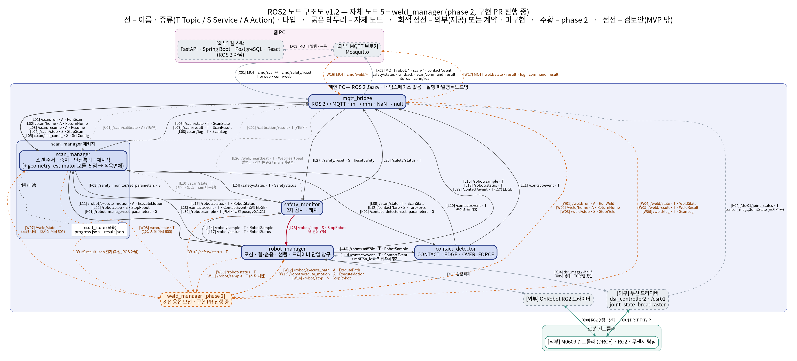

근거: `docs/design/contact-scan-node-diagram-v1.1.md` · `.drawio`(출발, 40 선) · `docs/contracts/ros-interfaces.md` 2장 · 6.4절 · `docs/contracts/mqtt-schema.md` 2장 · `docs/phase2/weld-ros-interfaces.md` 2장 · `docs/phase2/weld-mqtt-schema.md` 1장 (origin/main `7286e8e`, 2026-09-28)

# 06. ROS2 노드 구조도 (v1.2)

작성: 병후 · 2026-09-27. 그림 원본은 Graphviz 텍스트 [`06-node-graph.dot`](06-node-graph.dot)이고 png 는 `figures.py` 가 만든다. v1.1 drawio 는 이 PC 에서 열 수 없어 고치지 않았다.

- 선 라벨 = **이름 · 종류(T Topic / S Service / A Action) · 타입**. `[L..]` 번호가 아래 표의 행이다. 같은 두 노드 사이의 같은 방향 선은 화살표 하나에 모았다.
- phase 2(주황 점선)를 뺀 판: [`06-node-graph-no-phase2.png`](06-node-graph-no-phase2.png).
- 자체 노드 6 개: 1차 5 개 + `weld_manager`(phase 2, **구현 PR 진행 중** — #191 · #195~#197 · P5 #204, 2026-09-28 머지 전). 네임스페이스 없음, 실행 파일명 = 노드명, 노드별 패키지(`ws_cobot1/src/`).
- 메시지 필드 · QoS 는 계약 문서에 있다. 요약은 [05 인터페이스 정의서](05-interfaces.md).
- 이 그림은 **계약**의 연결이다. 2026-09-28 main 의 코드와 대조해 다른 곳은 L10 · L26 두 선(safety_monitor 가 구독하지 않음)뿐이고, 회색 점선으로 표시했다. 나머지 노드의 발행 · 구독은 계약과 같다.

## 1. 노드

| 노드 | 패키지 | 발행 | 구독 | 서버 | 클라이언트 |
|---|---|---|---|---|---|
| `scan_manager` | scan_manager | `/scan/state` · `/scan/result` · `/scan/log` | `/robot/status` · `/robot/sample`(v0.1.21) · `/contact/event` · `/safety/status` · (P2) `/weld/state` | A `/scan/run` · `/scan/home` · `/scan/resume`, S `/scan/stop` · `/scan/set_config` | A `/robot/execute_motion`, S `/robot/stop` · `/contact/tare` · `*/set_parameters` |
| `robot_manager` | robot_manager | `/robot/sample` · `/robot/status` · `/contact/event`(스텝 EDGE) | `/contact/event` | A `/robot/execute_motion` · (P2) `/robot/execute_path`, S `/robot/stop` | 두산 `dsr_msgs2` · RG2 |
| `contact_detector` | contact_detector | `/contact/event` | `/robot/sample` · `/scan/state` | S `/contact/tare` | — |
| `safety_monitor` | safety_monitor | `/safety/status` | `/robot/sample` · `/robot/status` (계약의 `/scan/state` · `/web/heartbeat` 는 9/27 main 미구현 — 아래 L10 · L26) | S `/safety/reset` | S `/robot/stop` |
| `mqtt_bridge` | mqtt_bridge | `/web/heartbeat` | `/robot/sample` · `/robot/status` · `/contact/event` · `/scan/*` · `/safety/status` · `/dsr01/joint_states` · (P2) `/weld/*` | — | A `/scan/run` · `/scan/home` · `/scan/resume`, S `/scan/stop` · `/scan/set_config` · `/safety/reset` · (P2) A `/weld/run` · `/weld/home` · S `/weld/stop` |
| `weld_manager` **[P2]** | weld_manager | `/weld/state` · `/weld/result` · `/weld/log` | `/scan/state` · `/robot/status` · `/safety/status` · `/robot/sample` | A `/weld/run` · `/weld/home`, S `/weld/stop` | A `/robot/execute_path` · `/robot/execute_motion`, S `/robot/stop` |

## 2. 연결 표 (한 줄 = 선 하나)

### 2.1 자체 인터페이스 (`contact_scan_interfaces`) — 30 선
| # | 이름 | 종류 | 타입 | 보내는 쪽 | 받는 쪽 | 뜻 |
|---|---|---|---|---|---|---|
| L01 | `/scan/run` | A | RunScan | mqtt_bridge | scan_manager | 새 작업 시작 |
| L02 | `/scan/home` | A | ReturnHome | mqtt_bridge | scan_manager | 안전복귀 = 홈(시작 위치) |
| L03 | `/scan/resume` | A | Resume | mqtt_bridge | scan_manager | 재시작(확정 측정값 유지, 중단 방향부터) |
| L04 | `/scan/stop` | S | StopScan | mqtt_bridge | scan_manager | 작업 중지 요청(접수 ≠ 정지 완료) |
| L05 | `/scan/set_config` | S | SetConfig | mqtt_bridge | scan_manager | 설정 등록(동작 중 거절) |
| L06 | `/scan/state` | T | ScanState | scan_manager | mqtt_bridge | 단계 · 방향 · 진행 n/4 |
| L07 | `/scan/result` | T | ScanResult | scan_manager | mqtt_bridge | 형상 결과(작업 종료 시 1 회, 무효값 NaN + `*_valid`) |
| L08 | `/scan/log` | T | ScanLog | scan_manager | mqtt_bridge | 시간순 로그 |
| L09 | `/scan/state` | T | ScanState | scan_manager | contact_detector | `scan_id` 태깅 |
| L10 | `/scan/state` | T | ScanState | scan_manager | safety_monitor | 단계별 감시. **계약에만 있고 9/27 main 의 safety_monitor 는 구독하지 않는다**(그림에서 회색 점선) |
| L11 | `/robot/execute_motion` | A | ExecuteMotion | scan_manager | robot_manager | 단위 모션(MOVE_TO · DESCEND · SLIDE · HOME). Result = 정지 pose + 사유 |
| L12 | `/contact/tare` | S | TareForce | scan_manager | contact_detector | 외력 기준값 F₀ |
| L13 | `/robot/sample` | T | RobotSample | robot_manager | contact_detector | TCP · 힘 + `motion_id` · `operation` |
| L14 | `/robot/sample` | T | RobotSample | robot_manager | safety_monitor | 값 · 시각 감시, 하강 제한 2차 |
| L15 | `/robot/sample` | T | RobotSample | robot_manager | mqtt_bridge | 표시(10 Hz 다운샘플) |
| L16 | `/robot/status` | T | RobotStatus | robot_manager | scan_manager | 시작 조건 · 정지 완료 확인 |
| L17 | `/robot/status` | T | RobotStatus | robot_manager | safety_monitor | 연결 감시 · 정지 완료 확인 |
| L18 | `/robot/status` | T | RobotStatus | robot_manager | mqtt_bridge | 표시 |
| L19 | `/contact/event` | T | ContactEvent | contact_detector | robot_manager | `motion_id` 대조 뒤 자체 정지 |
| L20 | `/contact/event` | T | ContactEvent | contact_detector | scan_manager | 판정 좌표 기록(정지 좌표와 구분) |
| L21 | `/contact/event` | T | ContactEvent | contact_detector | mqtt_bridge | 표시 |
| L22 | `/robot/stop` | S | StopRobot | scan_manager | robot_manager | 작업 중지 · 실패 때 정지(정지 경로 ①) |
| L23 | `/robot/stop` | S | StopRobot | safety_monitor | robot_manager | 안전 이상 정지(정지 경로 ③), 웹 경유 없음 |
| L24 | `/safety/status` | T | SafetyStatus | safety_monitor | scan_manager | 래치면 시작 · 재시작 거절 |
| L25 | `/safety/status` | T | SafetyStatus | safety_monitor | mqtt_bridge | 표시 |
| L26 | `/web/heartbeat` | T | WebHeartbeat | mqtt_bridge | safety_monitor | MQTT `hb/web` 을 실제로 받았을 때만. **mqtt_bridge 는 발행하지만 safety_monitor 의 감시(`HB_EXPIRED` 405)는 9/27 main 미구현**(그림에서 회색 점선, `integration-audit_20260921.md` T33) |
| L27 | `/safety/reset` | S | ResetSafety | mqtt_bridge | safety_monitor | 래치 해제(조건 해소 때만) |
| L28 | `/contact/event` | T | ContactEvent | robot_manager | scan_manager | **v1.2 추가.** 스텝 모드 SLIDE 의 EDGE(계약 v0.1.15) |
| L29 | `/contact/event` | T | ContactEvent | robot_manager | mqtt_bridge | **v1.2 추가.** 같은 이벤트의 표시 |
| L30 | `/robot/sample` | T | RobotSample | robot_manager | scan_manager | **v1.2 추가(계약 v0.1.21, #161).** 마지막 유효 pose 만 — 안전복귀의 올림 목표 · 재시작의 위치 확인. 측정값은 여전히 판정 좌표(`/contact/event`) |

### 2.2 표준 ROS 인터페이스 — 4 선
| # | 이름 | 종류 | 타입 | 보내는 쪽 | 받는 쪽 | 뜻 |
|---|---|---|---|---|---|---|
| P01 | `/robot_manager/set_parameters` | S | rcl_interfaces/SetParameters | scan_manager | robot_manager | `slide_target_force_n` · `drop_limit_m` 전파 |
| P02 | `/contact_detector/set_parameters` | S | rcl_interfaces/SetParameters | scan_manager | contact_detector | `contact_threshold_n` · `edge_drop_m` · `debounce_n` · `over_force_n` |
| P03 | `/safety_monitor/set_parameters` | S | rcl_interfaces/SetParameters | scan_manager | safety_monitor | `over_force_n` · `drop_limit_m`(이중 감시 같은 값) |
| P04 | `/dsr01/joint_states` | T | sensor_msgs/JointState | 두산 `joint_state_broadcaster` · `joint_state_publisher` | mqtt_bridge | **v1.2 추가.** 표시 전용 관절값 → MQTT `robot/joints` · `robot/gripper_joints`(계약 v0.1.19 · v0.1.20) |

### 2.3 외부 연결 (정의하지 않음) — 8 선
| # | 연결 | 보내는 쪽 | 받는 쪽 |
|---|---|---|---|
| X01 | MQTT `cmd/scan/+` · `cmd/safety/reset` · `hb/web` · `conn/web` | 브로커 | mqtt_bridge |
| X02 | MQTT `robot/*` · `scan/*` · `contact/event` · `safety/status` · `cmd/ack` · `scan/command_result` · `hb/ros` · `conn/ros` | mqtt_bridge | 브로커 |
| X03 | MQTT 발행 · 구독 | 웹 스택(FastAPI) | 브로커 |
| X04 | `dsr_msgs2` 서비스(이동 · 순응/힘 제어 · 정지 · 위치/외력 조회) | robot_manager | 두산 드라이버 |
| X05 | 상태 · TCP/힘 조회 응답 | 두산 드라이버 | robot_manager |
| X06 | 탐침 파지 명령 | robot_manager | RG2 드라이버 |
| X07 | DRCF TCP/IP | 두산 드라이버 | M0609 컨트롤러 |
| X08 | RG2 명령 · 상태 | RG2 드라이버 | RG2 |

### 2.4 검토안 (MVP 밖, 점선) — 2 선
| # | 이름 | 종류 | 보내는 쪽 | 받는 쪽 |
|---|---|---|---|---|
| C01 | `/scan/calibrate` | A | mqtt_bridge | scan_manager |
| C02 | `/calibration/result` | T | scan_manager | mqtt_bridge |

### 2.5 phase 2 (용접, 계약 v0.2.0 · 구현 PR 진행 중) — 17 선
| # | 이름 | 종류 | 타입 | 보내는 쪽 | 받는 쪽 | 뜻 |
|---|---|---|---|---|---|---|
| W01 | `/weld/run` | A | RunWeld | mqtt_bridge | weld_manager | 용접 시작(`scan_id` · `start_line` · `end_line`) |
| W02 | `/weld/home` | A | ReturnHome | mqtt_bridge | weld_manager | 안전복귀(1차 타입 재사용) |
| W03 | `/weld/stop` | S | StopWeld | mqtt_bridge | weld_manager | 용접 중지 |
| W04 | `/weld/state` | T | WeldState | weld_manager | mqtt_bridge | 단계 · 선 번호 · 진행 |
| W05 | `/weld/result` | T | WeldResult | weld_manager | mqtt_bridge | 8 선 계획 · 결과 |
| W06 | `/weld/log` | T | ScanLog | weld_manager | mqtt_bridge | 시간순 로그 |
| W07 | `/weld/state` | T | WeldState | weld_manager | scan_manager | 용접 중이면 스캔 START · RESUME 거절(601) |
| W08 | `/scan/state` | T | ScanState | scan_manager | weld_manager | 스캔 중이면 용접 START 거절(600) |
| W09 | `/robot/status` | T | RobotStatus | robot_manager | weld_manager | 정지 완료 확인 |
| W10 | `/safety/status` | T | SafetyStatus | safety_monitor | weld_manager | 래치면 시작 거절 |
| W11 | `/robot/sample` | T | RobotSample | robot_manager | weld_manager | 시작 때 현재 팁 위치 · 툴 등록 확인(용접 중에는 안 씀) |
| W12 | `/robot/execute_path` | A | ExecutePath | weld_manager | robot_manager | 경유점 경로 1 개(위빙 지그재그) |
| W13 | `/robot/execute_motion` | A | ExecuteMotion | weld_manager | robot_manager | 접근 · 안전 높이 이동(`OP_MOVE_TO`) · 홈(`OP_HOME`) |
| W14 | `/robot/stop` | S | StopRobot | weld_manager | robot_manager | `requester='weld_manager'` |
| W15 | `result.json` 읽기 | 파일 | — | result_store | weld_manager | ROS 아님. `scan_id` ("" = 최신) 의 스캔 결과 |
| W16 | MQTT `cmd/weld/+` | 외부 | — | 브로커 | mqtt_bridge | |
| W17 | MQTT `weld/state` · `weld/result` · `weld/log` · `weld/command_result` | 외부 | — | mqtt_bridge | 브로커 | |

합계: 자체 30 + 표준 4 + 외부 8 + 검토안 2 = **1차 44 선**, phase 2 **17 선**, 모두 **61 선**.

## 3. v1.1 → v1.2 에서 바뀐 것

| # | 바뀐 것 | 근거 |
|---|---|---|
| 1 | L28 · L29: robot_manager 가 스텝 모드 SLIDE 의 EDGE 를 `/contact/event` 로 낸다(실기 기본 `slide_mode: step`) | 계약 v0.1.15, PR #160 |
| 1b | L30: scan_manager 가 `/robot/sample` 을 구독한다(마지막 유효 pose, 안전복귀 · 재시작용) | 계약 v0.1.21, PR #161 |
| 2 | P04: `/dsr01/joint_states` 를 mqtt_bridge 가 표시 전용으로 중계 | 계약 v0.1.19 · v0.1.20, PR #179 |
| 3 | W01~W17: phase 2 weld_manager · ExecutePath · 배타 규칙 · MQTT `weld/*` | 계약 v0.2.0, PR #184 · #198 |
| 4 | 표기: 선마다 **타입**을 적었다(v1.1 은 이름 · 뜻만). 같은 두 노드 사이의 같은 방향 선은 그림에서 한 화살표에 모았다 | 강사 요구 "주고받는 데이터 형식 · 이름 · 연결 관계" |
| 5 | 계약과 구현이 다른 선(L10 · L26)을 회색 점선으로 표시 | `safety_monitor.py:83-84` |
| 6 | 형식: drawio 대신 Graphviz(`06-node-graph.dot`). phase 2 줄은 `// P2` 로 표시해 뺀 판을 자동으로 만든다 | — |

v1.1 의 파라미터 이름 열은 옮기지 않았다. 계약에 속하는 파라미터 이름은 `ros-interfaces.md` 6.4절, phase 2 는 `weld-motion.md` 6절에 있다.
