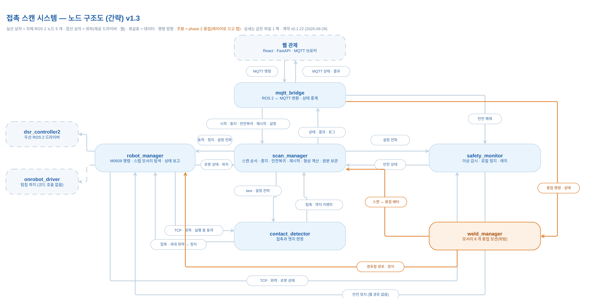

근거: `docs/design/contact-scan-node-diagram-v1.1.md` · `.drawio`(출발, 40 선) · `docs/design/contact-scan-node-overview-v1.2.drawio`(간략판 형식) · `docs/contracts/ros-interfaces.md` 2장 · 6.4절 · `mqtt-schema.md` 2장 · `docs/phase2/weld-ros-interfaces.md` 2장 · `weld-mqtt-schema.md` 1장 · `ws_cobot1/src/*` (origin/main `2335057`, 2026-09-28) · 구현 PR #191 · #195 ~ #197 (머지 전)

# 06. ROS2 노드 구조도 (v1.2)

> **문서 상태**: 계약 v0.1.22 · phase 2 v0.2.0 · main `2335057` 대조 (2026-09-28). **구속력 있는 계약은 `docs/contracts/` · `docs/phase2/` 다.** 이 문서와 다르면 계약이 맞다.
> **v1.2 (2026-09-28, 병후)**: 설계 문서 v1.1(9/18) 의 형식 — 노드 목록 · 그림 · 연결 표 · 시나리오 — 으로 다시 만들었다. 그림은 v1.1 과 같은 drawio 로 그렸다. 9/27 첫 판(Graphviz)은 `archive/v1-matplotlib-graphviz/` 에 있다.
> 짝 문서: [01 시스템 아키텍처](01-system-architecture.md) · [05 인터페이스 정의서](05-interfaces.md)(필드 · QoS · 시나리오 상세)

**그림 원본 [`06-node-graph.drawio`](06-node-graph.drawio)** — [app.diagrams.net](https://app.diagrams.net) 에서 연다. 쪽 3 개:

| 쪽 | 내용 | png |
|---|---|---|
| 1. 노드 구조도 v1.2 (상세) | v1.1 형식. 선마다 이름 · 종류 · 연결 표 번호. phase 2 는 레이어 **"phase 2 (용접)"** 에 있어 끄면 1 차만 남는다 | [`06-node-graph.png`](06-node-graph.png) |
| 2. 노드 구조도 v1.2 (1차만) | 1 쪽에서 phase 2 를 뺀 판(9/29 에 용접을 발표에서 빼면 이 그림) | [`06-node-graph-no-phase2.png`](06-node-graph-no-phase2.png) |
| 3. 노드 구조도 (간략) v1.3 | 발표용 간략판(v1.2 간략판 형식). 노드 이름과 한 줄 설명, 선은 뜻만 | [`06-node-graph-overview.png`](06-node-graph-overview.png) |

**읽는 법** — 굵은 테두리 = 자체 ROS 2 노드 · 회색 점선 테두리 = 외부(제공 드라이버 · 웹) · 주황 = phase 2. 선 모양: Topic 실선 화살표 · Service 는 ○(클라이언트) → ▶(서버) · Action 은 굵은 양방향. 선 색 = 갈래(명령 · 표시 데이터 · 로봇 상태 · 접촉 이벤트 · 모션 · 안전 · 저장). **회색 점선 = 계약에는 있고 코드에는 없는 연결.** 라벨 = `이름 · 종류 [연결 표 번호]` + 뜻 한 줄. 그림의 선 하나는 아래 연결 표에서 "같은 두 노드 · 같은 방향 · 같은 종류 · 같은 갈래" 인 행을 모은 것이다.

---

## 1. 노드 목록

### 1.1 자체 ROS 2 노드 (메인 PC · Ubuntu 24.04 · ROS 2 Jazzy · rclpy) — 1 차 5 개 + phase 2 1 개
네임스페이스 없음 · 실행 파일명 = 노드명 · 노드별 패키지(`ws_cobot1/src/`). 정의 패키지 `contact_scan_interfaces` 는 실행 노드가 아니다.

| 노드 | 담당 | 기능 (한 줄) | 내부 모듈 (노드 아님) | ROS 파라미터 (이름 · [계약] = 6.4 절) | BRD |
|---|---|---|---|---|---|
| `scan_manager` | 병후 (geometry_estimator 현지) | 스캔 순서 상태기계. 시작 관문 → tare → DESCEND → 방향 4 개 SLIDE → 형상 계산 → 마무리 복귀 → 완료. 작업 중지 · 안전복귀(5 단계) · 재시작(허용 목록)을 조정하고 SetConfig 를 세 노드에 전파한다. `scan_id` · `motion_id` 발급. 측정값은 `/contact/event` 의 판정 좌표, `/robot/sample` 은 마지막 유효 pose 만(v0.1.21). [P2] 용접 중이면 START · RESUME 을 601 로 거절(#204) | `geometry_estimator`(편향 보정 · 사각형 · 경로 후보 4 · 직육면체) · `result_store`(`progress.json` · `result.json`) · state_machine · sequence · resume · propagation · event_matcher | [계약] `descend_speed_mps` · `slide_speed_mps` · `max_descend_m` · `max_slide_m` · `motion_timeout_s` · `lift_height_m` / `move_speed_mps` · `recontact_speed_mps` · `recontact_margin_m` · `search_origin_pose` · `base_to_fixture` · `support_z_m` · `tip_radius_m` · `detect_latency_s` · `edge_round_radius_m` · `edge_bias_offset_m` · `result_dir` · `result_frame_id` · `motion_frame_id` · `direction_order` · `*_timeout_s` · `pose_max_age_s` · `state_publish_period_s` · `weld_state_timeout_s` | 4.2 · 4.3 · 4.4.7 ~ 4.4.9 |
| `robot_manager` | 학민 | 모션 · 힘/순응 제어 · 상태 수집. **두산 드라이버를 부르는 유일한 노드**(10 개 서비스를 한 줄로 차례로). 단위 · 프레임 변환, `sample_id` 발급, 샘플 · 상태에 실행 중 `motion_id` · `operation` 기록, `/contact/event` 대조 뒤 자체 정지, 하강 제한 1 차, 순응 · 힘 제어 해제는 finally. SLIDE 는 `step`(실기 — 긁고 멈춰 힘을 읽고 EDGE 를 직접 발행) · `force`(sim). RG2 호출은 코드에 없다. [P2] `/robot/execute_path`(#191) | call_queue · dsr_client · motions · motion_state · step_slide · conversions | [계약] `slide_target_force_n` · `drop_limit_m` / `home_joint_deg` · `home_speed_deg_s` · `slide_mode` · `step_*`(20) · `compliance_stiffness` · `arrival_*` · `motion_timeout_s` · `move_restart_max` · `release_force_time_s` · `frame_id` · `dsr_namespace` · `sample_rate_hz` · `status_rate_hz` · `moving_*` · `service_timeout_s` · [P2] `path_*` | 4.1.6 · 4.2 · 4.5 |
| `contact_detector` | 현지 | CONTACT(이동 기준 F₀ 대비 3 N · 3 회) · EDGE(z 추세선 0.5 mm · 3 회) · OVER_FORCE(원시 30 N, 모든 operation) 판정 · tare. 판정 모드는 샘플의 `operation`. 입력원 `robot_force` \| `sim`. 스텝 모드 SLIDE 의 EDGE 는 robot_manager 가 낸다 | detector_core · sim_source | [계약] `contact_threshold_n` · `edge_drop_m` · `debounce_n` · `over_force_n` / `source` · `over_force_debounce_n` · `descend_ref_*` · `descend_hold_threshold_n` · `edge_arm_*` · `edge_trend_*` · `edge_force_*` · `stale_age_ms` · `tare_*` · `sim_*` | 4.1 · 4.5.3 · TR-01 |
| `safety_monitor` | 현지 | 소프트웨어 이상 감시 4 가지(과대 외력 400 · 하강 제한 2 차 205 · 샘플 끊김 403 · 상태 끊김 404) → `/robot/stop` **즉시 로컬 요청(웹 경유 없음)** · 래치 · `/safety/status`. 정지 확인 못 하면 2 s 마다 다시 요청. 해제는 `/safety/reset`(조건이 사라졌을 때만). 하드웨어 안전 대체 아님 | safety_core | [계약] `over_force_n` · `drop_limit_m` / `drop_limit_margin_m` · `confirm_n` · `startup_grace_s` · `sample_stale_ms` · `robot_status_timeout_ms` · `stop_confirm_timeout_s` · `stop_retry_period_s` · `status_publish_period_s` · `check_period_s` | 4.5.3 · 4.5.4 · 4.6 |
| `mqtt_bridge` | 의석 (T27 병후 공동) | ROS 2 ↔ MQTT. `cmd/scan/+` · `cmd/safety/reset` 검사(형식 · 중복 · 만료, stop 은 만료 제외) → Action/Service 호출 → `cmd/ack`(접수) · `scan/command_result`(완료). ROS 토픽 → JSON(m → mm · NaN → null · enum 이름 · `UNKNOWN_<n>`). 표시 솎기 · `hb/ros` · `conn/ros`(LWT) · `/dsr01/joint_states` → `robot/joints` | command_guard · decoders · encoders · conversions | `broker_host` · `broker_port` · `topic_prefix` · `dedup_cache_size` · `cmd_expiry_s` · `sample_publish_hz` · `joint_publish_hz` · `joint_state_topic` · `heartbeat_hz` · `keepalive_s` | 4.4.2 · 4.6 · 4.7 |
| `weld_manager` **[P2]** | 현지 | 스캔 `result.json` 의 모서리 8 개를 45° 자세 · 스탠드오프 · 위빙 경유점으로 바꿔 선마다 접근 → ExecutePath → 후퇴. 스캔 중이면 600. 구현 PR #195 → #196 → #197 **머지 전**(Virtual 8 선 완주, 실기 9/29) | weld_path · sequence · weld_record · params | `weld_speed_mps` · `standoff_m` · `weave_*` · `tilt_deg` · `approach_m` · `travel_clearance_m` · `tool_profile_*` · `path_tolerance_m` · `path_point_dwell_s` · `continue_on_line_failure` · `top_line_offset_dir` · … (`weld-motion.md` 6 절) | phase 2 BRD |

### 1.2 외부 구성요소 (제공 · 설치 사용 · 이름과 방향만)
| 구성요소 | 컴퓨터 | 연결 | 상태 |
|---|---|---|---|
| 두산 드라이버 `doosan-robot2`(`dsr_bringup2` · `dsr_hardware2` · `dsr_msgs2`) · 실행명 `dsr_controller2` · 네임스페이스 `dsr01` · 모델 `m0609` | 메인 PC | robot_manager 만 서비스 호출: `motion/move_line` · `move_joint` · `move_stop` · `force/task_compliance_ctrl` · `set_desired_force` · `release_force` · `release_compliance_ctrl` · `aux_control/get_current_posx` · `get_tool_force` · `system/get_robot_state`. `joint_state_broadcaster` → `/dsr01/joint_states` | 동작 여부는 `docs/env/api-check-log.md` |
| OnRobot RG2 드라이버(`onrobot_driver`) | 메인 PC | 계약상 robot_manager → `/onrobot/sendCommand`(탐침 파지) | **코드에 호출 없음** — 실기는 탐침을 쥔 채 운용 |
| MQTT 브로커(Mosquitto 2) | 웹 PC (Docker, :1883) | mqtt_bridge ↔ 브로커 ↔ FastAPI | 익명 · persistence · JSON 은 `mqtt-schema.md` |
| 웹 스택 — FastAPI · Spring Boot · PostgreSQL · React+Three.js | 웹 PC · 브라우저 | 브로커 너머 한 덩어리(ROS 2 아님). 명령 REST → FastAPI → MQTT, 표시 WS, DB 쓰기 FastAPI | 01 시스템 아키텍처 |
| M0609 컨트롤러(DRCF) · RG2 · 무센서 탐침 팁 · 작업대 | 로봇 컨트롤러 | 드라이버 너머(DRCF TCP/IP). 하드웨어 안전(비상정지 · 충돌 감지) 담당 | — |

---

## 2. 노드 구조도

위 그림(쪽 1). 1 차만: [`06-node-graph-no-phase2.png`](06-node-graph-no-phase2.png). 간략판:

---

## 3. 연결 표

한 줄 = 연결 하나. "구현" 열: **○** = 계약과 main 코드가 같다 · **계약만** = 계약에만 있다 · **PR** = 구현이 머지 전 PR 에만 있다. 필드 · QoS 는 [05](05-interfaces.md).

### 3.1 자체 인터페이스 (`contact_scan_interfaces`) — 30 선
| # | 이름 | 종류 | 타입 | 보내는 쪽 | 받는 쪽 | 뜻 | 갈래 | 구현 |
|---|---|---|---|---|---|---|---|---|
| L01 | `/scan/run` | A | RunScan | mqtt_bridge | scan_manager | 새 작업 시작 | 명령 | ○ |
| L02 | `/scan/home` | A | ReturnHome | mqtt_bridge | scan_manager | 안전복귀 = 홈(시작 위치). 5 단계(v0.1.21) | 명령 | ○ |
| L03 | `/scan/resume` | A | Resume | mqtt_bridge | scan_manager | 재시작(확정 측정값 유지, 남은 방향부터) | 명령 | ○ |
| L04 | `/scan/stop` | S | StopScan | mqtt_bridge | scan_manager | 작업 중지 요청(접수 ≠ 정지 완료) | 명령 | ○ |
| L05 | `/scan/set_config` | S | SetConfig | mqtt_bridge | scan_manager | 설정 등록(동작 중 거절). 화면 버튼은 없다(TR-05) | 명령 | ○ |
| L06 | `/scan/state` | T | ScanState | scan_manager | mqtt_bridge | 단계 · 방향 · 진행 n/4 | 표시 | ○ |
| L07 | `/scan/result` | T | ScanResult | scan_manager | mqtt_bridge | 형상 결과(작업 끝 1 회, 무효값 NaN + `*_valid`) | 표시 | ○ |
| L08 | `/scan/log` | T | ScanLog | scan_manager | mqtt_bridge | 시간순 로그 | 표시 | ○ |
| L09 | `/scan/state` | T | ScanState | scan_manager | contact_detector | `scan_id` 태깅(판정 모드는 샘플의 `operation`) | 표시 | ○ |
| L10 | `/scan/state` | T | ScanState | scan_manager | safety_monitor | 단계별 감시 | 안전 | **계약만** — safety_monitor 는 구독하지 않는다(`safety_monitor.py:87-88`) |
| L11 | `/robot/execute_motion` | A | ExecuteMotion | scan_manager | robot_manager | 단위 모션(MOVE_TO · DESCEND · SLIDE · HOME). Result = 정지 pose + 사유 | 모션 | ○ |
| L12 | `/contact/tare` | S | TareForce | scan_manager | contact_detector | 외력 기준값 F₀(무접촉 · 정지) · 툴 등록 점검 | 모션 | ○ |
| L13 | `/robot/sample` | T | RobotSample | robot_manager | contact_detector | TCP · 힘 + `motion_id` · `operation` | 로봇 상태 | ○ |
| L14 | `/robot/sample` | T | RobotSample | robot_manager | safety_monitor | 과대 외력 · 하강 제한 2 차 · 샘플 끊김 | 로봇 상태 | ○ |
| L15 | `/robot/sample` | T | RobotSample | robot_manager | mqtt_bridge | 표시(10 Hz 솎음) | 로봇 상태 | ○ |
| L16 | `/robot/status` | T | RobotStatus | robot_manager | scan_manager | 시작 조건 · 정지 완료 확인 | 로봇 상태 | ○ |
| L17 | `/robot/status` | T | RobotStatus | robot_manager | safety_monitor | 상태 끊김 · 정지 완료 확인 | 로봇 상태 | ○ |
| L18 | `/robot/status` | T | RobotStatus | robot_manager | mqtt_bridge | 표시 | 로봇 상태 | ○ |
| L19 | `/contact/event` | T | ContactEvent | contact_detector | robot_manager | `motion_id` 대조 뒤 자체 정지(경로 ②). OVER_FORCE 는 대조 없이 | 접촉 이벤트 | ○ |
| L20 | `/contact/event` | T | ContactEvent | contact_detector | scan_manager | 판정 좌표 = 측정값(정지 좌표와 구분) | 접촉 이벤트 | ○ |
| L21 | `/contact/event` | T | ContactEvent | contact_detector | mqtt_bridge | 표시 · DB | 접촉 이벤트 | ○ |
| L22 | `/robot/stop` | S | StopRobot | scan_manager | robot_manager | 작업 중지 · 실패 때 정지(경로 ①) + goal cancel 을 함께 | 안전 | ○ |
| L23 | `/robot/stop` | S | StopRobot | safety_monitor | robot_manager | 안전 이상 정지(경로 ③), 웹 경유 없음. `reason` 에 사유 | 안전 | ○ |
| L24 | `/safety/status` | T | SafetyStatus | safety_monitor | scan_manager | 래치면 시작 · 재시작 거절 · 안전복귀의 손상 의심 판정 | 안전 | ○ |
| L25 | `/safety/status` | T | SafetyStatus | safety_monitor | mqtt_bridge | 표시 · 안전 해제 버튼 켜기 | 안전 | ○ |
| L26 | `/web/heartbeat` | T | WebHeartbeat | mqtt_bridge | safety_monitor | MQTT `hb/web` 을 받았을 때만 전달 | 안전 | **계약만** — 웹이 `hb/web` 을 보내지 않고 safety_monitor 도 구독하지 않는다(만료 405 없음) |
| L27 | `/safety/reset` | S | ResetSafety | mqtt_bridge | safety_monitor | 래치 해제(조건 해소 때만, 아니면 406) | 안전 | ○ |
| L28 | `/contact/event` | T | ContactEvent | robot_manager | scan_manager | 스텝 모드 SLIDE 의 EDGE(v0.1.15) | 접촉 이벤트 | ○ |
| L29 | `/contact/event` | T | ContactEvent | robot_manager | mqtt_bridge | 같은 이벤트의 표시 | 접촉 이벤트 | ○ |
| L30 | `/robot/sample` | T | RobotSample | robot_manager | scan_manager | 마지막 유효 pose 만 — 안전복귀 올림 목표 · 재시작 위치 확인(v0.1.21) | 로봇 상태 | ○ |

### 3.2 표준 ROS 인터페이스 — 4 선
| # | 이름 | 종류 | 타입 | 보내는 쪽 | 받는 쪽 | 뜻 | 구현 |
|---|---|---|---|---|---|---|---|
| P01 | `/robot_manager/set_parameters` | S | rcl_interfaces/SetParameters | scan_manager | robot_manager | `slide_target_force_n` · `drop_limit_m` 전파 | ○ |
| P02 | `/contact_detector/set_parameters` | S | 같음 | scan_manager | contact_detector | `contact_threshold_n` · `edge_drop_m` · `debounce_n` · `over_force_n` | ○ |
| P03 | `/safety_monitor/set_parameters` | S | 같음 | scan_manager | safety_monitor | `over_force_n` · `drop_limit_m`(두 겹 감시 같은 값) | ○ |
| P04 | `/dsr01/joint_states` | T | sensor_msgs/JointState | 두산 `joint_state_broadcaster` · `joint_state_publisher` | mqtt_bridge | 표시 전용 관절값 → `robot/joints` · `robot/gripper_joints`(v0.1.19 · v0.1.20) | ○ |

scan_manager 는 전파 뒤 `*/get_parameters` 로 되읽어 쌍이 어긋나면 108 로 알린다(그림에는 P01 ~ P03 선에 포함).

### 3.3 외부 연결 (정의하지 않음) — 8 선
| # | 연결 | 보내는 쪽 | 받는 쪽 | 구현 |
|---|---|---|---|---|
| X01 | MQTT `cmd/scan/+` · `cmd/safety/reset` · `hb/web` · `conn/web` | 브로커 | mqtt_bridge | ○ (`hb/web` · `conn/web` 은 웹이 아직 안 보낸다) |
| X02 | MQTT `robot/*` · `scan/*` · `contact/event` · `safety/status` · `cmd/ack` · `scan/command_result` · `hb/ros` · `conn/ros` | mqtt_bridge | 브로커 | ○ |
| X03 | MQTT 발행 · 구독 | 웹 스택(FastAPI) | 브로커 | ○ |
| X04 | `dsr_msgs2` 서비스 10 개(이동 · 순응/힘 제어 · 정지 · 위치/외력/상태 조회) | robot_manager | 두산 드라이버 | ○ |
| X05 | 조회 응답(TCP · 외력 · 상태) | 두산 드라이버 | robot_manager | ○ |
| X06 | 탐침 파지 명령 `/onrobot/sendCommand` | robot_manager | RG2 드라이버 | **계약만** — 코드에 호출이 없다 |
| X07 | DRCF TCP/IP | 두산 드라이버 | M0609 컨트롤러 | ○ |
| X08 | RG2 명령 · 상태 | RG2 드라이버 | RG2 | — |

### 3.4 검토안 (MVP 밖, 점선) — 2 선
| # | 이름 | 종류 | 보내는 쪽 | 받는 쪽 | 구현 |
|---|---|---|---|---|---|
| C01 | `/scan/calibrate` | A | mqtt_bridge | scan_manager | 없음(타입도 없다) |
| C02 | `/calibration/result` | T | scan_manager | mqtt_bridge | 없음 |

### 3.5 phase 2 (용접, 계약 v0.2.0) — 18 선
| # | 이름 | 종류 | 타입 | 보내는 쪽 | 받는 쪽 | 뜻 | 구현 |
|---|---|---|---|---|---|---|---|
| W01 | `/weld/run` | A | RunWeld | mqtt_bridge | weld_manager | 용접 시작(`scan_id` "" = 최신 · `start_line` · `end_line`). Feedback = WeldState | 서버 PR #197 · **브리지 계약만** |
| W02 | `/weld/home` | A | ReturnHome | mqtt_bridge | weld_manager | 용접의 안전복귀(1 차 타입 재사용) | 서버 PR #197 · **브리지 계약만** |
| W03 | `/weld/stop` | S | StopWeld | mqtt_bridge | weld_manager | 용접 중지(휴지면 `/robot/stop` 을 부르지 않는다) | 서버 PR #197 · **브리지 계약만** |
| W04 | `/weld/state` | T | WeldState | weld_manager | mqtt_bridge | 단계 · 선 번호 · 진행 | 발행 PR #197 · **브리지 계약만** |
| W05 | `/weld/result` | T | WeldResult | weld_manager | mqtt_bridge | 8 선 계획 · 결과(홈 복귀보다 먼저 1 회) | 발행 PR #197 · **브리지 계약만** |
| W06 | `/weld/log` | T | ScanLog | weld_manager | mqtt_bridge | 시간순 로그(`scan_id` 칸에 `weld_id`) | 발행 PR #197 · **브리지 계약만** |
| W07 | `/weld/state` | T | WeldState | weld_manager | scan_manager | 용접 중이면 스캔 START · RESUME 거절(601). 판정 불가면 통과 | 받는 쪽 ○ (#204 main) · 보내는 쪽 PR |
| W08 | `/scan/state` | T | ScanState | scan_manager | weld_manager | 스캔 중이면 용접 시작 거절(600). 없거나 5 s 넘으면 101 | PR #197 |
| W09 | `/robot/status` | T | RobotStatus | robot_manager | weld_manager | 연결(104) · 정지 완료 확인 | PR #197 |
| W10 | `/safety/status` | T | SafetyStatus | safety_monitor | weld_manager | 래치면 시작 거절(103) · 모션 사이 래치 확인 · 요청하지 않은 정지의 사유 | PR #197 |
| W11 | `/robot/sample` | T | RobotSample | robot_manager | weld_manager | 시작 위치 · 툴 점검(무접촉 \|F\| > 6 N 이면 302) · 선 실패 뒤 팁 z · `/weld/home` 출발점 | PR #197 |
| W12 | `/robot/execute_path` | A | ExecutePath | weld_manager | robot_manager | 경유점 경로 1 개([p0 … pN, 후퇴점], 위빙 지그재그) | PR #191 · #197 |
| W13 | `/robot/execute_motion` | A | ExecuteMotion | weld_manager | robot_manager | 접근 · 후퇴 · 안전 높이 이동 · 복구 · 마무리 올림(`OP_MOVE_TO`) · 홈(`OP_HOME`). goal 의 `scan_id` 칸에 `weld_id` | PR #197 |
| W14 | `/robot/stop` | S | StopRobot | weld_manager | robot_manager | `requester='weld_manager'` · `/weld/stop` 과 응답 없는 goal 정리 | PR #197 |
| W15 | `result.json` 읽기 | 파일 | — | scan_manager(result_store 가 쓴 파일) | weld_manager | ROS 아님. weld_manager 가 result_store 모듈을 import 해 `scan_id` 의 스캔 결과를 읽는다 | PR #197 |
| W16 | MQTT `cmd/weld/+` | 외부 | — | 브로커 | mqtt_bridge | 용접 명령 | **계약만** |
| W17 | MQTT `weld/state` · `weld/result` · `weld/log` · `weld/command_result` | 외부 | — | mqtt_bridge | 브로커 | 용접 표시 · 완료(접수는 X02 의 `cmd/ack`) | **계약만** |
| W18 | `weld/<weld_id>.json` 쓰기 | 파일 | — | weld_manager | `<result_dir>/<scan_id>/weld/` | 용접 기록(선 8 개 계획 · 결과) | PR #197 |

합계: 자체 30 + 표준 4 + 외부 8 + 검토안 2 = **1 차 44 선**, phase 2 **18 선**, 모두 **62 선**. 용접 중에도 1 차 선 L14 · L15(`operation="WELD_PATH"`) · L19(OVER_FORCE 는 ExecutePath 도 세운다) · L23 · X04 가 그대로 쓰인다.

---

## 4. 시나리오별 흐름 (노드 순서와 인터페이스 이름만 · 상세는 05 의 1 장)

| 시나리오 | 흐름 | 근거 |
|---|---|---|
| 작업 시작 | 웹 `cmd/scan/start` → **mqtt_bridge** ⇒ `/scan/run`(A) → **scan_manager**(관문 100 · 108 · 102 · 601 · 103 · 104 → `scan_id` · `/scan/state` PREPARING) → `/robot/execute_motion`(MOVE_TO 기준점) → `/contact/tare`(S) → **contact_detector** → `/robot/execute_motion`(DESCEND) → **robot_manager** → `dsr_msgs2` | US-01 · 4.1.3 · 4.2.1 |
| 윗면 접촉 | **robot_manager** `/robot/sample` → **contact_detector**(이동 기준 F₀) → `/contact/event` CONTACT → ① **robot_manager** 대조 · 정지 · Result ② **scan_manager** 판정 z = z_top ③ **mqtt_bridge** | 4.1.1 · 4.2.1 |
| 모서리 × 4 | **scan_manager** MOVE_TO × 3(올림 · 원점 · 첫 접촉 z + 1 mm) → SLIDE → **robot_manager** 스텝 모드(긁고 멈춰 힘 읽기) → `/contact/event` EDGE(robot_manager 발행) → **scan_manager** 기록 · 다음 방향 | 4.1.2 · 4.2.2 · 7.2 · 7.3 |
| 마무리 | **scan_manager** GEOMETRY → result.json → `/scan/result` → HOMING(올림 → OP_HOME) → DONE → **mqtt_bridge** `scan/command_result` | 4.2.4 · 4.3 · 7.4 |
| 작업 중지 ① | `cmd/scan/stop` → **mqtt_bridge** → `/scan/stop`(S) → **scan_manager** → `/robot/stop`(S) + cancel → **robot_manager** → `/robot/status` connected · !moving → STOPPED(못 하면 407) | US-04 · 4.5.1 · 7.1 |
| 안전복귀 | `cmd/scan/home` → `/scan/home`(A) → **scan_manager**(손상 의심 · 위치 확인 → 수직 올림 → 도착 확인 → OP_HOME) | US-11 · 7.5 |
| 재시작 | `cmd/scan/resume` → `/scan/resume`(A) → **scan_manager**(관문 100 · 108 · 105 · 601 · 103 · 104 → 기록 검사: ERROR 는 403 · 404 · 407 + `/safety/reset` 뒤만 · 안전복귀 뒤 107 · 위치 모르면 107 → 올림 → tare → 남은 방향) | US-12 · TR-08 · 7.6 |
| 안전 이상 ③ | **robot_manager** `/robot/sample` · `/robot/status` → **safety_monitor**(400 · 205 · 403 · 404) → `/robot/stop`(S, 웹 경유 없음) · 래치 → `/safety/status` → **scan_manager** · **mqtt_bridge** | 4.5.3 · TR-07 |
| 과대 외력 ② | **contact_detector** OVER_FORCE → **robot_manager** 우선 정지 · **scan_manager** 실패 · **mqtt_bridge**. safety_monitor 도 같은 조건으로 래치(두 겹) | 4.5.3 · 7.2 |
| 래치 해제 | `cmd/safety/reset` → `/safety/reset`(S) → **safety_monitor**(조건 남으면 406) → `/safety/status` | 결정 #6 |
| 설정 등록 | `cmd/scan/set_config` → `/scan/set_config`(S) → **scan_manager**(휴지만 · 범위 102) → SetParameters P03 → P02 → P01 → 되읽기(108) → `cmd/ack` applied | US-05 |
| [P2] 용접 | `cmd/weld/start`(계약만) → `/weld/run`(A) → **weld_manager**(600 · 602 · 603 · 604 검사 → 8 선 계획) → 선마다 `/robot/execute_motion`(접근) → `/robot/execute_path`(경로) → 후퇴 → `/weld/result` → HOMING → DONE | weld-motion.md 5 절 |

세 정지 경로 모두 정지 **완료**는 `/robot/status` 로 확인하고, `accepted` 는 접수일 뿐이다.

---

## 5. 검토안 (MVP 밖)
`/scan/calibrate`(Action) · `/calibration/result`(Topic). 타입도 구현도 없다. 환경 세팅 뒤 채택 여부를 검토한다. 무접촉 힘 영점 `/contact/tare` 는 MVP 필수이며 구현돼 있다.

---

## 6. 계약과 코드가 다른 선 (2026-09-28)
| 선 | 차이 | 근거 |
|---|---|---|
| L10 · L26 | safety_monitor 가 `/scan/state` · `/web/heartbeat` 를 구독하지 않는다. 웹도 `hb/web` 을 보내지 않아 `/web/heartbeat` 는 실제로 나가지 않는다 | `safety_monitor.py:87-88`, `backend/app/main.py` |
| X06 | robot_manager 에 RG2 호출이 없다 | `robot_manager/` grep, `docs/env/api-check-log.md:22` |
| W01 ~ W06 · W16 · W17 | mqtt_bridge 의 phase 2 중계가 없다(어느 브랜치에도 `cmd/weld` 없음). 서버 · 발행 쪽은 PR #197 에 있다 | `mqtt_bridge.py:317-322`, P4 PR 없음 |
| W08 ~ W15 · W18 | 구현이 머지 전 PR(#191 · #195 ~ #197)에만 있다 | PR 상태 2026-09-28 |

그 밖의 선의 발행 · 구독은 계약과 같다. 선 안의 동작 차이(예: goal 을 늘 받고 Result 로 거절)는 05 의 10 장.

---

## 7. v1.1 → v1.2 에서 바뀐 것
| # | 바뀐 것 | 근거 |
|---|---|---|
| 1 | L28 · L29: robot_manager 가 스텝 모드 SLIDE 의 EDGE 를 `/contact/event` 로 낸다(실기 기본 `slide_mode: step`) | 계약 v0.1.15, PR #160 |
| 2 | L30: scan_manager 가 `/robot/sample` 을 구독한다(마지막 유효 pose, 안전복귀 · 재시작용) | 계약 v0.1.21, PR #161 |
| 3 | P04: `/dsr01/joint_states` 를 mqtt_bridge 가 표시 전용으로 중계 | 계약 v0.1.19 · v0.1.20, PR #179 |
| 4 | W01 ~ W18: phase 2 weld_manager · ExecutePath · 배타 규칙(600 · 601) · MQTT `weld/*` · result.json · 용접 기록 파일 | 계약 v0.2.0, PR #184 · #198 · #199 · #204 |
| 5 | "구현" 열: 계약과 코드가 다른 선(L10 · L26 · X06 · phase 2 브리지)을 표에 적고 그림에서 회색 점선으로 그렸다 | 9/28 코드 조사 |
| 6 | 선마다 **타입**을 적었다(v1.1 은 이름 · 뜻만). 그림에서는 같은 두 노드 · 같은 방향 · 같은 종류 · 같은 갈래의 행을 선 하나로 모았다(선 62 → 그림 48) | 강사 요구 "주고받는 데이터 형식 · 이름 · 연결 관계" |
| 7 | 노드 목록에 담당 · 내부 모듈을 더하고, 파라미터 이름을 지금 yaml 로 바꿨다(v1.1 의 `rg2_*` · `stop_timeout_s` · `hb_*` 등은 없어지거나 이름이 바뀌었다) | `contact_scan_bringup/config/real.yaml` |
| 8 | 형식: v1.1 과 같은 drawio. 9/27 첫 판(Graphviz)은 보관 | `archive/v1-matplotlib-graphviz/` |

### 9/27 첫 판(Graphviz)에서 바로잡은 것
- W11 `/robot/sample` 의 뜻: "용접 중에는 안 씀" → 시작 위치 · 툴 점검 · 선 실패 뒤 팁 z · 안전복귀 출발점에 쓴다(계약 `weld-ros-interfaces.md` 2.1 의 문장과 `weld-motion.md` D33 이 서로 다르다 — 05 의 15 장).
- W15 보내는 쪽: result_store(노드 아님) → scan_manager 가 쓴 파일.
- W18(용접 기록 파일) 추가. W01 ~ W06 · W16 · W17 은 브리지 구현이 없어 "계약만".
- "계약과 코드가 다른 선은 L10 · L26 뿐" → X06 과 phase 2 브리지 선도 다르다(위 6 장).

---

## 8. 그림 다시 만들기
- 작은 수정은 app.diagrams.net 에서 `06-node-graph.drawio` 를 열어 고치고, 파일 → 내보내기 → PNG 로 같은 이름에 덮어쓴다.
- 처음 만들 때 쓴 스크립트: `python3 docs/deliverables/drawio_06.py` (색 · 선 모양은 `drawio_lib.py`, v1.1 과 같은 값). 스크립트로 다시 만들면 손으로 고친 것은 사라진다.
- png 내보내기(Chrome · 인터넷 필요): `python3 docs/deliverables/drawio_export.py 06-node-graph.drawio 1:06-node-graph.png 2:06-node-graph-no-phase2.png 3:06-node-graph-overview.png`
