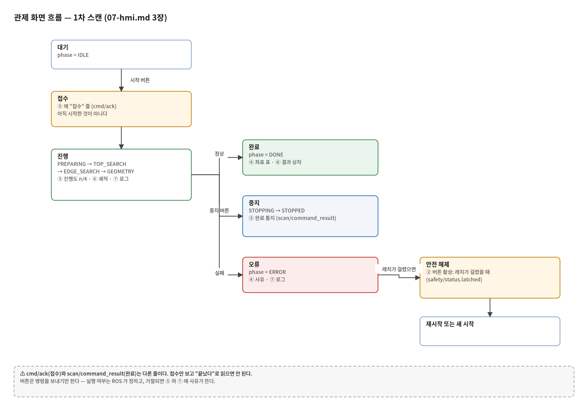

# 07. HMI 화면 구성

근거: `frontend/src/App.jsx` · `frontend/vite.config.js` · `backend/app/main.py` · `docs/contracts/mqtt-schema.md` 2 · 3 · 4장 · `docs/test-reports/TR-05_20260922.md` · `docs/test-reports/t41-robot-visualization.md`

담당: 의석. 화면은 React 19 + Three.js 로 만든 단일 페이지다(`frontend/`). 스캔 1차 범위만 다룬다 — 용접(phase 2) 화면은 P3 에서 더한다.

---

## 1. 화면 한 장

<!-- CAPTURE-1 : 전체 화면 (스캔 완료 상태). 요소 번호 ①~⑦ 을 이미지 위에 표기한다 -->

*캡처 조건은 6장에 적었다.*

화면은 위에서 아래로 **일곱 구역**이다. 스크롤 한 장에 다 들어간다.

| # | 구역 | 무엇을 보여 주나 |
|---|---|---|
| ① | 머리말 | 시스템 이름 |
| ② | 제어 버튼 | 시작 · 중지 · 안전복귀 · 재시작 · 안전 해제 |
| ③ | 현재 상태 | 연결 · 단계 · 진행도 · 관절 수신 · 팁 위치 |
| ④ | 외곽 엣지 · 경로 후보 | 결과 프레임 · 좌표 표 |
| ⑤ | 명령 상태 이력 | 명령별 접수 → 완료 |
| ⑥ | 3D 화면 | M0609 · RG2 · 궤적 · 접촉점 · 결과 상자 |
| ⑦ | 시간순 로그 | ROS 로그 + 웹이 만든 줄 |

---

## 2. 요소 → 표시 정보 → 데이터 출처

**모든 값은 `docs/contracts/mqtt-schema.md` 의 JSON 그대로다.** 화면이 값을 만들지 않는다.

### ② 제어 버튼

| 요소 | 누르면 | REST | MQTT 토픽 | 활성 조건 |
|---|---|---|---|---|
| 시작 | 스캔 시작 | `POST /commands/scan/start` | `cmd/scan/start` | 항상 |
| 중지 | 작업 중지 | `POST /commands/scan/stop` | `cmd/scan/stop` | 항상 |
| 안전복귀 | 홈 복귀 | `POST /commands/scan/home` | `cmd/scan/home` | 항상 |
| 재시작 | 중단 지점부터 이어서 | `POST /commands/scan/resume` | `cmd/scan/resume` | 항상 (6장 ①) |
| 안전 해제 | 래치 해제 | `POST /commands/safety/reset` | `cmd/safety/reset` | `safety/status` 미수신 **또는** `latched === true` |

- **버튼은 명령을 보내기만 한다.** 실행 여부는 ROS 가 정한다. 거절되면 ⑤ 와 ⑦ 에 사유가 뜬다
- `request_id`(UUID v4)는 **FastAPI 가 발급**한다(계약 1장). 화면이 만들지 않는다
- **`cmd/scan/set_config` 버튼은 없다** (BRD 4.4.2 미구현 — 6장 ②)

### ③ 현재 상태

| 표시 | 값 | 출처 토픽 · 필드 |
|---|---|---|
| FastAPI WebSocket | 연결됨 / 연결 안 됨 | WebSocket `/ws` 자체 상태 |
| 현재 단계 | 한글 라벨 (`IDLE` · `TOP_SEARCH` · …) | `scan/state.phase` |
| Phase 코드 | 원문 문자열 | `scan/state.phase` |
| 진행 방향 | `POS_X` · `NEG_Y` 등 | `scan/state.direction` |
| 진행도 | n / 4 | `scan/state.progress` · `progress_total` |
| Scan ID | `20260922-205447-1618` 형식 | `scan/state.scan_id` |
| 최근 명령 상태 | 접수 · 거절 · 완료 | 가상 토픽 `command/status` (FastAPI 가 합성) |
| Request ID | UUID v4 | 〃 |
| M0609 3D 모델 | LOADING · OK · PARTIAL · ERROR | 모델 파일 로딩 상태 (MQTT 아님) |
| M0609 관절 수신 | n / 6 | `robot/joints.positions_rad` |
| RG2 자세 | 고정 문구 | **고정값** — 실기 탐침 파지 자세 0.721396 rad |
| 팁 기준 프레임 | `base_link` | `robot/sample.frame_id` |
| 팁 위치 X · Y · Z | mm | `robot/sample.pose.{x_mm, y_mm, z_mm}` |

> **`null` 은 0 으로 그리지 않는다.** `formatNumber()` 가 `Number.isFinite` 로 걸러 미수신과 정상 0 을 구분한다(계약 1장 무효 값).

### ④ 외곽 엣지 · 경로 후보

| 표시 | 출처 |
|---|---|
| 결과 좌표 프레임 | `scan/result.frame_id` (`workpiece_fixture`) |
| 꼭짓점 · 엣지 · 경로 후보 좌표 | `scan/result.{vertices, edges, path_candidates}` |
| 실패 사유 | `scan/result.{reason_code, reason}` |
| "작업대 원점 미설정" 경고 | `VITE_BASE_TO_FIXTURE_MM` 미설정 시 |

> 화면에 **좌표 정렬 안내문**을 띄운다: *"contact/event · robot/sample 은 base_link, scan/result 는 base_to_fixture 로 base_link 에 정렬"*. 두 프레임을 섞어 그렸던 사고(PR #143) 뒤에 넣은 표시다.

### ⑤ 명령 상태 이력

| 표시 | 출처 |
|---|---|
| 명령 이름 | `command/status.command_topic` |
| 접수 결과 (접수 / 거절) | `cmd/ack.accepted` · `reason_code` · `reason` |
| 완료 결과 | `scan/command_result.success` · `reason_code` · `reason` |

> **`cmd/ack` 는 접수이고 완료가 아니다**(계약 2장). 화면도 두 줄로 나눠 보여 준다. 이름을 모르는 코드는 `UNKNOWN_<n>` 으로 오고, 옆의 숫자(`reason_code`)로 판단한다(계약 v0.1.22).

### ⑥ 3D 화면

| 그리는 것 | 출처 | 좌표 |
|---|---|---|
| M0609 6축 자세 | `robot/joints.positions_rad` | Base |
| RG2 + 탐침 | **고정 표시** (0.721396 rad, 끝에서 13 mm) | Base |
| TCP 궤적 | `robot/sample.pose` (최근 1000점) | Base |
| 접촉점 · 엣지점 | `contact/event.pose` | Base |
| 스캔 결과 상자 | `scan/result.vertices` | 작업대 → `VITE_BASE_TO_FIXTURE_MM` 로 Base 에 정렬 |
| 작업대 모델 | `VITE_TABLE_ORIGIN_MM` | Base |

좌표 변환 두 가지가 겹쳐 있다.

1. **축 대응** `toThreePosition(x, y, z) → (x, z, −y)` — ROS 는 z 가 위, Three.js 는 y 가 위다. `−y` 의 음수 부호가 빠지면 화면이 거울상이 된다(PR #143)
2. **원점 이동** `VITE_BASE_TO_FIXTURE_MM` — 작업대 좌표와 Base 좌표를 겹친다

조작: 좌클릭 드래그 회전 · 휠 확대/축소 · 우클릭 드래그 이동. 표시 배율 `DISPLAY_SCALE = 0.01`(mm → Three.js 단위).

### ⑦ 시간순 로그

| 표시 | 출처 |
|---|---|
| ROS 로그 | `scan/log.{level, message, timestamp_ms}` |
| 웹이 만든 줄 | 명령 전송 성공 · 실패 (화면 자체 생성) |

최근 **100줄**만 보관한다(`slice(-100)`).

---

## 3. 화면 흐름

<!-- CAPTURE-2 : 화면 흐름 그림. 아래 상태 전이를 그림 한 장으로 -->


사람이 버튼을 누르고 화면이 바뀌는 순서다.

```
[대기]  phase=IDLE
   │ 시작 버튼
   ▼
[접수]  ⑤ 에 "접수" 줄 (cmd/ack)          ← 아직 시작한 게 아니다
   │
   ▼
[진행]  phase=PREPARING → TOP_SEARCH → EDGE_SEARCH → GEOMETRY
        ③ 진행도 n/4, ⑥ 궤적·접촉점 늘어남, ⑦ 로그 쌓임
   │
   ├─ 정상 ──▶ [완료]  phase=DONE · ④ 좌표 표 · ⑥ 결과 상자
   │
   ├─ 중지 버튼 ──▶ phase=STOPPING → STOPPED
   │                ⑤ 에 완료 통지 (scan/command_result)
   │
   └─ 실패 ──▶ phase=ERROR · ④ 에 사유 · ⑦ 에 로그
                    │
                    │ 안전 래치가 걸렸으면 ② 안전 해제 버튼 활성
                    ▼
               [안전 해제] → 재시작 또는 새 시작
```

**중요**: `cmd/ack`(접수)와 `scan/command_result`(완료)는 다른 줄이다. 접수만 보고 "끝났다"로 읽으면 안 된다.

---

## 4. 데이터 경로

```
ROS 노드 ─ mqtt_bridge ─ MQTT ─ Mosquitto ─ FastAPI ─ WebSocket /ws ─ 화면
                                              │
버튼 ─ Vite proxy ─ FastAPI REST /commands ───┘ (여기서 request_id 발급)
                        └─ MQTT 발행 ─ mqtt_bridge ─ ROS 액션 · 서비스
```

- 화면이 구독하는 토픽 **8개**: `scan/state` · `scan/result` · `scan/log` · `robot/joints` · `robot/sample` · `contact/event` · `safety/status` · `command/status`(가상)
- FastAPI 는 **해석하지 않고** `{topic, payload}` 그대로 넘긴다
- 전체 구성은 `02-network.md`

---

## 5. 측정 (TR-05, 2026-09-22 실기)

| 항목 | 기준 (BRD 9장) | 측정 | 판정 |
|---|---|---|---|
| 화면 반영 지연 | ≤ 200 ms | 평균 **2.64 ms** · 최대 **312 ms** | **FAIL** |
| 중지 반응 표시 | ≤ 1000 ms | 기준 만족 | 합격 |
| 설정 등록 버튼 | BRD 4.4.2 | UI 미구현 | FAIL |

평균은 기준의 **1/75** 인데 최대값 하나가 기준을 넘었다. **최대값을 낸 개별 토픽은 분리하지 못했다(미실시)** — 재시험 때 `topic / scan_id / published_at_ms / received_at_ms / latency_ms` 를 함께 기록한다.

근거: `docs/test-reports/TR-05_20260922.md`

---

## 6. 알려진 문제

| # | 내용 | 상태 |
|---|---|---|
| ① | **재시작 버튼에 활성 조건이 없다.** 버튼과 명령 경로는 있고(`handleResume` → `/commands/scan/resume`) 실제로 동작하지만, 언제 눌러도 되는지 화면이 알려 주지 않는다. 계약 v0.1.21(#161)이 `ERROR` 재시작을 허용 목록(`SAMPLE_STALE 403` · `ROBOT_STATUS_LOST 404` · `STOP_UNCONFIRMED 407`)으로 열었으므로, 활성 조건은 `STOPPED` **또는** (`ERROR` && `reason_code ∈ {403,404,407}` && 래치 해제) 다 | 미착수 |
| ② | **`cmd/scan/set_config` 버튼이 없다** (BRD 4.4.2, TR-05 FAIL). REST · MQTT 경로는 있다 | 이슈 미생성 |
| ③ | **화면 반영 지연 최대 312 ms > 200 ms** | 이슈 미생성. 재시험 필요 |
| ④ | **새로고침하면 화면이 빈다.** `robot/status` · `scan/state` · `safety/status` 는 retain 토픽인데 FastAPI 가 마지막 값을 들고 있지 않아, 다음 발행까지 아무것도 안 보인다 | 미착수 |
| ⑤ | **이력 화면이 없다.** Spring 이력 API(`/api/history/scans`)는 있으나 화면이 부르지 않는다 | 9/29 뒤 |
| ⑥ | RG2 자세가 **고정 표시**다. `robot/gripper_joints` 를 받고 있지만 3D 에는 반영하지 않는다 | 실기 파지 자세가 일정해 우선순위 낮음 |

---

## 7. 캡처 목록 (찍을 것)

<!-- 아래 3장을 docs/deliverables/assets/ 에 넣고 1 · 3장의  를 채운다 -->

| 파일 | 무엇을 | 만드는 법 |
|---|---|---|
| `07-hmi-overview.png` | **전체 화면, 스캔 완료 상태.** ①~⑦ 구역 번호를 이미지 위에 표기 | 목업 발행기 시나리오를 끝까지 재생 |
| `07-hmi-3d.png` | ⑥ 3D 화면 확대 — 궤적 · 접촉점 · 결과 상자가 같이 보이게 | 같은 상태에서 3D 만 |
| `07-hmi-flow.png` | 3장의 화면 흐름 그림 | drawio 로 그린다 |

**캡처 조건 (캡션에 반드시 적는다)**

```
목업 발행기(backend/mock_publisher) + RViz2 M0609 기준 캡처, 2026-09-27.
화면 구성과 데이터 경로를 보이기 위한 것이며 표시된 수치는 실측이 아니다.
실기 종단 확인은 2026-09-23 (PR #179, docs/test-reports/t41-robot-visualization.md).
```

실기 화면 캡처는 레포에 없다. 9/23 실기 종단은 텍스트로만 기록됐다.
