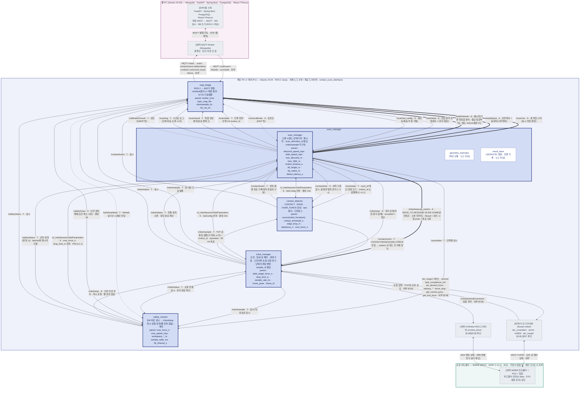

# 노드 구성도 v1.1 — 접촉 스캔 시스템 (ROS 2)

> **문서 상태: 초안 · 실기 검증 전 · 수치는 설계 출발값**
> **v1.1 (2026-09-18)**: T01 계약 동결 회의 결정을 반영했다. 구속력 있는 계약은 레포의 `docs/contracts/` v0.1이며, 이 문서와 다르면 계약이 우선한다. v1.0 대비 변경은 7장. 짝 그림 `contact-scan-node-diagram-v1.1.drawio`도 같은 내용으로 갱신했다(2026-09-19).
> 기준 문서: BRD v3.2.0(`docs/BRD.md`) (2026-09-18) · `contact-scan-system-architecture-v1.6.drawio` (계약 v0.1 반영)
> 작성일: 2026-09-18 · 짝 문서: `contact-scan-node-diagram-v1.1.drawio`(같은 그림) · `contact-scan-node-overview-v1.2.drawio`(간략판) · `contact-scan-interface-spec-integrated-v1.2.md`(통합 인터페이스 정의서, 이하 "정의서" · Part 1 절 번호 기준)
> 표기: **확정**(BRD) · **초안**(아키텍처 4.7) · **제안(TBD)**(이 문서에서 채움). 통신은 이름·종류·의미만 적고 필드·타입·QoS는 정의서에 둔다.

---

## 1. 노드 목록

### 1.1 자체 ROS 2 노드 (메인 PC · Ubuntu 24.04 · ROS 2 Jazzy · rclpy) — 정확히 5개 (확정 · BRD 4.7)

| 노드 | 컴퓨터 | 기능 (한 줄) | 내부 모듈 (노드 아님) | ROS 파라미터 (이름만 · 정의서 6장) | 근거 BRD 절 |
|---|---|---|---|---|---|
| `scan_manager` | 메인 PC | 스캔 시퀀스 상태기계 · 재시작 · 형상 계산 · 로컬 원본 보관. 시작 조건 점검 → tare → DESCEND → 방향 루프(+x·−x·+y·−y) → 형상 생성 → 완료 / 중지·이상·실패 / 재시작. 정상 완료 시 형상 생성 → 홈 복귀(마무리) → 완료. `scan_id`·`motion_id` 발급. `/robot/sample` 미구독(중단 위치 = ExecuteMotion Result pose) | `geometry_estimator`(편향 보정 · 사각형 · 경로 후보 4 · 직육면체) · `result_store`(JSON/CSV 원본 · 진행 기록) | `descend_speed_mps` · `slide_speed_mps` · `max_descend_m` · `max_slide_m` · `motion_timeout_s` · `lift_height_m` · `recontact_margin_m` · `recontact_speed_mps` · `tip_radius_m` · `detect_latency_s` · `result_frame_id` · `base_to_fixture` · `support_z_m` · `search_origin_pose` · `result_dir` · `allow_concurrent` | 4.2 · 4.3 · 4.4.7~4.4.9 · 4.6 |
| `robot_manager` | 메인 PC | 모션 · 힘/순응 제어 · 상태 수집. **제공 드라이버 호출 단일 창구**, 단위(mm·deg ↔ m·rad)/프레임 변환. RG2 탐침 파지 명령. `sample_id` 발급. 샘플 · 상태에 실행 중 goal의 `motion_id` · `operation`을 직접 기록(v1.1). 모서리 하강량 제한 1차 감시. 정지/취소/OVER_FORCE 우선, 순응·힘 제어 해제 finally 보장 | — | `slide_target_force_n` · `drop_limit_m` · `sample_rate_hz` · `status_rate_hz` · `home_pose` · `frame_id` · `dsr_namespace` · `dsr_model` · `mode` · `rg2_grip_width_m` · `rg2_grip_force_n` · `stop_timeout_s` | 4.2.3 · 4.5.1 · 4.5.2 · 4.5.4 · 4.6 |
| `contact_detector` | 메인 PC | 접촉(CONTACT) · 접촉 소실(EDGE) · 과대 외력(OVER_FORCE) 판정. tare(기준값 F₀) · 필터 · 디바운스. 판정 모드는 샘플의 `operation`에서 얻음(v1.1). 입력원 robot_force \| sim (A. RG2 폭 변화 제외) | — | `source` · `contact_threshold_n` · `edge_drop_m` · `edge_force_drop_ratio` · `debounce_n` · `over_force_n` · `tare_duration_s` · `tare_max_force_n` · `filter_window` · `stale_age_ms` · `sim_box_size_m` · `sim_box_origin_m` | 4.1.1~4.1.6 · 4.5.3 · TR-01 |
| `safety_monitor` | 메인 PC | 소프트웨어 이상 감시(과대 외력 · 모서리 하강량 제한 2차(v1.1) · 속도 · 하강/작업영역 · 샘플 stale · 로봇 연결 · 웹 HB 만료) → `/robot/stop` **즉시 로컬 요청(웹 경유 없음)** · 안전 상태 발행 · 래치. 하드웨어 안전(E-Stop · 충돌 감지) 대체 아님 | — | `over_force_n` · `drop_limit_m` · `max_speed_mps` · `workspace_min_m` · `workspace_max_m` · `max_descend_m` · `sample_stale_ms` · `robot_status_timeout_ms` · `hb_timeout_s` · `hb_expired_action` · `latch_levels` | 4.5.3 · 4.6 · 6장 |
| `mqtt_bridge` | 메인 PC | ROS 2 ↔ MQTT 변환. `cmd/scan/+` → Action/Service 호출, ROS Topic → MQTT JSON 발행, `cmd/ack`(접수) ≠ 최종 결과, `hb/web` 실수신 시에만 `/web/heartbeat`, 표시용 다운샘플(10 Hz) | — | `broker_host` · `broker_port` · `client_id` · `topic_map_file` · `downsample_hz` · `hb_ros_hz` · `cmd_expiry_s` · `qos_default` | 4.4.2 · 4.6 · 4.7 |

정의 패키지 `contact_scan_interfaces`(msg · srv · action)는 실행 노드가 아니다. 실행 패키지는 **노드별 패키지**(레포 `ws_cobot1/src`) · 실행 파일명 = 노드명 · 네임스페이스 없음(T01 확정).

### 1.2 외부 구성요소 (제공 · 설치 사용 · 노드 구성도에 "외부"로 구분)

| 구성요소 | 컴퓨터 | 연결 (이름 · 방향만 · 정의하지 않음) | 확인 표기 |
|---|---|---|---|
| 두산 드라이버 `doosan-robot2` (`dsr_bringup2` · `dsr_hardware2` · `dsr_msgs2`) · 실행명 `dsr_controller2` · 네임스페이스 `dsr01` · 모델 `m0609` | 메인 PC | `robot_manager`만 서비스 호출: amovel · task_compliance_ctrl · set_desired_force · release_* · move_stop · get_current_posx · get_tool_force · check_position_condition. 상태·조회 응답 ← | Python 노출 [E18]/[E19] 구분 · 실제 이름 **[E19] 실PC 확인 필요** |
| OnRobot RG2 드라이버 (`onrobot_driver`) | 메인 PC | `robot_manager` → `/onrobot/sendCommand`(탐침 파지) | 소스 근거 [E18] · 실제 노드/네임스페이스 [E19] |
| MQTT Broker (Mosquitto) | 웹 PC | `mqtt_bridge` ↔ Broker. 수신 `cmd/scan/+` · `hb/web` · `conn/web` / 발행 `robot/…` · `scan/…` · `contact/event` · `safety/status` · `cmd/ack` · `scan/command_result` · `hb/ros` · `conn/ros` | JSON 스키마는 웹 계약 |
| 웹 스택 — FastAPI · Spring Boot · PostgreSQL · React+Three.js | 웹 PC / 브라우저 | Broker 너머 한 덩어리(ROS 2 아님). 명령 REST → FastAPI → MQTT, 표시 WS, DB 쓰기 FastAPI | 범위 밖 |
| M0609 컨트롤러 (DRCF · DART 2.12.1) · RG2 · 무센서 탐침 팁 · 배치 가이드/스토퍼 | 로봇 컨트롤러 | 제공 드라이버 너머(DRCF TCP/IP · RG2 연결). 하드웨어 안전(E-Stop · STO · 충돌 감지) 담당 | Virtual Mode 힘 제어 미동작 가능 [E10] |

---

## 2. 노드 구성도 (Mermaid)

선 종류: `-->` Topic(T) · `<-->` Service(S, 요청/응답) · `<==>` Action(A, 목표/피드백/결과/취소) · `-.->` 점선 = heartbeat · 검토안(MVP 밖). 굵은 테두리 = 자체 노드 5개, 회색 = 외부 구성요소. 라벨 = `이름 · 종류 · 의미 한 줄`.

범례: `[외부]` = 제공·설치 사용 구성요소(정의하지 않음 · 이름과 방향만). 자체 노드 5개 = 진한 테두리. 점선 = heartbeat · 검토안. `rcl_interfaces/srv/SetParameters`는 자체 정의가 아닌 ROS 표준 서비스(결정 #16). 갈래 색은 drawio(A-1)에서 명령 `#5F7FD8` · 표시 데이터 `#4FA79B` · 로봇 상태 `#DB8368` · 접촉 이벤트 `#C99A1E` · 모션 `#A78BE4` · 안전 `#D9736C` · 저장 `#C2A57C`로 구분한다.

---

## 3. 연결 표

한 줄 = 그림의 선 하나. 종류 `T`/`S`/`A`. "정의서 절"은 `contact-scan-ros2-interface-spec-v1.0.md`의 절 번호. 표기 열은 인터페이스 이름·방향의 근거.

### 3.1 자체 인터페이스 (`contact_scan_interfaces`) — 27선

| # | 인터페이스 | 종류 | 송신(발행/클라이언트) | 수신(구독/서버) | 의미 한 줄 | 갈래 | 표기 | 정의서 |
|---|---|---|---|---|---|---|---|---|
| L01 | `/scan/run` | A | mqtt_bridge | scan_manager | 새 작업 시작(동시 작업 제한) | 명령 | 초안 | 5.1 |
| L02 | `/scan/home` | A | mqtt_bridge | scan_manager | 안전복귀 = 홈위치(시작위치), 측정값·로그 보존 | 명령 | 초안 | 5.2 |
| L03 | `/scan/resume` | A | mqtt_bridge | scan_manager | 재시작(기존 측정값 유지 · 중단 방향부터). 별도 Action 유지 | 명령 | 초안 · 결정 #1(2026-09-18) | 5.3 |
| L04 | `/scan/stop` | S | mqtt_bridge | scan_manager | 작업 중지 요청. accepted = 접수 ≠ 정지 완료 | 명령 | 초안 | 4.3 |
| L05 | `/scan/set_config` | S | mqtt_bridge | scan_manager | 설정 등록. 동작 중 거절 | 명령 | 초안 | 4.4 |
| L06 | `/scan/state` | T | scan_manager | mqtt_bridge | 단계·방향·진행 n/4·motion_id | 표시 | 초안 | 3.4 |
| L07 | `/scan/result` | T | scan_manager | mqtt_bridge | 최종 결과(유효 플래그). Action 결과와 중복 반영 방지 | 표시 | 초안 | 3.5 |
| L08 | `/scan/log` | T | scan_manager | mqtt_bridge | 시간순 로그(단계·좌표·오류·시각) | 표시 | 초안 | 3.6 |
| L09 | `/scan/state` | T | scan_manager | contact_detector | scan_id 태깅. **(v1.1)** 판정 모드 · motion_id는 `/robot/sample`의 `operation` · `motion_id`에서 얻는다 | 표시 | 초안 | 3.4 |
| L10 | `/scan/state` | T | scan_manager | safety_monitor | 동작 단계별 감시 | 표시 | 초안 | 3.4 |
| L11 | `/robot/execute_motion` | A | scan_manager | robot_manager | MOVE_TO·DESCEND·SLIDE·HOME 단위 모션. Result = 정지 시점 pose + 종료 사유(중단 위치 출처) | 모션 | 초안 | 5.4 |
| L12 | `/contact/tare` | S | scan_manager | contact_detector | 외력 기준값 F₀(무접촉·정지 1~2 s) | 모션 | 초안 | 4.2 |
| L13 | `/robot/sample` | T | robot_manager | contact_detector | TCP·힘 통합 샘플(각 취득 시각 별도) + 실행 중 `motion_id` · `operation`(v1.1) · 50 Hz 목표 | 로봇 상태 | 초안 | 3.1 |
| L14 | `/robot/sample` | T | robot_manager | safety_monitor | 값·시각·유효성 감시 · 모서리 하강량 2차 감시(SLIDE 첫 샘플 z 기준, v1.1) | 로봇 상태 | 초안 | 3.1 |
| L15 | `/robot/sample` | T | robot_manager | mqtt_bridge | 표시용 다운샘플(10 Hz) | 로봇 상태 | 초안 | 3.1 |
| L16 | `/robot/status` | T | robot_manager | scan_manager | 연결·동작·오류. 시작 조건 · 정지 완료 확인 | 로봇 상태 | 초안 | 3.2 |
| L17 | `/robot/status` | T | robot_manager | safety_monitor | 로봇 연결 감시 · 정지 완료 확인(구독 1개 · 용도 2가지) | 로봇 상태 | 초안(정합 #8) | 3.2 |
| L18 | `/robot/status` | T | robot_manager | mqtt_bridge | 표시 | 로봇 상태 | 초안 | 3.2 |
| L19 | `/contact/event` | T | contact_detector | robot_manager | CONTACT/EDGE/OVER_FORCE → goal의 scan_id·motion_id 대조 후 자체 정지(정지 경로 ②) | 접촉 이벤트 | 초안 | 3.3 |
| L20 | `/contact/event` | T | contact_detector | scan_manager | 판정 샘플 좌표·시각 기록(정지 완료 좌표와 구분) | 접촉 이벤트 | 초안 | 3.3 |
| L21 | `/contact/event` | T | contact_detector | mqtt_bridge | 표시(즉시) | 접촉 이벤트 | 초안 | 3.3 |
| L22 | `/robot/stop` | S | scan_manager | robot_manager | 작업 중지·실패 시 정지 요청(정지 경로 ①). accepted = 접수 | 안전 | 초안 | 4.1 |
| L23 | `/robot/stop` | S | safety_monitor | robot_manager | 안전 이상 정지(정지 경로 ③) · 즉시 로컬 · 웹 경유 없음 | 안전 | 초안 | 4.1 |
| L24 | `/safety/status` | T | safety_monitor | scan_manager | 안전 상태(변경 시). latched면 시작·재시작 거절 | 안전 | 초안 | 3.7 |
| L25 | `/safety/status` | T | safety_monitor | mqtt_bridge | 표시 | 안전 | 초안 | 3.7 |
| L26 | `/web/heartbeat` | T (점선) | mqtt_bridge | safety_monitor | hb/web 실수신 시에만 전달 | 안전 | 초안 | 3.8 |
| L27 | `/safety/reset` | S | mqtt_bridge | safety_monitor | 안전 래치 해제(관제자 확인 후 · 조건 해소 시만 성공). 로봇은 움직이지 않음 | 안전 | 결정 #6(2026-09-18) | 4.5 |

### 3.2 표준 ROS 인터페이스 연결 — 3선 (결정 #16 · 2026-09-18 · 자체 정의 아님 · P03은 v1.1 추가)

| # | 인터페이스 | 종류 | 송신 | 수신 | 의미 | 갈래 | 표기 | 정의서 |
|---|---|---|---|---|---|---|---|---|
| P01 | `rcl_interfaces/srv/SetParameters` (`/robot_manager/set_parameters`) | S | scan_manager | robot_manager | SetConfig 수락 시 `slide_target_force_n` · `drop_limit_m` 전파 | 명령 | 결정 #16 | 8.4 |
| P02 | `rcl_interfaces/srv/SetParameters` (`/contact_detector/set_parameters`) | S | scan_manager | contact_detector | SetConfig 수락 시 임계값·디바운스·과대 외력 전파 | 명령 | 결정 #16 | 8.4 |
| P03 | `rcl_interfaces/srv/SetParameters` (`/safety_monitor/set_parameters`) | S | scan_manager | safety_monitor | **(v1.1)** `over_force_n` · `drop_limit_m` 전파. 이중 감시의 두 노드 동일 값을 지키기 위함 | 명령 | T01 | 8.4 |

### 3.3 외부 연결 — 8선 (정의하지 않음 · 이름과 방향만)

| # | 연결 | 종류 | 송신 | 수신 | 의미 | 갈래 | 확인 | 정의서 |
|---|---|---|---|---|---|---|---|---|
| X01 | MQTT `cmd/scan/+` · `hb/web` · `conn/web` | 외부 | Broker | mqtt_bridge | 웹 명령 · heartbeat · 연결 | 명령 | 웹 계약 | 8.3 |
| X02 | MQTT `robot/…` · `scan/…` · `contact/event` · `safety/status` · `cmd/ack` · `scan/command_result` · `hb/ros` · `conn/ros` | 외부 | mqtt_bridge | Broker | 텔레메트리 · 이벤트 · 접수/완료 | 표시 | 웹 계약 | 8.3 |
| X03 | MQTT 발행/구독 | 외부 (양방향) | 웹 스택(FastAPI) | Broker | 명령 발행 · 데이터 구독 · DB 쓰기는 FastAPI | 저장 | 웹 계약 | 8.3 |
| X04 | `dsr_msgs2` 서비스(amovel · task_compliance_ctrl · set_desired_force · release_* · move_stop · get_current_posx · get_tool_force · check_position_condition) | 외부 (요청/응답) | robot_manager | 두산 드라이버 | 모션 · 힘/순응 · 정지 · 조회 | 모션 | [E18]/[E19] | 8.1 |
| X05 | 로봇 상태 · TCP/힘 조회 응답 | 외부 | 두산 드라이버 | robot_manager | 로봇 상태 · 위치 · 외력 | 로봇 상태 | [E19] | 8.1 |
| X06 | `/onrobot/sendCommand` | 외부 | robot_manager | RG2 드라이버 | 탐침 파지 명령(폭 변화는 판정에 미사용) | 모션 | [E18]/[E19] | 8.2 |
| X07 | DRCF TCP/IP | 외부 (양방향) | 두산 드라이버 | M0609 컨트롤러 | 모션·힘 제어 명령 / 상태·외력 추정 | 모션 | 실기 확인 | 8.1 |
| X08 | RG2 명령·상태 | 외부 (양방향) | RG2 드라이버 | RG2(컨트롤러 측) | 파지 명령 / 폭·상태 | 모션 | 연결 방식 실기 확인 | 8.2 |

### 3.4 검토안 (MVP 밖) — 2선 (점선)

| # | 인터페이스 | 종류 | 송신 | 수신 | 의미 | 정의서 |
|---|---|---|---|---|---|---|
| C01 | `/scan/calibrate` | A (점선) | mqtt_bridge | scan_manager | 기준면 자동 캘리브레이션 — 환경 세팅 후 범위 검토(6장) | 9장 |
| C02 | `/calibration/result` | T (점선) | scan_manager | mqtt_bridge | 캘리브레이션 결과 | 9장 |

합계: 자체 27 + 표준 ROS 3 + 외부 8 + 검토안 2 = **40선** (drawio v1.1과 동일).

---

## 4. 시나리오별 흐름 (노드 순서와 인터페이스 이름만)

| 시나리오 | 흐름 | 근거 |
|---|---|---|
| 작업 시작 | 웹 `cmd/scan/start` → **mqtt_bridge** ⇒ `/scan/run`(A) → **scan_manager**(시작 조건: `/robot/status` connected · `/safety/status` latched=false · 동시 작업 없음 · `scan_id` 발급 · `/scan/state` PREPARING) → `/contact/tare`(S) → **contact_detector**(F₀) → `/robot/execute_motion`(A · MOVE_TO 기준점 상공 → DESCEND) → **robot_manager** → `dsr_msgs2`(외부) | US-01 · 4.1.3 · 4.1.5 · 4.2.1 |
| 접촉 판정 (DESCEND) | **robot_manager** `/robot/sample`(T) → **contact_detector**(`/scan/state` TOP_SEARCH · motion_id) → `/contact/event` CONTACT(T · motion_id는 판정 샘플에서 복사, v1.1) → ① **robot_manager**(motion_id 대조 + 현재 goal이 DESCEND → move_stop → Result 정지 pose · reason CONTACT) ② **scan_manager**(판정 샘플 pose로 z_top 기록) ③ **mqtt_bridge**(표시). 정지 완료 = `/robot/status` moving=false | 4.1.1 · 4.1.4 · 4.2.1 |
| 엣지 판정 (SLIDE) | **scan_manager** `/robot/execute_motion`(A · **(v1.1)** MOVE_TO 연속: 올림 `lift_height_m` → 원점 상공 이동 → 첫 접촉 z + `recontact_margin_m`까지 저속 내림(이 구간은 판정 안 함) → SLIDE 방향) → **robot_manager**(순응 + −z 목표 힘 파라미터 + amovel · 하강량 제한 5 mm) · `/scan/state` EDGE_SEARCH n/4 → **contact_detector**(z 급강하 0.5 mm 주 신호 · 연속 3회) → `/contact/event` EDGE → **robot_manager**(정지 · 순응 해제 finally · Result) · **scan_manager**(좌표 기록 → progress+1 → 다음 방향) · **mqtt_bridge**. 4/4 후 **(v1.1 마무리)** GEOMETRY: geometry_estimator → result_store 원본 저장 → `/scan/result`(T) 즉시 발행 → HOMING: 들어 올림 → `/robot/execute_motion`(HOME) → DONE: RunScan Result → **mqtt_bridge**(scan_id로 중복 방지 · `scan/command_result`). 정상 완료일 때만 복귀 | 4.1.2 · 4.2.2 · 4.2.4 · 4.2.6 · 4.3 · 4.5.4 |
| 작업 중지 (정지 경로 ①) | 웹 `cmd/scan/stop` → **mqtt_bridge** → `/scan/stop`(S · accepted = 접수) → **scan_manager** → `/robot/stop`(S) + ExecuteMotion cancel(제안 #21) → **robot_manager**(move_stop · 순응 해제 finally) → `/robot/status`(T · moving=false) → **scan_manager**(정지 **완료** 확인 → `/scan/state` STOPPED · 중단 위치 = ExecuteMotion Result pose · 확정 측정값 보존 · 자동 홈/재시작 없음) → **mqtt_bridge** `scan/command_result` | US-04 · 4.5.1 · 4.2.3 |
| 안전복귀 | 웹 `cmd/scan/home` → **mqtt_bridge** ⇒ `/scan/home`(A) → **scan_manager**(HOMING · 측정값·로그 보존) → `/robot/execute_motion`(A · HOME → 파라미터 home_pose) → **robot_manager** → Result → ReturnHome Result → **mqtt_bridge** `scan/command_result` | US-11 · 4.4.9 |
| 재시작 | 웹 `cmd/scan/resume` → **mqtt_bridge** ⇒ `/scan/resume`(A · scan_id) → **scan_manager**(result_store 진행 기록 확인 · `/safety/status` latched=false · 기존 측정값 유지 · RESUMING → 중단 방향부터 "엣지 판정" 흐름 계속 · 새 작업과 구분). 안전복귀 후 재접근 절차는 TBD | US-12 · 4.4.8 · TR-08 |
| 안전 이상 (정지 경로 ③) | **robot_manager** `/robot/sample` · `/robot/status` → **safety_monitor** (+ **scan_manager** `/scan/state`, **mqtt_bridge** `/web/heartbeat`) → 이상 판정 → `/robot/stop`(S · 즉시 · 웹 경유 없음) → **robot_manager** ; `/safety/status`(T · STOP · latched) → **scan_manager**(중단 처리 · 재시작 거절) · **mqtt_bridge**(표시). 정지 완료 = `/robot/status` | 4.5.3 · TR-07 |
| 안전 래치 해제 | 웹 `cmd/safety/reset` → **mqtt_bridge** → `/safety/reset`(S) → **safety_monitor**(조건 재평가 · 해소됐으면 latched=false, 아니면 거절 CONDITION_ACTIVE) → `/safety/status`(T) → **scan_manager**(시작·재시작 허용) · **mqtt_bridge**. 로봇은 움직이지 않음 | 결정 #6 · 4.5.3 · 6장 |
| 과대 외력 (정지 경로 ②) | **contact_detector** `/contact/event` OVER_FORCE(모든 operation에서 원시 외력으로 판정) → **robot_manager**(대조 없이 우선 정지 · Result OVER_FORCE) · **scan_manager**(실패 · 원인·위치·단계 기록) · **mqtt_bridge**. safety_monitor도 같은 조건을 독립 감시해 래치(이중 경로 유지 · 결정 #17) | 4.5.3 · 위험 4 |
| 설정 등록 | 웹 `cmd/scan/set_config` → **mqtt_bridge** → `/scan/set_config`(S) → **scan_manager**(동작 중이면 거절 BUSY · 수락 시 자체 값 갱신 → `rcl_interfaces/srv/SetParameters`(결정 #16) → **robot_manager** · **contact_detector** · **safety_monitor**(v1.1 · P03)) → 응답 `applied` → **mqtt_bridge** `cmd/ack` | US-05 · 4.1.6 |

모서리 하강량 제한(BRD 4.5.4)도 과대 외력과 같은 이중 감시다(v1.1): 1차 robot_manager(SLIDE 안에서 즉시 정지 · `DROP_LIMIT`), 2차 safety_monitor(래치). 1차와 2차는 값과 기준 z(SLIDE 첫 샘플의 z)가 같다.

세 정지 경로 모두 정지 **완료**는 `/robot/status`로 확인하며, `accepted`는 접수일 뿐이다(BRD 4.5.1 · 4.2.3).

---

## 5. 검토안 (MVP 밖)

| 이름 | 종류 | 방향 | 상태 |
|---|---|---|---|
| `/scan/calibrate` (`Calibrate`) | Action | mqtt_bridge → scan_manager (← MQTT `cmd/scan/calibrate`) | 기준면 자동 접촉 측정·보정·저장. 환경 세팅 후 채택 여부·범위 검토(BRD 6장). MVP 필수 아님, 그림에서 점선 |
| `/calibration/result` (`CalibrationResult`) | Topic | scan_manager → mqtt_bridge (→ MQTT `scan/calibration/result`) | 결과 발행. FastAPI `calibration_result` 기준값 이력 저장이 채택을 뜻하지 않음 |

무접촉 힘 영점 `/contact/tare`(4.1.3)는 검토안이 아니라 MVP 필수이다.

---

## 6. 미확정 항목

정의서 10장의 21개 항목과 1:1. 노드 구성도에 직접 영향이 있는 것만 요약한다. **T01 회의(2026-09-18)로 아래 제안은 모두 계약 v0.1로 채택되었다**(#11만 노드별 패키지로 정정).

| # | 항목 | 구성도에 미치는 영향 | 현재 그림 |
|---|---|---|---|
| 1 | 재시작 인터페이스 이름·방식 | **결정(2026-09-18): 별도 Action `/scan/resume` 유지** | L03 그대로 |
| 6 | 래치 해제 방법 | **결정(2026-09-18): `/safety/reset` Service 신설** → L27 추가, MQTT `cmd/safety/reset` | L27 표시 |
| 11 | 실행 패키지명 · 네임스페이스 | 노드 이름 앞 접두어 | 네임스페이스 없음 |
| 16 | SetConfig 파라미터 전파 | **결정(2026-09-18): 표준 `rcl_interfaces/srv/SetParameters`** | P01 · P02 실선 |
| 17 | 과대 외력 이중 경로 | **결정(2026-09-18): 둘 다 유지**(1차 L19 · 2차 L23) | 둘 다 표시 |
| 19 | HOME 목표 출처 | 선 변화 없음(goal 필드 vs 파라미터) | 파라미터 `home_pose` |
| 21 | 작업 중지 시 ExecuteMotion cancel | 선 변화 없음(L11의 cancel 사용 여부) | cancel + `/robot/stop` 병행 |
| — | 제공 드라이버 실제 이름 · Python 노출 | X04 · X05 · X06 라벨 | [E18]/[E19] 확인 표기 |
| — | BRD 6장 미결정(홈 복귀 경로 · 재접근 절차 · 재시작 허용 조건 · HB 만료 · 브라우저 단절 · 좌표계·TCP·홈 좌표) | 선 변화 없음. 파라미터 값·절차 | 값 TBD |

결정 #18(하위 msg 신설)은 선 변화 없음. 아키텍처 그림으로 되돌릴 수정 제안(R1~R7, 정의서 10장 끝)은 아키텍처 v1.6에 반영했다.

---

## 7. v1.0 → v1.1 변경 (T01 계약 동결 회의 · 2026-09-18)

| # | 변경 | 위치 |
|---|---|---|
| 1 | `/robot/sample` · `/robot/status`에 실행 중 goal의 `motion_id` · `operation` 추가. contact_detector의 판정 모드 · 태깅은 샘플에서 얻고 `/scan/state`는 scan_id 태깅에만 사용 | L09 · L13 · 1.1 |
| 2 | SetConfig 전파 경로 P03(scan_manager → safety_monitor: `over_force_n` · `drop_limit_m`) 신설. 선 수 39 → 40 | 2장 · 3.2 |
| 3 | 모서리 하강량 제한을 robot_manager(1차) · safety_monitor(2차 · 래치)의 이중 감시로 | 1.1 · L14 · 4장 |
| 4 | 방향 전환 절차(MOVE_TO 연속 · 재하강 없음)와 스캔 마무리(GEOMETRY → HOMING → DONE, 정상 완료일 때만) | 4장 |
| 5 | HOME은 관제자의 안전복귀와 스캔 마무리에 함께 사용 | 2장 · 4장 |
| 6 | 실행 패키지는 노드별 패키지 | 1.1 |

메시지 필드 추가(`source` · `requester` · `stop_confirmed` 등) · ReasonCode 추가 · NaN 규칙 · 꼭짓점 순서 · 프레임/TCP 기준은 선의 변화가 없으므로 정의서 v1.2 16장과 `docs/contracts/`를 본다.

