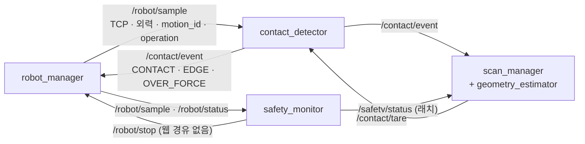

# 접촉 판정 · 안전 감시 · 형상 추정 · 브링업 정리 (1차 스캔, 2026-09-18 ~ 09-23)
담당: 현지 · 관련 이슈: #16 #18 #24 #33 #34 #53 #109 #120 #126 #128 #130 #146 #182 · 관련 PR: #61 #68 #70 #74 #75 #86 #89 #97 #99 #100 #117 #127 #131 #132 #148 #151 #160 #168 #169 #172 #173

수치 표기: **실측**(날짜 · 측정자 · 조건) / **설계 출발값**(BRD · 계약의 값, 실측 아님) / **계산값**(식으로 구한 값)을 섞지 않는다. 출처가 없는 값은 쓰지 않았다.

## 1. 맡은 것과 범위
- **contact_detector**(T07 · T16): 외력 기준값(tare), 접촉(CONTACT) · 접촉 소실(EDGE) · 과대 외력(OVER_FORCE) 판정, Virtual 용 sim 입력원(가상 직육면체), 기록 CSV 오프라인 분석기. → [README](../../ws_cobot1/src/contact_detector/README.md)
- **safety_monitor**(T18 · T33): 과대 외력 · 하강 제한의 2차 감시, 샘플 · 상태 최신성 감시, 웹을 거치지 않는 `/robot/stop` 요청과 래치. → [README](../../ws_cobot1/src/safety_monitor/README.md)
- **geometry_estimator**(T17): 측정 5 점 → 편향 보정 → 치수 · 꼭짓점 · 외곽 엣지 · 경로 후보 · 비정상 검출(scan_manager 안의 순수 모듈). → [README](../../ws_cobot1/src/scan_manager/scan_manager/geometry_estimator/README.md)
- **contact_scan_bringup**(T05): 노드 5 개 launch, sim · real 파라미터 파일, 계약 값 검사 시험. → [README](../../ws_cobot1/src/contact_scan_bringup/README.md)
- **통합**(T06): 저녁 통합 빌드 · 일일 기록([daily](../test-reports/daily/)), 통합 감사(#131) · 안전 감사 검토(#151), 시연 중 정지 대응표(#173).
- **하지 않은 것**: 웹 heartbeat 감시(계약 9장 TBD, #33) · 작업영역 감시(`OUT_OF_WORKSPACE`) 미구현. 외력 감소 보조 신호는 스위치만 두고 끔(#128). 실기 EDGE 확정은 robot_manager 스텝 모드로 넘어갔다(5.2). 반복성(TR-02 10 회)은 미실시.

## 2. 설계
| # | 무엇을 | 왜 | 검토한 대안 | 근거 |
|---|---|---|---|---|
| 2.1 | **판정 좌표 = 조건이 처음 성립한 샘플**(연속 N 회 중 첫 번째). 확정 시각 · 검출 하중은 N 번째 샘플 | 디바운스(N)를 바꿀 때마다 측정 좌표가 밀리면(5 mm/s · N=3 에서 0.2 mm, 계산값) 편향 보정 상수를 다시 재야 한다. 판정 지연은 `detect_stamp − force_stamp` 로 이벤트가 스스로 들고 다닌다 | 확정 샘플 좌표(단순하지만 N 과 편향이 묶인다) | 계약 3.3 v0.1.5(#69) |
| 2.2 | **판정 모드는 샘플의 `operation` 에서 얻는다**. robot_manager 가 실행 중인 goal 의 `motion_id` · `operation` 을 샘플에 직접 찍는다 | 스캔 단계(`/scan/state`)로 모드를 고르면 모션 시작 · 끝과 어긋나는 틈에서 엉뚱한 판정을 한다. 이벤트는 `motion_id` 로 goal 과 짝을 맞춘다 | `/scan/state` 단계 구독 | 계약 3.1 · 3.3 v0.1 변경 |
| 2.3 | **safety_monitor 는 "접수"와 "정지 완료"를 가르고, 래치는 `/safety/reset` 으로만 푼다.** 최신성 이상은 움직이는 중에만 정지, 서 있으면 경고 | 드라이버가 멈추면 `/robot/stop` 과 `/robot/status` 가 같이 죽는다 — 확인이 안 되면 "물리 비상정지가 필요할 수 있다"를 계속 올리는 것이 할 수 있는 전부다 | 조건이 사라지면 자동 해제(같은 이상이 되풀이된다) | 계약 3.7 · 7.1 ③, `api-check-log.md` |
| 2.4 | **편향 보정 = √(2rδ − δ²) + v · t_detect + offset**, 순수 Python 모듈로 ROS 없이 시험 | 팁 구가 모서리를 넘어 δ 만큼 내려간 뒤 판정되므로 판정 x · y 는 모서리보다 바깥이다. δ 는 EDGE 이벤트의 `z_drop_m` 이 실측으로 준다 | 보정 없음(방향마다 같은 부호로 폭이 커진다) | 계약 3.3, PR #70 · #75 |

## 3. 구현

- **CONTACT(하강)**: 하강 중 기준 F₀ 를 최근 [t − 1.0, t − 0.3] s 외력 평균(이동 기준)으로 두고 `|F − F₀| > 3 N` 이 연속 3 회면 확정. 출발 뒤 5.5 s 는 이동 기준이 흔들리므로 tare F₀ · 6 N 으로 둔하게 본다(끄지 않는다 — 그 사이 닿으면 막을 것이 과대 외력뿐이다)
- **EDGE(밀기)**: z 가 멈추고 x · y 가 움직이면 "누르고 있다"로 켜고, z 가 최근 0.5 s 추세선보다 0.5 mm 넘게 떨어지면 확정. 힘 꺾임(Fz 가 최근 중앙값보다 떨어짐)은 스위치로 둔다. **실기 기본(스텝 모드)에서는 robot_manager 가 멈춘 채 힘을 읽어 확정한다**(5.2)
- **OVER_FORCE**: 모든 동작에서 원시 `|F| > 30 N` 한 번이면 확정. 1차는 contact_detector → robot_manager, 2차는 safety_monitor → `/robot/stop` + 래치(계약 7.2)
- **safety_monitor**: 조건 확정 → `/robot/stop` 비동기 호출(응답을 기다리지 않는다) → `/robot/status` 의 `connected && !moving` 으로 완료 확인 → 0.6 s 안에 안 되면 `UNCONFIRMED` 로 올리고 2 s 주기로 다시 요청. 기동 뒤 3 s 는 최신성을 보지 않는다(5.3)
- **geometry_estimator**: 윗면 1 점 + 모서리 4 점 → 방향별 편향 보정 → 폭 · 길이 · 높이 · 꼭짓점 8 · 엣지 12 · 경로 후보 4 → 폭 0 이하 · 높이 음수면 `INVALID_SHAPE`
- **sim 입력원**: Virtual 은 외력이 0 이라 접촉이 안 일어난다. 샘플의 외력 · z 를 가상 직육면체 모델 값으로 바꿔 판정기에 넣는다(x · y 는 실제 로봇 값). 2026-09-24 현지 PC Virtual 종단: 가상 박스 100 × 60 × 40 mm 를 99.72 × 59.76 × 39.92 mm 로 복원(82 s)

## 4. 시험 · 실측
| 항목 | 설계 출발값 · 목표 | 실측 (날짜 · 측정자 · 조건) | 판정 · 출처 |
|---|---|---|---|
| 검출 하중 | KPI 5 N 이하(도전 3 N), 임계 3 N | 임계 3.0 N: 평균 **4.49 N**, 10 회 중 **2 회 5 N 초과**(5.15 · 5.29). 임계 2.0 N: 평균 2.76 N, 0/7 초과 (2026-09-23 학민 실기, 하강 2 mm/s, 큐브 윗면 1 점) | 임계 3.0 은 회차 기준 **불합격**, 2.0 은 합격. 같은 날 하강 거짓 접촉 3/10 은 임계가 아니라 settle 구간의 6 N 판정 문제([#182](https://github.com/yujh5537/rokey_cobot1_Weld-Made/issues/182), 학민 정정). [TR-01_20260923](../test-reports/TR-01_20260923.md)(PR #181, 2026-09-23 머지) |
| 같은 점 반복 접촉 z 산포 | — | **σ 0.040 mm**, 폭 0.130 mm (2026-09-23 학민, 위와 같은 10 회) | 반복성 KPI(0.3 mm, 치수 10 회)와는 다른 양 — **치수 반복성 KPI 로 쓰지 않는다**(학민, PR #181 결론 4) |
| 무접촉 외력 잡음 | tare RMS 한계 0.3 N | 0.035 N(2026-09-20 홈 정지, 기록기 단독) · tare RMS 0.636~0.813 N(2026-09-23 실기 통합 기준점) | 조건이 달라 한 줄로 읽지 않는다. real 한계 1.0 N 으로 조정(PR #179) |
| 샘플 주기 · 공백 | 50 Hz | 42.7 Hz(2026-09-20 학민, 기록기 단독) · 42.8 Hz, 공백 141~160 ms(2026-09-23 학민) · 정지 중 약 3 s 마다 316~365 ms 공백(2026-09-21~22 실기) | [TR-01_20260920](../test-reports/TR-01_20260920.md) · TR-01_20260923(PR #181) · 계약 6.3 · #130 |
| 샘플 최신성 한계 | 300 ms | 300 에서 **goal 의 약 40 % 가 SAMPLE_STALE 로 정지**(2026-09-22 실기) | real 500 ms 로 예외 조정(PR #168). 687 ms 공백은 여전히 정지 |
| 하강 중 공중 거짓 접촉 | 0 회 | 이동 기준 적용 뒤 홈 출발 하강 6 회 **0 회**(2026-09-21 18:38 학민 실기) · **3/10**(2026-09-23 실기, 6 N 둔한 구간) | PR #127, #182 |
| EDGE(z 추세선) | 모서리마다 1 회 | 밀기 4 회 **0 회**(2026-09-21 학민 실기, 모서리 뒤 z 가 0.2~0.35 mm/s 로 흘러 추세선이 따라감) | 계약 CHANGELOG v0.1.13 |
| 치수 정확도 | KPI ±3 mm | 캘리퍼 대비 width **+1.50** · length **−0.36** · height **+0.26 mm**(2026-09-23 실기 통합, scan `20260923-183211-3702`, 스텝 모드) | **합격**. #180 코멘트 |
| 탐색 시간 | KPI 120 s(시작 버튼 → 형상 생성 종료, 마무리 홈 복귀 제외) | **438 s**(같은 scan, 액션 실측). 구간: 스텝 긁기 4 방향 **331.1 s(76 %)** · 방향 전환 재접근 내림 3 회 **75.9 s(17 %)** · 기준점 이동 · tare · 첫 하강 18.7 s · 올림 · 수평 이동 16.0 s(구간 합 441.7, [#180](https://github.com/yujh5537/rokey_cobot1_Weld-Made/issues/180) 학민 정정 2026-09-23) | 불합격(3.6 배). **원인**: 힘 제어 연속 밀기가 실기에서 실패(방향별 누름 1.5~8.6 N 편차 · 방향 전환 뒤 뜸 · 가짜 EDGE, #152~#155) → 멈춰서 힘을 읽는 스텝 모드(#160). 120 s 는 연속 밀기를 전제로 잡은 숫자. **팀 결정(병후 2026-09-25)**: #180 선택지 ③ "KPI 를 다시 본다" — 스텝 모드 기준으로 재설정한다는 것을 발표에서 숨기지 않는다. **개선안(계산값 · 미실시)**: 재접근 내림 2 단(빠름 45 mm + 저속 5 mm, 방향당 25 → 4 s, 3 회 −60 s) · 거친 스텝 0.5 → 1.0 mm(−150 s, 분해능은 다듬기 0.1 mm 가 정함) → 약 230 s(1.9 배). 그 아래는 스텝당 비용(settle 0.15 s + 힘 샘플 3 개 + 서비스 왕복)이라 방식의 한계. 시간 쪽 구현은 robot_manager · scan_manager 담당 |
| 반복성(치수 10 회 σ) | KPI 0.3 mm | **미실시** | TR-02 · #34 |
| sim 치수 복원 | 0.4 mm 안 | 0.28 mm(2026-09-24 현지 PC Virtual) · 단위시험 `test_full_scan_recovers_the_virtual_box` | [bringup README](../../ws_cobot1/src/contact_scan_bringup/README.md) |
| 팁 반지름 r | 3 mm(BRD 예시) → 0.225 mm(2026-09-19 옛 탐침 실측) | **약 2 mm 잠정**(2026-09-23 병후 · 학민, 폭 · 높이가 함께 맞는 값. 캘리퍼 전) | `units-frames.md` v0.1.18, PR #169 |

## 5. 문제와 해결
### 5.1 하강 중 허공에서 거짓 접촉 (2026-09-21 실기)
- 증상: 큐브 윗면 38 · 44 · 78 mm 위 공중에서 CONTACT 가 확정돼 밀기가 허공에서 나갔다([realrobot-session_20260921](../test-reports/realrobot-session_20260921.md) 5-2 · 5-11)
- 원인: `get_tool_force` 는 센서가 아니라 모델 추정값이고, 치우침(2~3 N)이 마지막 이동 방향 · 자세를 따라 흐른다. 정지 상태에서 한 번 잡은 F₀ 가 하강 중에 맞지 않았다
- 조치: 하강 중 F₀ 를 최근 [t − 1.0, t − 0.3] s 이동 기준 평균으로 바꾸고, 출발 뒤 5.5 s 는 6 N 둔한 판정으로 둔다(학민 구현 · 현지 리뷰로 settle · 6 N 을 정함, PR #127, 계약 v0.1.12)
- 결과: 같은 날 18:38 홈 출발 하강 6 회 거짓 접촉 0 회. 2026-09-23 실기에서 6 N 구간이 다시 뚫려 3/10 → #182
- 교훈: 힘 추정값은 "그 모션 · 그 자세 근처"에서만 기준으로 쓸 수 있다

### 5.2 모서리(EDGE)를 z 추세선으로 한 번도 못 잡음 (2026-09-21 실기)
- 증상: 밀기 4 회 모두 EDGE 가 나오지 않고 최대 거리까지 밀었다
- 원인: 모서리를 넘은 뒤 팁이 급강하하지 않고 z 가 일정 속도(0.2~0.35 mm/s)로 떨어져, 추세선이 그 기울기를 따라갔다. 반면 Fz 는 모서리에서 0.4 s 안에 2~4 N 꺾였다
- 조치: ① 힘 꺾임 EDGE 추가(학민, PR #132, 기본 꺼짐. 재생 464.43~466.70, 기대 463.56) ② 움직이는 중의 힘을 믿을 수 없다는 근본 문제로 robot_manager **스텝 모드**(한 스텝 가고 멈춘 뒤 힘을 읽어 소실 확정)로 전환(학민, PR #160, 계약 v0.1.15)
- 결과: 2026-09-22 18:40 네 방향 성공, 2026-09-23 웹 START 로 실기 종단 성공(PR #179). 대신 탐색 시간이 438 s 로 늘었다(#180)
- 교훈: 움직이는 중의 힘 추정값보다 멈춘 뒤의 평균이 믿을 만하다 — 정확도와 시간을 맞바꿨다

### 5.3 safety_monitor 가 기동하자마자 래치 (2026-09-21 아침 sim 종단)
- 증상: `/scan/run` 이 `SAFETY_LATCHED(103)` 로 거절됐다. 로그 `SAMPLE_STALE: 508 ms 동안 수신 없음`
- 원인: 노드 5 개가 동시에 뜨며 샘플이 508 ms 끊겼고, 그때 robot_manager 는 "위치를 모르면 이동 중"(PR #72)이라 moving=true 였다. "움직이는 중의 최신성 이상 = 정지" 규칙과 겹쳤다
- 조치: `startup_grace_s` 3 s 동안 최신성으로는 정지 · 래치를 걸지 않는다. **과대 외력 · 하강 제한은 유예하지 않는다**(PR #99)
- 결과: 고친 뒤 기동 직후 `level=0, latched=false`(Virtual + sim 재현)
- 교훈: 각자 옳은 보수적 기본값 두 개가 겹치면 오탐이 된다 — 노드 사이 기본값은 같이 본다

### 5.4 safety_monitor 가 실기 중 두 번 죽음 (2026-09-21 10:34 · 11:51)
- 증상: 과대 외력 이벤트 · 작업대 접촉 직후 노드가 죽었고, 11:51 이후 **하강 5 회 · 밀기 2 회가 2 차 감시 없이** 돌았다(#103)
- 원인: 같은 줄에서 로거를 `error` · `warn` 으로 바꿔 불렀다. rclpy 로거는 호출 위치마다 severity 를 고정해, 바뀌면 `ValueError` 를 타이머 콜백 안에서 던진다. "서 있을 때 끊김(WARN) 뒤 움직일 때 끊김(STOP)" 순서에서만 났다
- 조치: `error` · `warn` 을 다른 줄에서 부른다(PR #117, 병후가 Virtual · 실기에서 발견)
- 결과: 이후 재발 없음. 감시자가 죽은 것을 아무도 몰랐다는 점은 #120 으로 남았다(scan_manager 는 `/safety/status` 가 끊기면 START 를 거절하도록 PR #136)
- 교훈: 감시자는 죽을 수 있다 — 감시자의 생존도 누군가 봐야 한다

### 5.5 SAMPLE_STALE 로 goal 의 약 40 % 가 정지 (2026-09-22 실기)
- 증상: 정지 중 약 3 s 마다 316~365 ms 공백이 반복되어 300 ms 한계에 걸렸고, 접촉 위치에서 곧바로 안전복귀가 나간 것도 2 회(#130)
- 원인: 미확인(robot_manager 직렬 호출 줄 · 드라이버 응답 지연 · 호스트 부하 중 하나). 늦은 응답을 이름 · 시간과 남기는 1 단계만 했다(PR #135)
- 조치: real 한계를 500 ms 로 예외 조정(병후, PR #168, 계약 v0.1.16) — 기록된 공백 14 개 중 687 ms 하나만 걸린다. 시연 중 멈췄을 때의 사람 대응표를 만들었다(현지, PR #173)
- 결과: 9/23 시연 진행. 687 ms 공백이 실제로 있었으므로 500 도 완전하지 않다 — 원인이 풀리면 300 으로 되돌린다
- 교훈: 감시 한계를 올리는 것은 원인을 모를 때의 임시 조치이고, 되돌릴 조건을 같이 적어 둔다

### 5.6 시험이 실기 도메인에 가짜 이벤트를 넣음 (2026-09-22 16:03)
- 증상: `ROS_DOMAIN_ID=30`(조 공용 · 실기) 셸에서 돌린 `colcon test` 가 실기의 `/contact/event` 에 가짜 이벤트를 넣었다(`contact_scan_testing` 모듈 설명에 기록. 그 설명이 가리키는 t25 원본 `docs/test-reports/data/20260922/` 는 레포에 커밋되지 않았다). PID 로 번호를 고르던 방식도 1/9 확률로 같은 PC 의 Virtual 과 겹쳤다(#126)
- 원인: `ROS_AUTOMATIC_DISCOVERY_RANGE=LOCALHOST` 는 PC 밖만 막는다. 같은 PC 에서는 도메인 번호만이 경계다
- 조치: 살아 있는 프로세스가 쓰는 번호를 빼고 31~39 중 빈 번호를 락 파일로 점유하는 시험 헬퍼 `contact_scan_testing`(학민, PR #172). 네 패키지가 쓴다
- 결과: 노드 시험이 조 공용 도메인에 뜨지 않는다. 9 개가 다 차면 조용히 공유하지 않고 멈춘다
- 교훈: 시험도 로봇을 움직일 수 있다 — 격리는 "확인"이 아니라 "점유"로 한다

## 6. 남은 문제 · 한계
| 번호 | 내용 |
|---|---|
| #182 | 하강 settle 5.5 s 구간 6 N 판정이 공중 치우침에 뚫림(9/23 3/10) |
| (TR-01) | 검출 하중 KPI: 임계 3.0 N 에서 회차 2/10 불합격. 2.0 으로 내릴지 팀 결정 전 |
| #146 · PR #148 | δ(`z_drop_m`)를 모르는 EDGE 하나로 스캔 전체가 501. δ 를 모르면 d = 0 으로 보정하는 수정이 리뷰 대기(실기 발생은 0 회) |
| #130 | 샘플 공백의 원인 미확인. 500 ms 는 예외 조정 |
| #53 · PR #161 | 1 차 · 2 차 하강 제한 동시 래치 — 팀 결정(2 차 +5 mm 여유)이 머지 전 · 실기 미검증 |
| #33 | 웹 heartbeat 감시 미구현 |
| #154 | 힘 꺾임 EDGE 의 출발 흔들림 오판(기본 꺼짐) |
| 미측정 | 반복성(TR-02 10 회), 실기 `/robot/status` 주기, 외력 갱신 약 94 ms 가 robot_manager 경로에서도 같은지, 팁 반지름 캘리퍼 값 |
| 가정 | 부재 변이 Base 축과 평행(회전은 관측하지 않는다, `units-frames.md` 배치 원칙), 탐침 밀림 · 마모는 세션 시작 점검으로 막는다 |

## 7. 발표 후보
1. **그림**: 3 장의 자료 흐름 — 판정(contact_detector) · 2 차 감시(safety_monitor) · 정지(robot_manager)가 웹을 거치지 않고 메인 PC 안에서 끝난다
2. **한 문장**: "힘 추정값은 그 모션 · 그 자세 근처에서만 기준이 된다" — 정지 F₀ 거짓 접촉 → 이동 기준 0 회(5.1)
3. **수치**: 치수 오차 +1.50 · −0.36 · +0.26 mm, KPI ±3 mm 합격 / 탐색 438 s, KPI 120 s 불합격(정확도와 시간을 맞바꿈, 5.2)
4. **수치**: 검출 하중 임계 3 N → 평균 4.49 N · 2/10 초과, 임계 2 N → 2.76 N · 0/7 — KPI 를 회차 기준으로 정직하게
5. **장애 → 조치 흐름**(평가 "지속성" 증거): SAMPLE_STALE 로 멈춤 → 래치 · 사유 표시 → 관제자 조그 · 해제 · 안전복귀 → 새 START(5.5, daily 0923 §7)
6. **한 문장**: "감시자도 죽는다" — safety_monitor 가 두 번 죽는 동안 하강 5 · 밀기 2 가 감시 없이 돌았다(5.4)
7. **그림 후보**: EDGE 판정 — z 추세선이 따라간 실기 z 곡선과 Fz 꺾임. 레포에 있는 원본은 `docs/test-reports/data/20260921/rm_real_01`(오전 bag)뿐이다. 계약이 인용하는 오후 bag(`20260921_pm/…`)은 커밋되지 않았다 — 그림을 만들려면 학민 PC 원본이 필요하다
