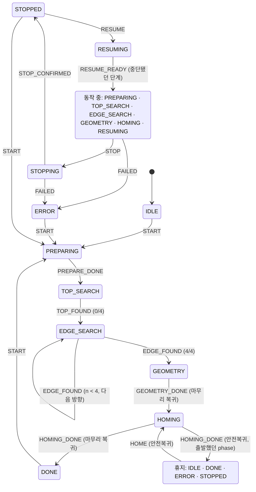

# scan_manager

스캔 순서(윗면 → ±X/±Y → 형상 계산 → 마무리 복귀)와 작업 중지 · 안전복귀 · 재시작을 조정하는 노드다. 담당은 병후다.
기준은 `docs/contracts/ros-interfaces.md` v0.1.1이고, 이 문서와 계약이 다르면 계약이 맞다.

| 파일 | 내용 | rclpy |
|---|---|---|
| `scan_manager/contract_enums.py` | `Phase` · `Direction` · `Reason`. 계약 3.4절 · 6.1절 상수의 사본 | 쓰지 않음 |
| `scan_manager/state_machine.py` | 이벤트 · 전이표 · `ScanStateMachine` | 쓰지 않음 |
| `scan_manager/scan_manager.py` | 노드. 상태 기계를 들고 `/scan/state`를 발행한다 | 씀 |

T10은 골격까지다. Action · Service 서버와 ExecuteMotion 호출 · tare · 방향 전환 · SetConfig 전파는 T19, `result_store/`는 T20, 중지 · 안전복귀 · 재시작의 실제 처리는 T26, `geometry_estimator/`는 T17(현지)에서 얹는다.

## 실행 · 테스트
```bash
cd ws_cobot1
python3 -m pytest src/scan_manager/test -q     # ROS를 source하지 않은 셸. ROS가 필요한 테스트는 skip된다
source /opt/ros/jazzy/setup.bash               # ws_dsr 없이 빌드된다
colcon build --symlink-install --packages-up-to scan_manager && source install/setup.bash
colcon test --packages-select scan_manager && colcon test-result --verbose
ros2 run scan_manager scan_manager             # 로봇 · 드라이버 연결 없이 단독 실행
```

## 파라미터
값은 `contact_scan_bringup/config/*.yaml`에 둔다. 아래 값은 설계 출발값이며 실측값이 아니다.

| 이름 | 출발값 | 뜻 |
|---|---|---|
| `state_publish_period_s` | 1.0 | `/scan/state` 주기 발행 간격(s). 상태가 바뀌면 이 주기와 상관없이 바로 발행한다. 0 이하면 노드가 기동하지 않는다 |

## 상태 기계

### 입력
입력은 두 종류다. 이름은 T19 · T26이 그대로 쓰도록 고정한다.

**Command** — 관제자 명령. `sm.request(Command.X, conditions=..., scan_id=...)`. 허용되지 않으면 예외 없이 `Outcome(accepted=False, reason=<ReasonCode>)`를 돌려준다. 그 값을 goal 거절 · Service 응답에 그대로 싣는다.

| Command | 대응 인터페이스 | 필요한 입력 |
|---|---|---|
| `START` | `/scan/run` goal | `scan_id`(새로 발급, 필수) · `conditions` |
| `STOP` | `/scan/stop` | 없음 |
| `HOME` | `/scan/home` goal | `conditions` |
| `RESUME` | `/scan/resume` goal | `scan_id`(goal 값, `""` = 가장 최근 중단 작업) · `conditions` |
| `SET_CONFIG` | `/scan/set_config` | 없음. phase는 바뀌지 않고 접수 여부만 판정한다 |

`Conditions(robot_connected, safety_latched)`는 명령 시점의 `/robot/status.connected`와 `/safety/status.latched`다. `None`은 "아직 받지 못함"이고 거절 사유가 된다.

**Signal** — 노드 내부의 진행 보고. `sm.notify(Signal.X)`. 현재 phase에서 허용되지 않으면 `InvalidTransition`을 던진다. 조용히 무시하지 않는다. 경합(예: 중지 직후에 도착한 EDGE)을 어떻게 다룰지는 호출 측이 정한다.

| Signal | 보내는 시점 |
|---|---|
| `PREPARE_DONE` | 시작 조건 점검과 tare가 끝났다 |
| `TOP_FOUND` | 윗면 접촉을 확보했다 |
| `EDGE_FOUND` | 모서리 1개를 확보했다 |
| `GEOMETRY_DONE` | 형상 계산 · 원본 저장 · `/scan/result` 발행이 끝났다 |
| `HOMING_DONE` | 홈 복귀가 끝났다(마무리 · 안전복귀 공용) |
| `STOP_CONFIRMED` | `/robot/status`로 `connected && !moving`을 확인했다 |
| `RESUME_READY` | 재시작 준비가 끝났다 |
| `FAILED` | 실패 · 안전 이상. `reason_code`(0이 아닌 ReasonCode)가 필수다 |

### 전이도

`ACTIVE` · `REST`는 그림을 줄이려고 묶은 것이며 phase가 아니다. 위쪽의 phase들과 같은 것이다.

### 전이표
표에 없는 조합은 허용되지 않는다. Command는 거절하고 Signal은 `InvalidTransition`이다. 코드의 `COMMAND_TRANSITIONS` · `SIGNAL_TRANSITIONS`가 이 표이며, 테스트가 11개 phase × 전 이벤트를 전수 확인한다.

| 현재 phase | 이벤트 | 다음 phase | 비고 |
|---|---|---|---|
| IDLE · DONE · ERROR · STOPPED | `START` | PREPARING | 새 `scan_id`, progress 0. 이전 재개 지점 · 실패 사유를 버린다 |
| IDLE · DONE · ERROR · STOPPED | `SET_CONFIG` | 그대로 | 접수만 한다 |
| IDLE · DONE · ERROR · STOPPED | `HOME` | HOMING | 안전복귀. 이 시점부터 그 작업의 재시작은 `NOT_SUPPORTED` |
| PREPARING · TOP_SEARCH · EDGE_SEARCH · GEOMETRY · HOMING · RESUMING | `STOP` | STOPPING | 접수 ≠ 정지 완료 |
| STOPPING · IDLE · DONE · ERROR · STOPPED | `STOP` | 그대로 | 멱등 접수 |
| STOPPED | `RESUME` | RESUMING | 재개 지점이 있을 때만 |
| PREPARING | `PREPARE_DONE` | TOP_SEARCH | |
| TOP_SEARCH | `TOP_FOUND` | EDGE_SEARCH | 0/4, 첫 방향 |
| EDGE_SEARCH | `EDGE_FOUND` | EDGE_SEARCH 또는 GEOMETRY | progress +1. 4/4면 GEOMETRY |
| GEOMETRY | `GEOMETRY_DONE` | HOMING | 마무리 복귀(7.4절) |
| HOMING | `HOMING_DONE` | DONE 또는 출발했던 휴지 phase | 마무리 복귀 → DONE, 안전복귀 → 출발 phase |
| STOPPING | `STOP_CONFIRMED` | STOPPED | |
| RESUMING | `RESUME_READY` | PREPARING · TOP_SEARCH · EDGE_SEARCH · GEOMETRY | 중단됐던 단계. progress · 방향 · `scan_id` 유지 |
| PREPARING · TOP_SEARCH · EDGE_SEARCH · GEOMETRY · HOMING · RESUMING · STOPPING | `FAILED` | ERROR | 자동 홈 복귀 없음. `sm.failure`에 사유 · 실패한 phase |

### 거절 사유
값은 계약 6.1절 ReasonCode와 같다. 여러 조건에 걸리면 위에서부터 먼저 걸린 것을 돌려준다.

| Command | 판정 순서 |
|---|---|
| `START` | `BUSY`(100) → `SAFETY_LATCHED`(103) → `ROBOT_DISCONNECTED`(104) |
| `SET_CONFIG` | `BUSY` |
| `HOME` | `BUSY` → `ROBOT_DISCONNECTED`. 안전 래치는 막지 않는다 |
| `RESUME` | `BUSY` → `NO_RESUMABLE_SCAN`(105) 또는 `NOT_SUPPORTED`(107) → `SAFETY_LATCHED` → `ROBOT_DISCONNECTED` |
| `STOP` | 거절 없음 |

`RESUME`의 105 · 107:

| 상황 | 사유 |
|---|---|
| IDLE · DONE | `NO_RESUMABLE_SCAN` |
| 마무리 HOMING 중에 중지된 작업(7.4절) | `NO_RESUMABLE_SCAN` |
| goal의 `scan_id`가 중단된 작업과 다르다 | `NO_RESUMABLE_SCAN` |
| 중지 뒤에 안전복귀(`HOME`)를 접수했다(끝까지 갔는지와 무관, 5.3절) | `NOT_SUPPORTED` |
| ERROR(이상 상태별 재시작 허용 조건이 TBD, 9장) | `NOT_SUPPORTED` |

### 세 명령은 독립이다
- `STOP`은 STOPPING으로만 간다. STOPPING에서 갈 수 있는 곳은 STOPPED(`STOP_CONFIRMED`)와 ERROR(`FAILED`)뿐이다.
- STOPPED를 떠나는 Signal은 없다. 관제자의 `START` · `HOME` · `RESUME`만 STOPPED를 떠나게 한다.
- 실패(ERROR)도 자동으로 홈 복귀하지 않는다.
- 이 세 가지는 `test/test_commands.py`가 전이표 수준에서 고정한다.

### 상태 필드
| 필드 | 규칙 |
|---|---|
| `scan_id` | IDLE에서만 `""`. DONE · ERROR · STOPPED에서도 유지한다 |
| `direction` | EDGE_SEARCH에서만 값이 있다. 그 밖은 `NONE`. 순서는 +X → −X → +Y → −Y(생성자 인자 `direction_order`로 바꿀 수 있다) |
| `progress` | 확보한 모서리 수. 다음 `START` 전까지 유지한다. `progress_total`은 4 |
| `motion_id` | `sm.set_motion_id()`로 넣는다. 휴지 phase에 들어가면 0으로 돌아간다 |

### 사용 예
```python
from scan_manager.contract_enums import Reason
from scan_manager.state_machine import Command, Conditions, ScanStateMachine, Signal

sm = ScanStateMachine(on_change=publish)      # 상태가 바뀔 때마다 Snapshot으로 publish 호출
cond = Conditions(robot_connected=True, safety_latched=False)

out = sm.request(Command.START, conditions=cond, scan_id='20260918-210000-0001')
if not out.accepted:
    reject_goal(int(out.reason), out.detail)   # 예: 100 BUSY
sm.notify(Signal.PREPARE_DONE)                 # → TOP_SEARCH
sm.notify(Signal.TOP_FOUND)                    # → EDGE_SEARCH 0/4 +X
sm.notify(Signal.EDGE_FOUND)                   # → EDGE_SEARCH 1/4 −X
sm.notify(Signal.FAILED, reason_code=Reason.NO_EDGE, detail='max_distance')   # → ERROR
```
