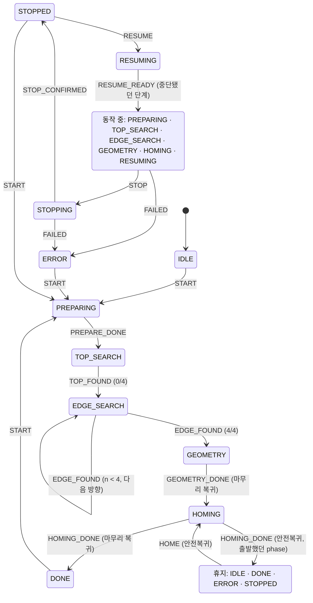

# scan_manager

스캔 순서(윗면 → ±X/±Y → 형상 계산 → 마무리 복귀)와 작업 중지 · 안전복귀 · 재시작을 조정하는 노드다. 담당은 병후다.
기준은 `docs/contracts/ros-interfaces.md` v0.1.1이고, 이 문서와 계약이 다르면 계약이 맞다.

| 파일 | 내용 | rclpy |
|---|---|---|
| `scan_manager/contract_enums.py` | `Phase` · `Direction` · `Reason` · `Operation` · `MotionReason`. 계약 3.4절 · 5.4절 · 6.1절 상수의 사본 | 쓰지 않음 |
| `scan_manager/state_machine.py` | 이벤트 · 전이표 · `ScanStateMachine` | 쓰지 않음 |
| `scan_manager/params.py` | 파라미터 이름 · 필수 여부 · 범위 검사, `ScanParams`. 모션 · 보정 수치에는 코드 예비값이 없다 | 쓰지 않음 |
| `scan_manager/sequence.py` | 시퀀스: `MotionPlanner`(goal 값 · 방향 전환 3단계 · 마무리 순서), `classify`(모션 결과 → 도달 · 측정 · 중지 · 실패), `ScanRunner` · `ResumeRunner` · `run_home`(순서. 바깥일은 `Ports` 뒤에 둔다), `ResumePlan` | 쓰지 않음 |
| `scan_manager/resume.py` | 재시작의 판단: 기록(result_store) → 상태 기계를 되돌릴 값(`restoration_from`), 이어 갈 계획 또는 거절(`plan_resume`) | 쓰지 않음 |
| `scan_manager/event_matcher.py` | `ContactEvent` ↔ `ExecuteMotion.Result` 짝 맞추기(`motion_id` 대조, `event_id` 짝, 도착 순서 무관) | 쓰지 않음 |
| `scan_manager/geometry_adapter.py` | Base → 작업대 좌표 평행 이동, `geometry_estimator` 호출, `BoxEstimate` → `ShapeResult` · `BiasCorrection`, `GEOM_*` → ReasonCode. `geometry_estimator`를 import하는 유일한 곳 | 쓰지 않음 |
| `scan_manager/result_store/` | 진행 기록 · 결과 원본의 파일 보존(T20). [README](scan_manager/result_store/README.md) | 쓰지 않음 |
| `scan_manager/geometry_estimator/` | 5점 → 편향 보정 · 직육면체(T17, 현지). [README](scan_manager/geometry_estimator/README.md) | 쓰지 않음 |
| `scan_manager/conversions.py` | msg ↔ 순수 자료형: `ContactEvent` → `Detection`, `MotionRequest` → goal, `ShapeResult` → `ScanResult`(None → NaN + `*_valid=false`), `ScanConfig` ↔ 값 | msg 타입만 |
| `scan_manager/scan_manager.py` | 노드. 서버 5개 · 구독 · 클라이언트 · `Ports` 구현 · 쓰기 스레드 · 종료 처리 | 씀 |

T19a(시퀀스 · 서버 · geometry 연결) · T26(재시작) · T19b(SetConfig 전파 P01~P03)까지 들어 있다. **전파를 포함한 검증은 테스트 안에서 띄운 가짜 상대 노드(`test/fake_peers.py`)로 한다.** 실제 노드 · Virtual Mode 종단은 T19b에서 홈 복귀 · tare · 윗면 접촉 · 첫 모서리까지 확인했고, 그 뒤는 에뮬레이터가 조회에 응답을 멈춰 못 갔다(#100 코멘트 · #102).

## 시퀀스 (`sequence.py`)
기준은 계약 5.4 · 7.1 · 7.3 · 7.4절과 BRD 4.2.5 · 4.2.6이다.

| 단계 | 모션 · 호출 | 다음 |
|---|---|---|
| PREPARING | `OP_MOVE_TO` 기준점(`search_origin_pose`) → 정지 확인 → `/contact/tare` | `PREPARE_DONE` |
| TOP_SEARCH | `OP_DESCEND` | CONTACT 이벤트 → 기록 → `TOP_FOUND`. 이 판정 좌표의 z가 첫 접촉 z다 |
| EDGE_SEARCH | 첫 방향은 접촉한 자리에서 바로 `OP_SLIDE`. 다음 방향부터 `OP_MOVE_TO` ×3(① 정지 좌표에서 `lift_height_m` 올림 ② 기준 원점의 x · y로 수평 이동 ③ 첫 접촉 z + `recontact_margin_m`까지 `recontact_speed_mps`로 내림) → `OP_SLIDE`. 재하강(`OP_DESCEND`)은 없다 | EDGE 이벤트 → 기록 → `EDGE_FOUND` |
| GEOMETRY | 형상 계산 → 원본 저장 → `/scan/result` 발행 | `GEOMETRY_DONE` |
| HOMING | `OP_MOVE_TO` 들어 올림 → `OP_HOME` | `HOMING_DONE` → DONE |

- 측정값의 출처는 판정 좌표(`ContactEvent.pose`)다. 정지 좌표(`ExecuteMotion.Result.pose`)는 따로 기록한다.
- **좌표는 `frame_id`를 확인하고 쓴다**(계약 1장). `motion_frame_id`와 다른 프레임의 이벤트는 측정값으로 받지 않고(`frame_id_mismatch`로 무시), 다른 프레임의 `Result.pose`로는 다음 모션을 만들지 않는다(실패).
- 정의서 1.1절은 tare → 기준점 이동 순서다. 여기서는 기준점으로 간 뒤 그 자리에서 tare를 한다(측정을 시작할 자세 · 위치에서 F₀를 잡는다). 계약 4.2절은 "`moving=false`를 확인하고 호출한다"만 정한다.
- **스캔의 모든 모션(마무리 복귀 포함)은 보내기 전에 안전 래치를 본다.** 모션 사이(tare · 기록 · 형상 계산 중)에 래치가 걸렸으면 `SafetyStatus.reason_code`로 실패한다. 모션 중의 래치는 로봇 정지의 Result로 잡힌다. 관제자의 안전복귀(`/scan/home`)는 래치가 막지 않는다.
- **실패 · 중지 · 형상 계산 실패에서는 모션을 더 보내지 않는다.** 자동 홈 복귀는 없다(계약 7.4절). `test/test_sequence.py`가 고정한다.
- **실패는 원인 · 단계 · 위치를 함께 남긴다**(BRD 4.2.5). 기록(`progress.json`의 `failure`: `reason_code` · `detail` · `phase` · `pose`)과 `/scan/log`에 적는다. 위치는 실패한 `ExecuteMotion`의 정지 좌표다.
  - **그 모션이 로봇을 움직였을 수 있는데 쓸 수 있는 `Result.pose`가 없으면 위치를 모르는 것이다**: Result가 끝내 오지 않음 · 응답 없는 goal의 늦은 수락 · 다른 프레임의 `Result.pose` · `pose_stamp=0`. `null` + `pose_valid=false`로 남기고 **앞 모션의 좌표로 대신하지 않는다**.
  - 로봇을 움직이지 않고 끝난 명령(goal 거절 · 서버 없음 · 보내지 않은 goal)에서는 로봇이 그대로 있는 앞 모션의 정지 좌표를 적는다. 그것도 없으면(재시작의 첫 모션) 이어받은 중단 좌표다 — `record_stop`과 같은 규칙이다. 이 이어받은 좌표는 기록에만 남는다(`/scan/log`는 그 명령에서 받은 정지 좌표만 싣는다).

모션 결과의 판정(`classify`):

| `ExecuteMotion.Result` | 판정 |
|---|---|
| 서버 없음 · goal 응답 없음 / goal 거절 | 실패 `ROBOT_DISCONNECTED(104)` / `ROBOT_ERROR(204)` + "goal rejected"(ROS 2의 거절에는 사유가 없어 추측하지 않는다) |
| `compliance_released=false` | 실패. Result의 코드, 없으면 `ROBOT_ERROR`. 계약 9장 TBD |
| `REASON_STOP_REQUESTED` · `REASON_CANCELED` | `/scan/stop`을 접수했으면 중지 경로. 아니면(예: safety_monitor의 정지) 실패: 래치 중이면 `SafetyStatus.reason_code`, 아니면 `ROBOT_ERROR` |
| 중지 접수 뒤에 도달 · 측정으로 끝남 | 중지 경로. 그때 도착한 측정값은 **버린다**(기록하지 않고 INFO 로그만). 정지 요청 뒤의 판정은 감속 중의 값일 수 있어 편향 보정의 속도 가정과 어긋나고, 재시작이 그 방향을 기준 원점에서 처음부터 다시 밀기 때문에 잃는 것이 없다 |
| 중지 접수 뒤에 **실패 사유**로 끝남(`OVER_FORCE` · `ROBOT_ERROR` · `MAX_DISTANCE` · `TIMEOUT` · 해제 실패 · goal 거절) | **실패(ERROR).** 중지를 접수했어도 사실을 가리지 않는다. STOPPED로 보내면 재시작 대상이 된다 |
| `REASON_CONTACT`(DESCEND) · `REASON_EDGE`(SLIDE) | `event_id`의 이벤트를 `event_wait_timeout_s`까지 기다린다. 오지 않으면 **측정값 없이 통과시키지 않고** 실패 `TIMEOUT(203)`. `event_id=0`이면 `ROBOT_ERROR` |
| `REASON_MAX_DISTANCE` | `NO_CONTACT(300)` / `NO_EDGE(301)` |
| `REASON_TIMEOUT` · `REASON_OVER_FORCE` | `TIMEOUT(203)` · `OVER_FORCE(400)` |
| `REASON_ROBOT_ERROR` · `REASON_REJECTED` | Result의 `reason_code` 그대로(`DROP_LIMIT(205)` 포함) |

중지 경로: 정지 완료 확인(`Ports.wait_still`, 요청보다 뒤에 찍힌 `/robot/status`) → `record_stop` → `STOP_CONFIRMED`. 확인하지 못하면 `ROBOT_STATUS_LOST(404)`로 ERROR.
중단 위치(`Interruption.pose`)는 **로봇이 마지막으로 멈춘 자리**다: 그 모션의 `Result.pose`, 보내지 않은 goal(중지가 먼저 접수됨)이면 그 앞 모션의 `Result.pose`, 재시작 뒤 모션을 하나도 보내지 않고 다시 중지됐으면 직전 중지의 좌표. `Result.pose`가 채워지지 않았으면 `null`이다(추측하지 않는다).

## 재시작 (`resume.py` · `sequence.ResumeRunner`)
기준은 계약 5.3 · 7.3 · 7.4절, BRD 4.4.8 · TR-08이다. `scan_id`를 유지하고, 확정된 윗면 · 방향은 **다시 재지 않는다**(모션을 보내지 않는다).

**기록이 기준이다.** 측정값 · 첫 접촉 z · 중단 좌표 · 설정을 메모리에서 가져오지 않고 `progress.json`에서 읽는다. 그래서 같은 프로세스에서 중지한 경우와 프로세스가 재시작된 경우가 같은 길을 간다.
- 측정값 캐시(형상 계산의 입력): 기록의 `detection`(판정 좌표) + 기록의 `config`에 있는 속도.
- **설정은 그 작업의 기록(`config` · `node_params`)을 쓴다.** 중지 뒤의 SetConfig · yaml 변경은 다음 새 작업부터 적용된다(한 작업은 한 벌의 설정으로 끝나고 `ScanResult.config`가 실제와 같다). `result_dir`만 현재 파라미터다.
- `motion_id`는 (메모리의 마지막 값, 기록의 `last_motion_id`) 중 큰 값 + 1부터 잇는다. 같은 `scan_id` 안에서 되풀이되지 않는다.
- `started_at`은 원래 작업의 값이다. 그래서 `finished_at − started_at`에는 중지해 있던 시간이 들어간다(계약에 정의가 없다).

**준비(`RESUMING`)는 방향 전환(7.3절)과 같은 절차다.** 중지하면 순응이 풀린 채 팁이 윗면에 닿아 있을 수 있고 F₀는 작업 시작 때의 값이다. 그래서 떼고(올림) → 정지 확인 → **tare** → 기준 원점의 x · y에서 첫 접촉 z + `recontact_margin_m`까지 저속 내림 → 그 방향을 **처음부터** 민다. 새 파라미터는 없다.
중단한 x · y로 돌아가 이어 밀지 않는 이유: 모서리를 막 넘은 자리에서 중지됐다면(늦게 온 EDGE를 버린 경우가 그렇다) 허공에서 SLIDE가 시작돼 `DROP_LIMIT`이나 틀린 모서리가 나온다.

| 기록의 상태 | `RESUMING`에서 | `RESUME_READY` 뒤 |
|---|---|---|
| PREPARING에서 중지 | 없음 | 기준점 → 정지 확인 → tare → 하강 → … (새 작업과 같다) |
| TOP_SEARCH에서 중지, 윗면 미확정 | 기준점으로(`OP_MOVE_TO`) → 정지 확인 → tare. **그 자리에서 tare하지 않는다**(중지가 접촉과 겹쳤다면 팁이 닿아 있다) | 하강 → … |
| 윗면 확정 · 방향이 남음 (SLIDE 중 · 방향 전환의 `OP_MOVE_TO` 중 · 아래의 "한 칸 어긋남") | 중단 좌표에서 `lift_height_m` 올림 → 정지 확인 → tare | 원점 x · y → 다시 닿기 → **확정되지 않은 첫 방향**부터 SLIDE → 이후 정상 흐름 |
| 네 방향 확정 / GEOMETRY에서 중지 | 없음 | 원본(`result.json`)이 있으면 `load_result()`로 읽어 **새 `stamp`로 재발행**(다시 계산 · 저장하지 않는다), 없으면 기록의 측정값으로 계산 → 저장 → 발행. 그 뒤 HOMING → DONE |
| 마무리 HOMING에서 중지 | — | 재시작 대상이 아니다(`NO_RESUMABLE_SCAN`, 7.4절) |

- **한 칸 어긋남**: "측정값 기록 직후 · 상태 기계 통지 직전"에 중지되면 기록은 CONFIRMED인데 progress는 그대로다. 기록이 기준이므로 그 윗면 · 방향은 다시 재지 않고 `TOP_FOUND` · `EDGE_FOUND`만 통지한다(INFO 로그).
- 재시작 도중의 중지는 새 `Interruption`으로 남고 다시 재시작할 수 있다. `RESUMING` 중의 중지는 재개 지점(단계 · 방향)을 바꾸지 않는다. 들어 올릴 좌표는 **가장 최근 중지**의 좌표다.
- **올림은 언제나 "가장 최근 중지의 좌표 + `lift_height_m`"다.** 이미 올라가 있는 자리(준비의 tare · 수평 이동 · 다시 닿기 도중)에서 중지됐다면 그 위로 또 올린다. 공중에서의 중지 → 재시작을 되풀이하면 높이가 쌓이고, 끝내는 robot_manager가 목표를 거절해 ERROR가 된다. "이미 충분히 떠 있으면 올리지 않는다" 같은 높이 규칙은 새 판단 기준이라 넣지 않았다(재접근 절차의 팀 안건).
- 재시작이 준비를 지나 측정 단계로 돌아가면(`RESUME_READY`) 그 재개 지점은 **소비된 것**이다. 그 뒤에 새 중지 없이 STOPPED가 됐다면(재시작 → DONE → 안전복귀 중 중지) 이을 것이 없다(`NO_RESUMABLE_SCAN`). 기록에서는 "`resumed_at`이 찍힌 중지 바로 뒤에 RESUMING 중지가 이어지지 않는다"로 읽는다(`resume.resume_point_consumed`).
- 재시작의 모든 모션 전에도 안전 래치를 본다. 준비(올림 · tare)가 실패하면 ERROR이고 자동 복귀하지 않는다.
- 재시작은 `/robot/stop` · 안전복귀를 부르지 않는다. 끝의 `OP_HOME`은 스캔의 마무리 복귀(7.4절)다. 응답 없는 goal에 대한 보호 정지(아래 "추적하지 못하는 모션을 남기지 않는다")는 새 작업과 똑같이 남아 있다.
- `Resume.Result`는 `RunScan.Result`와 같은 규칙으로 채운다. 재시작이 중지로 끝나면 `/scan/result`(부분)를 다시 발행한다.

**프로세스가 재시작된 뒤.** 노드는 IDLE로 뜬다. `/scan/home` · `/scan/resume`이 IDLE에서 오면, **가장 최근 작업의 기록(그 하나만 읽는다)이 STOPPED · ERROR로 끝나 있을 때** 상태 기계를 그 상태로 되돌린다(`ScanStateMachine.restore`: `scan_id` · progress · 재개 지점 · "중지 뒤 안전복귀 접수 여부" · 실패 사유). 그 뒤는 죽지 않은 프로세스와 같은 경로라서 판정이 갈리지 않는다(`test_resume.py`가 무작위 명령열로 확인한다).
- 안전복귀도 되돌리는 이유: 재기동 뒤의 복귀가 그 작업의 기록에 남지 않으면 뒤따르는 재시작이 "복귀한 적 없음"으로 읽고 홈에서 중단 좌표로 곧장 움직인다. 되돌리지 못해도(디스크 오류 등) 복귀는 한다.
- 기록이 **동작 중인 phase로 끝나 있으면**(작업 도중에 프로세스가 죽었다) 되돌리지 않는다. 중지 기록이 없어 로봇이 어디서 멈췄는지 모른다 → `NO_RESUMABLE_SCAN`. 가장 최근 작업이 DONE이거나 **그 기록을 읽을 수 없는 경우**도 같다(더 오래된 중단 작업으로 넘어가지 않는다. detail에 이유가 실린다).
- **작업의 기록에 남기지 못한 안전복귀**(기록을 읽지 못해 어느 작업의 복귀인지 몰랐다 · `result_dir` 없음 · 쓰기 실패)가 있었으면, 다음 START까지 재시작을 `NOT_SUPPORTED`로 거절한다. 기록은 "복귀한 적 없음"인데 로봇은 홈에 있을 수 있다. IDLE일 때만 보지 않는다: 거절된 HOME도 기록에서 상태를 되돌려 IDLE을 벗어나게 한다. 기록할 작업이 **확실히 없던** 복귀(기록 없음 · 가장 최근 작업이 DONE)는 해당하지 않는다. 이 표시는 메모리에만 있다: 그 뒤에 프로세스가 또 재시작되면 알 수 없다(→ "알려진 한계"와 같은 뿌리다. 현재 좌표를 모른다).
- 거절된 재시작은 `RESUMING`에 들어가지 않는다(판정 → 기록 읽기 → 계획을 **접수 전에** 끝낸다). 다만 위의 되돌림(IDLE → STOPPED · ERROR)은 거절과 무관하게 일어난다. 전이가 아니라 기록에 있는 사실이다.

**알려진 한계.** scan_manager는 현재 TCP 좌표를 모른다(`/robot/sample`을 구독하지 않는다. 계약 2.1절. `RobotStatus`에는 pose가 없다). 그래서 **중지 뒤에 누가 조그 · 직접 교시로 로봇을 옮겼는지 알 수 없다.** 재시작의 첫 모션은 기록된 중단 좌표 기준의 절대 `OP_MOVE_TO`라서, 옮겨진 자리에서는 그 좌표 위로 직선 이동한다. 중지 뒤에 로봇을 손으로 옮겼다면 재시작하지 말고 안전복귀 → 새 작업으로 한다. 현재 좌표와 중단 좌표의 비교는 계약 변경이 필요해 T19b · 팀 안건으로 넘겼다.

## 실행 · 테스트
```bash
cd ws_cobot1
python3 -m pytest src/scan_manager/test -q     # ROS를 source하지 않은 셸. ROS가 필요한 테스트는 skip된다
source /opt/ros/jazzy/setup.bash               # ws_dsr 없이 빌드된다
colcon build --symlink-install --packages-up-to scan_manager && source install/setup.bash
colcon test --packages-select scan_manager && colcon test-result --verbose
ros2 run scan_manager scan_manager             # 로봇 · 드라이버 연결 없이 단독 실행. 파라미터가 없어 START 는 거절된다
ros2 launch contact_scan_bringup bringup.launch.py source:=sim   # yaml 을 읽는다. 자체 노드만 뜬다
```
**시뮬레이션 테스트**는 세 갈래다. ⓪ `test_node_config.py`: 전파 대상 3개를 가짜 노드로 띄워 `/scan/set_config` → `SetParameters` → 그 노드의 실제 값까지 본다(`test_propagation.py`가 계획 · 부분 실패 · 쌍 검사를 ROS 없이 전수로 본다). ① `test_node_scan.py`: 노드를 테스트 프로세스 안에 만들어 서버 · 실패 · 중지 경로와 운영 시나리오(설정 → 스캔 중 중지 → 안전복귀 → 새 스캔)를 본다. ② `test_sim_process.py`: **실제 `scan_manager` 프로세스에 bringup의 `sim.yaml`을 `--params-file`로 주고** 전체 스캔을 돌려, `main()`(executor · 종료 처리)과 yaml의 값(기준점 · `max_descend_m` · `max_slide_m` · `base_to_fixture` · `tip_radius_m`)이 가상 직육면체에서 실제로 동작하는지 본다. `sim.yaml`의 `detect_latency_s`는 TBD라 테스트 전용 임의값을 덮어쓴다. 가짜 상대 노드는 상자까지의 거리가 `max_distance`를 넘으면 `REASON_MAX_DISTANCE`로 끝낸다. **모션 도중의 SIGINT**(하강 goal을 붙잡아 둔 채 Ctrl-C)도 여기서 본다 — 종료 코드 0, stderr에 `Traceback` 없음.
재시작: `test_resume.py`(순수. 실제 `ResultStore` + 가짜 로봇으로 모든 측정 모션에서의 중지 → "프로세스 재시작" → 기록만으로 재개, `plan_resume`의 거절 전부, 죽지 않은 상태 기계와 되돌린 상태 기계의 판정 일치를 무작위 명령열로), `test_sequence.py`(재개 지점 표의 모든 행 · 확정된 방향에 모션이 나가지 않음 · `motion_id` 연속), `test_node_scan.py`(+x 중 중지 → 재시작 → z_top 유지, 단계별 중지, 중지 → 재시작 ×2, 상태 기계의 거절과 기록을 읽을 수 없는 경우 · `result_dir` 없음 · 기록하지 못한 안전복귀, 새 노드 인스턴스로 흉내 낸 재기동. **기록 내용에 따른 거절(중단 좌표 없음 · 설정 · 탐색 순서)과 "GEOMETRY에서 중지 · 원본 없음"은 순수 테스트에만 있다**), `test_sim_process.py`(+x 중 중지 → 같은 프로세스에서 재시작 / **프로세스를 SIGKILL로 죽이고 다시 띄운 뒤** 재시작 → `progress.json` · `result.json` 확인).
두 테스트 모두 `ROS_DOMAIN_ID`를 따로 잡고 가짜 `/robot/execute_motion` · `/contact/tare` · `/robot/stop` 서버와 가짜 `/contact/event` · `/robot/status` · `/safety/status` 발행기를 같은 프로세스에 띄운다. 로봇 · 드라이버 · Virtual Mode를 쓰지 않는다.

## 파라미터
값은 `contact_scan_bringup/config/*.yaml`의 `scan_manager:` 절에 둔다. **모션 · 보정 수치에는 코드 예비값이 없다.** 값이 없어도 노드는 기동해 IDLE로 있고, 필수(●) 항목이 비어 있으면 START를 `INVALID_VALUE(102)`로 거절하며 detail에 빠진 이름을 나열한다. 안전복귀(HOME)는 `motion_timeout_s` · `stop_confirm_timeout_s` · `server_wait_timeout_s` · `robot_status_timeout_s`만 본다(측정 파라미터가 비었다고 홈 복귀를 막지 않는다). 기동 로그에도 나온다. yaml의 수치는 sim 전용 가상값이거나 설계 출발값이며 실측값이 아니다.

| 이름 | 형 | 필수 | 범위 | 뜻 |
|---|---|---|---|---|
| `state_publish_period_s` | double | — (출발값 1.0) | > 0 | `/scan/state` 주기 발행 간격. 상태가 바뀌면 이 주기와 상관없이 바로 발행한다. 0 이하면 노드가 기동하지 않는다 |
| `descend_speed_mps` · `slide_speed_mps` | double | ● | > 0 | 계약 이름. `OP_DESCEND` · `OP_SLIDE` 속도 |
| `max_descend_m` · `max_slide_m` | double | ● | > 0. `max_descend_m`은 기준점에서 지지면까지의 거리(`search_origin_pose.z` − `base_to_fixture.z` − `support_z_m`) 미만 | 계약 이름. 미접촉 · 미소실 실패 한계. 하강 한계가 지지면에 닿으면 부재가 없을 때 작업대 면을 윗면으로 잡는다(`units-frames.md`). 안전 여유 값은 TBD |
| `motion_timeout_s` | double | ● | > 0 | 계약 이름. 단위 모션 제한 시간. tare 응답을 기다리는 한도로도 쓴다 |
| `lift_height_m` | double | ● | > 0 | 계약 이름. 방향 전환 · 마무리 때 팁 상승량 |
| `move_speed_mps` | double | ● | > 0 | `OP_MOVE_TO` 속도(기준점 이동, 방향 전환의 올림 · 수평 이동, 마무리 들어 올림). robot_manager는 `OP_HOME`이 아닌 goal의 `speed <= 0`을 거절한다 |
| `recontact_margin_m` | double | ● | > 0, `lift_height_m` 미만 | 방향 전환 뒤 내림 목표 = 첫 접촉 z + 이 값. `drop_limit_m`보다 충분히 작아야 한다(계약 7.3절) |
| `recontact_speed_mps` | double | ● | > 0 | 방향 전환 뒤 내림 속도(저속) |
| `search_origin_pose` | double[7] | ● | 단위 quaternion | 탐색 기준점 상공. Base, `x y z qx qy qz qw`. 오일러로 두지 않는다(두산 ZYZ 규약과 헷갈린다) |
| `base_to_fixture` | double[3] | ● | 유한 | 작업대 원점의 Base 좌표. 평행 이동만(`units-frames.md`) |
| `support_z_m` | double | ● | 유한 | 지지면 높이(작업대 좌표). **0이 정당한 값이다** |
| `tip_radius_m` | double | ● | > 0 | 편향 보정 r. 반지름이다. sim에서는 `contact_detector.sim_tip_radius_m`과 같아야 한다 |
| `detect_latency_s` | double | ● | ≥ 0 | 편향 보정 지연 t. 뜻은 이슈 #69의 결정에 달려 있다 |
| `edge_round_radius_m` | double | ● | ≥ 0 | 부재 모서리 둥글림 R. 예리하면 0 |
| `edge_bias_offset_m` | double | ● | 유한(음수 가능) | 실측 나머지 편향. 스칼라 하나, 방향당 값, 진행 방향 + |
| `result_dir` | string | ● | 빈 문자열 아님 | result_store 경로. **절대경로로 둔다**(#187). 상대 경로는 노드를 띄운 셸의 현재 디렉터리 기준이라 같은 코드로도 launch 위치에 따라 다른 곳에 남는다(9/23 실기에서 `~/data` 와 `ws_cobot1/data` 로 갈렸다). `~`를 쓸 수 있다(`expanduser`). bringup yaml 은 `~/scan_results/real` · `~/scan_results/sim` 으로 **입력원을 나눈다** — `weld_tracer` 가 '가장 최근 결과'를 고르므로 섞이면 sim 좌표를 실기가 따라갈 수 있다 |
| `event_wait_timeout_s` | double | ● | > 0 | Result가 가리킨 `ContactEvent`를 기다리는 한도 |
| `stop_confirm_timeout_s` | double | ● | > 0 | 정지 완료(`connected && !moving`)를 기다리는 한도. Result가 끝내 오지 않을 때의 대비(`motion_timeout_s` + 이 값)에도 쓴다 |
| `server_wait_timeout_s` | double | ● | > 0 | 상대 서버의 미기동 판단 |
| `safety_status_timeout_s` | double | ● | > 0 | `/safety/status`의 마지막 `stamp`가 이보다 오래되면 **끊김**으로 보고 `START` · `RESUME`을 거절한다. 안전복귀는 막지 않는다. safety_monitor의 `status_publish_period_s`(1.0)의 여러 배로 둔다 |
| `robot_status_timeout_s` | double | ● | > 0 | `/robot/status`의 마지막 `stamp`가 이보다 오래되면 끊김으로 보고 `START` · `RESUME` · `HOME`을 거절한다. robot_manager의 발행 주기(10 Hz)와 부하에 따른 공백(이슈 #130)을 감안한다 |
| `result_frame_id` · `motion_frame_id` | string | — (`workpiece_fixture` · `base_link`) | | 프레임 이름(가칭) |
| `direction_order` | string[] | — (`POS_X, NEG_X, POS_Y, NEG_Y`) | 네 방향을 한 번씩 | 모서리 탐색 순서. **기동할 때만 읽는다**(상태 기계가 순서를 들고 있다). 나머지는 START 때마다 읽는다 |

실행에 쓰는 값 = yaml 파라미터 ← `/scan/set_config`로 받은 값 ← `RunScan.config_override`(`use_override=true`일 때, 그 작업에만). scan_manager가 직접 쓰는 것은 계약의 모션 6개뿐이고, 나머지 6개(`contact_threshold_n` · `edge_drop_m` · `debounce_n` · `over_force_n` · `target_force_n` · `drop_limit_m`)는 **이름으로 그 노드에 전파한다**(계약 2.4 P01~P03). 무엇을 어디로 보내고 부분 실패를 어떻게 알리는지는 `propagation.py`(순수)에 있고, 서비스 호출만 `scan_manager.py`가 한다.

- **보내는 순서는 safety_monitor → contact_detector → robot_manager다.** 감시 쪽을 먼저 바꾸면 도중에 실패해도 safety_monitor는 늘 요청한 값에 가 있고, 어긋남은 "1차 감시가 옛 값에 남았다"로만 남는다. 반대 순서면 관제자가 조인 줄 아는 임계가 감시에는 안 들어간 조합이 생긴다.
- **되돌리지 않는다.** 되돌리기도 실패할 수 있다. 대신 노드마다 무엇이 어떻게 됐는지 detail에 적고 `success=false` · `PARAM_SET_FAILED`로 답한다. `SetParameters`는 파라미터마다 결과가 따로 오므로 거절은 그 이름 하나에만 걸린다.
- **`SetConfig.applied`와 `ScanResult.config`의 다른 노드 칸은 `GetParameters`로 읽은 실제 값이다**(요청값이 아니다). 기동 직후와 START 직전에도 읽으므로, 전파한 적이 없어도 그 노드의 yaml 값이 채워진다. 읽지 못한 칸만 `NaN` + `*_set=false`다. 0을 채우지 않는다. `debounce_n`은 uint8이라 NaN을 실을 수 없으므로 `debounce_set`으로만 판단한다.
- **`over_force_n` · `drop_limit_m`은 두 노드가 같은 값이어야 한다**(계약 7.2). 읽어 온 값이 서로 다르면 대표값이 없으므로 그 칸은 `NaN` + `*_set=false`이고, **다음 START를 `PARAM_SET_FAILED`로 거절한다**(어긋난 이름과 노드별 값을 detail에 적는다). 한쪽을 읽지 못한 것은 어긋남으로 보지 않는다 — 다르다는 것을 본 적이 없고, 모른다고 막으면 노드 하나가 늦게 뜬 것만으로 모든 START가 막힌다. 부분 실패 규칙 자체는 계약에 아직 없다(#52).

## 서버
노드가 뜨자마자 5개가 준비된다. 상대 노드가 없어도 된다(mqtt_bridge가 `server_is_ready()`로 본다).

| 이름 | 처리 |
|---|---|
| `/scan/run` | 시작 조건(BUSY → 파라미터 → 래치 → 연결)을 확인하고 시퀀스를 돈다. **기록(`begin_scan`)이 디스크에 만들어진 것을 확인한 뒤에 첫 모션을 보낸다**(못 만들면 로봇을 움직이지 않고 ERROR). `scan_id`가 이미 있는 기록과 겹치면 다시 발급한다. Result는 DONE · ERROR · STOPPED에서 돌려준다. `success`는 명령 전체(마무리 복귀 포함), `result.success`는 측정의 성공 여부다 |
| `/scan/home` | 휴지 phase에서만. `OP_HOME` 하나를 보낸다(경로 · 순서는 TBD). 안전 래치도, 측정 파라미터 누락도, **기록 실패(디스크 오류 등)도** 복귀를 막지 않는다(기록 실패는 ERROR 로그). 작업 기록이 있으면 `record_home_requested` · `record_home_finished`를 남긴다(프로세스가 재시작된 뒤에도. "재시작" 절). 측정값 · 중지 기록은 건드리지 않는다. **복귀가 실패해도 기록의 `failure`(작업이 실패한 원인)는 덮어쓰지 않는다**: 첫 실패가 남고, 복귀의 실패는 `home_return.completed=false`와 `/scan/log`에 남는다. `motion_timeout_s`가 없으면 거절된다(`real.yaml`은 TBD라 실기에서 먼저 채워야 한다) |
| `/scan/resume` | 중단된 작업을 잇는다("재시작" 절). 판정 순서: `BUSY` → (IDLE이면 기록에서 되돌림) → 상태 기계의 판정(`NO_RESUMABLE_SCAN` · `NOT_SUPPORTED` · `SAFETY_LATCHED` · `ROBOT_DISCONNECTED`) → 기록으로 계획(아래 표). 재시작의 사실(`record_resume`)을 디스크에 남긴 뒤에 첫 모션을 보낸다(못 남기면 로봇을 움직이지 않고 ERROR) |
| `/scan/stop` | `/robot/stop` 호출과 진행 중 goal cancel을 **함께** 보내고 접수를 바로 돌려준다. 정지 완료 확인 · 중단 위치 기록 · `STOP_CONFIRMED`는 시퀀스 스레드가 한다. **홈 복귀 · 재시작을 부르지 않는다.** 멈출 작업이 없어도 `/robot/stop`은 보낸다(멱등). `/robot/stop`의 응답은 기다리지 않되, 접수되지 않았으면 WARN 로그를 남긴다. START · HOME의 접수와 겹치지 않게 명령 접수 락을 쥐고 처리하고, 시퀀스는 goal을 보내기 직전에 작업 락 안에서 중지를 한 번 더 본다(중지 접수 뒤에 goal이 나가지 않는다) |
| `/scan/set_config` | 동작 중이면 `BUSY`, 범위 밖이면 `INVALID_VALUE`(같이 온 정상값도 적용하지 않고 전파도 하지 않는다). `*_set`인 항목만 적용. 다른 노드가 거절하거나 안 떠 있으면 `PARAM_SET_FAILED` |

**goal 거절 방식.** ROS 2의 goal reject에는 사유 필드가 없고, main의 mqtt_bridge는 reject를 `BUSY`로 고정해 낸다. 그래서 **goal은 항상 accept하고, 거절할 요청은 phase를 바꾸지 않은 채 바로 Result(`success=false`, `reason_code`=1xx, `scan_id=""`)로 끝낸다(abort).** 실제 사유(`SAFETY_LATCHED` · `INVALID_VALUE` …)가 `scan/command_result`로 웹에 간다. 계약 5.1~5.3절의 "거절" 문구와 다르므로 계약 문서 PR에서 문구를 맞춘다. 거절 처리는 `ScanManager._reject` 한 곳에 있다.
Action의 cancel 요청은 받지 않는다. 작업 중지는 `/scan/stop` 하나로 한다(정지 확인과 중단 위치 기록이 거기에 묶여 있다). Feedback은 보내지 않는다(같은 내용이 `/scan/state`에 있다).

## 발행
| 토픽 | 시점 |
|---|---|
| `/scan/state` | 상태가 바뀔 때 + 주기. 주기 발행이 방금 나간 변경을 옛 상태로 덮어쓰지 않게 순번으로 거른다 |
| `/scan/result` | 작업 종료 시 1회. 정상이면 GEOMETRY 끝(복귀를 기다리지 않는다, `finished_at`도 그 시각). 실패 · 중단이면 확보한 값만 유효하고 나머지는 `NaN` + `*_valid=false`(좌표는 작업대 프레임). 거절된 명령의 `RunScan.Result.result`도 전부 `NaN`이다. `stamp`는 발행할 때마다 새로 찍는다(mqtt_bridge의 중복 제거 키). 마무리 복귀가 실패해도 다시 발행하지 않는다 |
| `/scan/log` | 시작 · 측정 확정 · 무시한 이벤트 · 거절 · 실패(원인 · 단계 · 위치) · 중지. 좌표가 판정 좌표인지 정지 좌표인지 message에 적는다. `pose`는 원본(`ContactEvent.pose` · `ExecuteMotion.Result.pose`)을 자세까지 그대로 싣고, `Result.pose`가 채워지지 않았으면(`pose_stamp=0`. 계약에 유효 플래그가 없어 이렇게 읽는다) 정지 좌표로 쓰지 않으며, 관련 좌표가 없으면 위치 · 자세 모두 `NaN` + `pose_valid=false`다 |

`result.json`(원본)은 GEOMETRY에서만 쓴다(성공 또는 형상 계산 실패). 모션 실패 · 중단으로 끝난 작업은 `/scan/result`만 발행하고 원본을 쓰지 않는다. 원본은 한 번만 쓸 수 있어서, 재시작이 끝까지 간 뒤에 쓸 자리를 남겨 둔다. 원본을 쓴 직후에 중지된 작업의 재시작은 그 파일을 읽어 재발행한다.

## executor · 스레드
`MultiThreadedExecutor`(스레드 수는 CPU 수, 최소 4). 콜백 그룹은 여섯이다: 구독(`/robot/status` · `/safety/status` · `/contact/event`, 순서 보장), Action 서버(Reentrant), Service 서버(`/scan/stop`), **`/scan/set_config` 전용**, 클라이언트(Reentrant), 기동 뒤 되읽기 전용(한 번만 도는 타이머. 상태 발행 타이머를 막지 않게 뺐다). 쓰기 전용 스레드 1개가 result_store의 모든 쓰기를 넣은 순서대로 한다.

`/scan/set_config`를 따로 둔 이유: 전파가 상대 노드의 응답을 기다리므로, `/scan/stop`과 같은 MutuallyExclusive 그룹이면 그동안 정지가 아예 돌지 못한다(규칙 3: 정지는 독립된 명령이다).

시퀀스는 `/scan/run`의 execute 콜백 안에서 돌며 executor 스레드 하나를 차지한다. 교착이 없는 이유:
- 시퀀스 스레드는 **락을 쥔 채 기다리지 않는다.** 상대 노드의 응답은 `add_done_callback`이 세우는 `threading.Event`로 기다리고, 콜백 안에서 spin하지 않는다. 그 완료 콜백 · 구독 · `/scan/stop`은 다른 그룹이라 남은 스레드에서 돈다.
- 상태 기계의 `on_change`(락 안)는 발행과 쓰기 큐 투입만 한다. 디스크 쓰기 · 서비스 호출 · 대기가 없어서 `/scan/stop`의 `request(STOP)`이 디스크를 기다리지 않는다.
- 명령 접수 락 안에서는 쓰기 스레드를 기다리지 않는다. 다만 HOME · RESUME의 접수는 그 락 안에서 **기록 파일 한두 개를 읽는다**(가장 최근 기록 · 이을 작업의 기록). 그동안 온 `/scan/stop`은 읽기가 끝날 때까지 기다린다. 이 구간은 휴지 phase라 scan_manager가 보낸 모션이 없다. 재시작의 쓰기 큐 대기는 락을 잡기 **전에** 한다.
- 락의 순서는 한 방향이다: (명령 접수 락 →) **설정 락 →** 작업 락 → 상태 기계 락 → 발행 락. 주기 발행은 상태 기계 락을 놓은 뒤에 발행 락을 잡는다.
- **다른 노드를 기다리는 동안 잡고 있는 것은 설정 락뿐이다.** SetConfig의 접수 · 전파 · 되읽기 전체가 설정 락 안이고, 작업 락은 접수 판정과 자기 값 반영에만 짧게 잡는다. START도 마찬가지로 **되읽기를 끝낸 뒤에** 작업 락을 잡는다. 그래서 상대 노드가 꺼져 있어도 **`/scan/stop`은 기다리지 않는다.** 기다리는 것은 START뿐이고, 그것은 의도다 — 반쯤 전파된 값으로 재지 않는다.
- 상대 노드가 꺼져 있을 때의 지연은 **꺼진 노드마다 `server_wait_timeout_s`가 두 번**이다(보낼 때 한 번, 되읽을 때 한 번). START는 자기 되읽기 몫만 든다.
- `set_parameters` · `get_parameters`의 응답은 클라이언트 그룹의 다른 스레드가 처리하고, 콜백 안에서 spin하지 않는다. **다만 계약 1장의 "Service 콜백은 다른 노드의 완료를 동기 대기하지 않는다"와는 어긋난다** — 계약 4.3이 `applied`를 "적용 후 전체 값"으로, 6.1이 `PARAM_SET_FAILED`를 SetConfig의 응답 코드로 정해 둬서 기다리지 않고는 답할 수 없다. 계약 쪽 정리는 #52다.
- `/scan/stop` 콜백은 아무것도 기다리지 않는다(`call_async` · `cancel_goal_async`).
- 상태 전이(`notify`)는 작업 락 안에서 한다. `/scan/stop`이 "접수 직전의 Snapshot"을 뜨고 STOP을 요청하는 사이에 전이가 끼지 않아 중단 기록이 실제와 같다.
- **추적하지 못하는 모션을 남기지 않는다.** goal 응답이 `server_wait_timeout_s` 안에 오지 않거나 Result가 끝내 오지 않으면 실패로 끝내면서 `/robot/stop`(멱등)을 요청하고, 늦게 수락된 goal은 바로 취소한다. 수락된 goal을 두고 예외로 빠져나갈 때도 취소한다. 홈 복귀 · 재시작은 부르지 않는다.
- 모든 기다림에는 파라미터로 준 한도가 있고, 종료 요청이 오면 바로 빠져나온다.

종료: SIGINT가 두 번 와도(launch의 Ctrl-C) **모션 도중이라도** 트레이스백 없이 코드 0으로 끝난다. 큐에 남은 기록을 디스크에 쓴 뒤 닫는다. **종료 중에는 `/scan/state` · `/scan/log` · `/scan/result`를 발행하지 않는다** — SIGINT는 rclpy의 처리기가 context를 먼저 내리고 `close()`는 그 뒤에 불려서, 그 사이에 일어나는 마지막 상태 전이(STOPPED · ERROR)의 발행이 터진다(`_shutting_down()`이 `_closing`과 `rclpy.ok(context=...)`를 같이 본다. 2026-09-21 Virtual Mode에서 하강 중 Ctrl-C로 관찰). 종료가 깨운 예외는 작업의 실패로 남기지 않는다 — `_internal_failure`가 `None`을 돌려주고 명령은 `_Closing`과 같이 `CANCELED`로 끝난다(`ERROR` 전이가 다시 발행을 부르지 않게). **모션 도중에 노드가 죽으면 robot_manager는 그 모션을 끝까지(`max_distance` · `timeout`) 실행한다.** 종료할 때 `/robot/stop`을 보내지 않는다(context가 이미 내려가 있다). **아직 안 고쳤다** — 진행 중인 goal의 cancel을 종료 경로에서 시도할지는 팀 안건이다(T19b D2).

## 상태 기계

### 입력
입력은 두 종류다. 이름은 T19 · T26이 그대로 쓰도록 고정한다.

**Command** — 관제자 명령. `sm.request(Command.X, conditions=..., scan_id=...)`. 허용되지 않으면 예외 없이 `Outcome(accepted=False, reason=<ReasonCode>)`를 돌려준다. 그 값을 goal 거절 · Service 응답에 그대로 싣는다.

| Command | 대응 인터페이스 | 필요한 입력 |
|---|---|---|
| `START` | `/scan/run` goal | `scan_id`(새로 발급, 필수) · `conditions` |
| `STOP` | `/scan/stop` | 없음 |
| `HOME` | `/scan/home` goal | `conditions` |
| `RESUME` | `/scan/resume` goal | `scan_id`(goal 값, `""` = 가장 최근 중단 작업) · `conditions` |
| `SET_CONFIG` | `/scan/set_config` | 없음. phase는 바뀌지 않고 접수 여부만 판정한다 |

`Conditions(robot_connected, safety_latched)`는 명령 시점의 `/robot/status.connected`와 `/safety/status.latched`다. `None`은 "아직 받지 못함"이고 거절 사유가 된다.

여기에 **최신성**이 붙는다(이슈 #120). `Conditions`는 두 상태 메시지의 `*_age_s`(마지막 `stamp`가 지난 시간)와 `*_timeout_s`(한도)를 같이 싣는다. **노드는 재기만 하고, 끊겼는지 판정하는 것은 순수 함수 `status_stale()`이다** — 그래서 경계(정확히 한계 시간 · 미래 `stamp` · 시계 0 · 한도 파라미터 없음)를 ROS 없이 시험할 수 있고, 주기 점검 로그도 관문과 같은 함수를 쓴다.

- **이미 받은 마지막 상태는 발행이 끊겨도 그대로 남는다.** 죽기 직전의 `latched=false`가 영원히 "안전 정상"으로 읽히는 것이 이 결함이다.
- 나이를 **수신 시각이 아니라 메시지 `stamp`**로 재는 이유는 따로 있다. `TRANSIENT_LOCAL`은 **발행자 프로세스가 살아 있는 한** 늦게 붙은 구독자에게도 마지막 샘플을 준다. 발행만 멈춘 채 프로세스가 살아 있으면(행 · 타이머 정지) 늦게 뜬 scan_manager가 옛 샘플을 "방금" 받고, 수신 시각으로는 그것을 거를 수 없다. `wait_still()`과 같은 관례이기도 하다. **발행자 프로세스가 아예 죽었으면** 늦은 구독자는 아무것도 못 받고, 그것은 지금도 `미수신`으로 거절된다(sim 종단에서 확인).
- "한 번도 못 받음"(`None`)과 "받다가 끊김"은 **같은 ReasonCode에 다른 `detail`**이다. 끊김을 `false`나 `0`으로 적지 않는다(규칙 4).
- 끊김은 래치보다 **먼저** 알린다. 끊긴 뒤의 `latched`는 죽은 감시자가 남긴 옛 값이라 믿을 수 없다.
- 나이를 잴 수 없거나(ROS 시계가 0) 한도 파라미터가 없으면 **통과시키지 않는다.**
- 관문은 `START`를 누른 뒤에야 알려 준다. 그래서 노드는 `/scan/state` 발행 주기마다 최신성을 보고 **끊긴 순간과 돌아온 순간을 `/scan/log`에 한 번씩** 남긴다(되풀이하지 않는다). 막지는 않는다.

**Signal** — 노드 내부의 진행 보고. `sm.notify(Signal.X)`. 현재 phase에서 허용되지 않으면 `InvalidTransition`을 던진다. 조용히 무시하지 않는다. 경합(예: 중지 직후에 도착한 EDGE)을 어떻게 다룰지는 호출 측이 정한다.

| Signal | 보내는 시점 |
|---|---|
| `PREPARE_DONE` | 시작 조건 점검과 tare가 끝났다 |
| `TOP_FOUND` | 윗면 접촉을 확보했다 |
| `EDGE_FOUND` | 모서리 1개를 확보했다 |
| `GEOMETRY_DONE` | 형상 계산 · 원본 저장 · `/scan/result` 발행이 끝났다 |
| `HOMING_DONE` | 홈 복귀가 끝났다(마무리 · 안전복귀 공용) |
| `STOP_CONFIRMED` | `/robot/status`로 `connected && !moving`을 확인했다 |
| `RESUME_READY` | 재시작 준비가 끝났다 |
| `FAILED` | 실패 · 안전 이상. `reason_code`(0이 아닌 ReasonCode)가 필수다 |

### 전이도

`ACTIVE` · `REST`는 그림을 줄이려고 묶은 것이며 phase가 아니다. 위쪽의 phase들과 같은 것이다.

### 전이표
표에 없는 조합은 허용되지 않는다. Command는 거절하고 Signal은 `InvalidTransition`이다. 코드의 `COMMAND_TRANSITIONS` · `SIGNAL_TRANSITIONS`가 이 표이며, 테스트가 11개 phase × 전 이벤트를 전수 확인한다.

| 현재 phase | 이벤트 | 다음 phase | 비고 |
|---|---|---|---|
| IDLE · DONE · ERROR · STOPPED | `START` | PREPARING | 새 `scan_id`, progress 0. 이전 재개 지점 · 실패 사유를 버린다 |
| IDLE · DONE · ERROR · STOPPED | `SET_CONFIG` | 그대로 | 접수만 한다 |
| IDLE · DONE · ERROR · STOPPED | `HOME` | HOMING | 안전복귀. 이 시점부터 그 작업의 재시작은 `NOT_SUPPORTED` |
| PREPARING · TOP_SEARCH · EDGE_SEARCH · GEOMETRY · HOMING · RESUMING | `STOP` | STOPPING | 접수 ≠ 정지 완료 |
| STOPPING · IDLE · DONE · ERROR · STOPPED | `STOP` | 그대로 | 멱등 접수 |
| STOPPED | `RESUME` | RESUMING | 재개 지점이 있을 때만 |
| PREPARING | `PREPARE_DONE` | TOP_SEARCH | |
| TOP_SEARCH | `TOP_FOUND` | EDGE_SEARCH | 0/4, 첫 방향 |
| EDGE_SEARCH | `EDGE_FOUND` | EDGE_SEARCH 또는 GEOMETRY | progress +1. 4/4면 GEOMETRY |
| GEOMETRY | `GEOMETRY_DONE` | HOMING | 마무리 복귀(7.4절) |
| HOMING | `HOMING_DONE` | DONE 또는 출발했던 휴지 phase | 마무리 복귀 → DONE, 안전복귀 → 출발 phase |
| STOPPING | `STOP_CONFIRMED` | STOPPED | |
| RESUMING | `RESUME_READY` | PREPARING · TOP_SEARCH · EDGE_SEARCH · GEOMETRY | 중단됐던 단계. progress · 방향 · `scan_id` 유지 |
| PREPARING · TOP_SEARCH · EDGE_SEARCH · GEOMETRY · HOMING · RESUMING · STOPPING | `FAILED` | ERROR | 자동 홈 복귀 없음. `sm.failure`에 사유 · 실패한 phase |

### 거절 사유
값은 계약 6.1절 ReasonCode와 같다. 여러 조건에 걸리면 위에서부터 먼저 걸린 것을 돌려준다.

| Command | 판정 순서 |
|---|---|
| `START` | `BUSY`(100) → `SAFETY_LATCHED`(103) → `ROBOT_DISCONNECTED`(104) |
| `SET_CONFIG` | `BUSY` |
| `HOME` | `BUSY` → `ROBOT_DISCONNECTED`. 안전 래치도 `/safety/status` 끊김도 막지 않는다 |
| `RESUME` | `BUSY` → `NO_RESUMABLE_SCAN`(105) 또는 `NOT_SUPPORTED`(107) → `SAFETY_LATCHED` → `ROBOT_DISCONNECTED` |
| `STOP` | 거절 없음 |

103 · 104 안에서의 순서와 `detail`(새 ReasonCode를 만들지 않는다. 사람이 읽는 문구로 가른다):

| 상황 | 사유 | `detail` |
|---|---|---|
| 한 번도 받지 못했다 | 103 · 104 | `/safety/status 미수신` |
| 마지막 `stamp`가 한도보다 오래됐다 | 103 · 104 | `… 끊김(마지막 stamp 가 N.N s 전, 한계 N.N s)` |
| 나이를 잴 수 없다(ROS 시계 0) | 103 · 104 | `… 최신성을 판정할 수 없다(ROS 시계가 0 이다)` |
| 한도 파라미터가 없다 · 0 이하다 | `START` · `HOME`은 **`INVALID_VALUE`(102)**. 파라미터 검사가 상태 기계보다 **먼저** 돌고 두 한도는 필수 항목이라 빠진 이름이 detail에 실린다. `RESUME`은 기록을 읽기 전에 상태 기계에 먼저 물으므로 103 · 104다 | `… 최신성을 판정할 수 없다(<이름> 파라미터가 없다)` (RESUME · 주기 점검 로그) |
| 래치 중이다 · 연결이 끊겼다 | 103 · 104 | (빈 문자열) |

`RESUME`의 105 · 107:

| 상황 | 사유 |
|---|---|
| IDLE · DONE | `NO_RESUMABLE_SCAN` |
| 마무리 HOMING 중에 중지된 작업(7.4절) | `NO_RESUMABLE_SCAN` |
| goal의 `scan_id`가 중단된 작업과 다르다 | `NO_RESUMABLE_SCAN` |
| 중지 뒤에 안전복귀(`HOME`)를 접수했다(끝까지 갔는지와 무관, 5.3절) | `NOT_SUPPORTED` |
| ERROR(이상 상태별 재시작 허용 조건이 TBD, 9장) | `NOT_SUPPORTED` |

상태 기계 밖의 거절. "직전 명령을 마무리하는 중"(`BUSY`) · "기록에 남기지 못한 안전복귀" · (IDLE일 때) `result_dir` 검사는 상태 기계의 판정 **앞**에서, 나머지는 상태 기계가 받을 수 있다고 한 작업의 기록을 읽은 뒤에 한다(`ScanManager._begin_resume` · `resume.plan_resume`):

| 상황 | 사유 |
|---|---|
| 팁을 들어 올려야 하는데(윗면 확정 뒤) 중단 좌표가 기록에 없다(`Result.pose` 미기재) | `NO_RESUMABLE_SCAN` |
| 그 작업의 기록이 없다 · 읽을 수 없다 · STOPPED가 아니다 · 이미 재시작한 중지뿐이다 · 재개 지점이 소비됐다 · 확정 방향이 탐색 순서의 앞부분이 아니다 · 기록된 좌표의 `frame_id`가 `motion_frame_id`와 다르다 | `NO_RESUMABLE_SCAN` |
| 기록에 남기지 못한 안전복귀가 있었다(다음 START까지) | `NOT_SUPPORTED` |
| 직전 명령이 휴지 phase를 발행했지만 아직 끝나지 않았다(마지막 상태 기록을 쓰는 중) | `BUSY` |
| 기록의 설정(`config` · `node_params`)이 지금의 파라미터 검사를 통과하지 못한다 · 기록의 탐색 순서가 이 노드의 `direction_order`와 다르다 · (IDLE인데) `result_dir`이 없다 | `INVALID_VALUE`(102) |

프로세스가 재시작된 뒤에는 `restore()`로 되돌린 상태 기계가 위의 105 · 107을 그대로 낸다. 되돌리지 않은 경우(기록 없음 · 더 새 작업 · 동작 중인 phase로 끝난 기록)는 IDLE이므로 `NO_RESUMABLE_SCAN`이고 detail에 이유가 실린다.

`sm.check(Command.X, ...)`는 `request()`가 내릴 판정만 돌려주고 상태를 바꾸지 않는다. `sm.restore(...)`는 입력(Command · Signal)이 아니다. IDLE에서만, STOPPED · ERROR로만 되돌리며 전이표를 거치지 않는다.

### 세 명령은 독립이다
- `STOP`은 STOPPING으로만 간다. STOPPING에서 갈 수 있는 곳은 STOPPED(`STOP_CONFIRMED`)와 ERROR(`FAILED`)뿐이다.
- STOPPED를 떠나는 Signal은 없다. 관제자의 `START` · `HOME` · `RESUME`만 STOPPED를 떠나게 한다.
- 실패(ERROR)도 자동으로 홈 복귀하지 않는다.
- 이 세 가지는 `test/test_commands.py`가 전이표 수준에서 고정한다.
- 재시작은 STOP · HOME을 부르지 않고, STOP · HOME은 재시작을 부르지 않는다(`test_node_scan.py`). 재시작 **안의** 마무리 HOMING은 스캔의 일부다(7.4절).

### 상태 필드
| 필드 | 규칙 |
|---|---|
| `scan_id` | IDLE에서만 `""`. DONE · ERROR · STOPPED에서도 유지한다 |
| `direction` | EDGE_SEARCH에서만 값이 있다. 그 밖은 `NONE`. 순서는 +X → −X → +Y → −Y(생성자 인자 `direction_order`로 바꿀 수 있다) |
| `progress` | 확보한 모서리 수. 다음 `START` 전까지 유지한다. `progress_total`은 4 |
| `motion_id` | `sm.set_motion_id()`로 넣는다. 휴지 phase에 들어가면 0으로 돌아간다 |

### 사용 예
```python
from scan_manager.contract_enums import Reason
from scan_manager.state_machine import Command, Conditions, ScanStateMachine, Signal

sm = ScanStateMachine(on_change=publish)      # 상태가 바뀔 때마다 Snapshot으로 publish 호출
cond = Conditions(robot_connected=True, safety_latched=False)

out = sm.request(Command.START, conditions=cond, scan_id='20260918-210000-0001')
if not out.accepted:
    reject_goal(int(out.reason), out.detail)   # 예: 100 BUSY
sm.notify(Signal.PREPARE_DONE)                 # → TOP_SEARCH
sm.notify(Signal.TOP_FOUND)                    # → EDGE_SEARCH 0/4 +X
sm.notify(Signal.EDGE_FOUND)                   # → EDGE_SEARCH 1/4 −X
sm.notify(Signal.FAILED, reason_code=Reason.NO_EDGE, detail='max_distance')   # → ERROR
```
